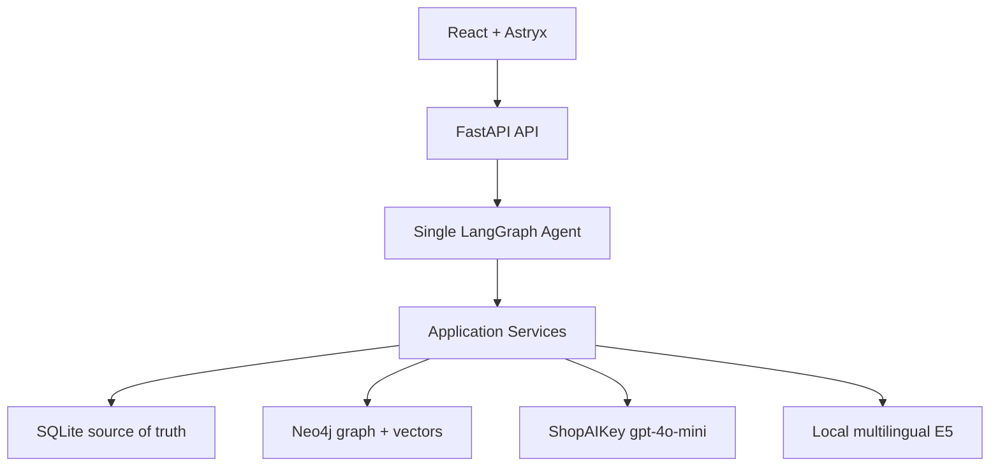
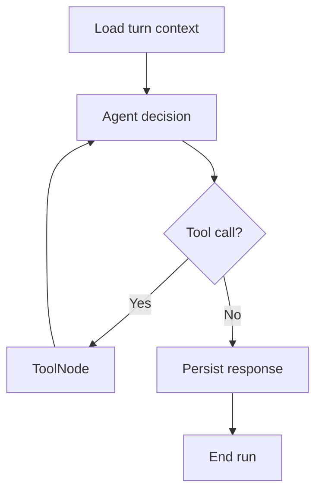

# JobAgent Master Plan

**Version:** 1.0  
**Date:** 2026-07-10  
**Status:** Ready for implementation after Phase 0 feasibility gates  
**Project type:** Single-user, local-first AI/NLP portfolio project  

---

## 1. Project Objective

JobAgent is a chat-first job matching assistant. The user primarily works through a ChatGPT-like conversation instead of editing complex forms or dashboards.

The system must let the user:

1. Upload a PDF CV from the sidebar or attach it in chat.
2. Let the Agent call tools to parse, redact, extract, normalize, and stage a Candidate Profile.
3. Review the extracted profile inside chat and choose **Save Profile** or **Request Changes**.
4. Send a public JD URL or paste JD text.
5. Let the Agent save every accepted JD input, extract structured fields, normalize skills, and synchronize derived graph data.
6. Rank saved jobs against the active profile.
7. Explain matched skills, related skills, missing skills, and non-skill score components.
8. Remember the active profile, preferences, corrections, saved jobs, and job-related conversation context across restarts.

The goal is to demonstrate practical AI/NLP engineering through structured extraction, multilingual embeddings, entity normalization, a knowledge graph, tool calling, human approval, evaluation, and failure handling.

### Complexity guardrail

> JobAgent must not become too complex for an AI/NLP Engineer Intern portfolio project.

Every new dependency or feature must satisfy at least one of these conditions:

- It is required for a locked user flow.
- It measurably improves a defined metric.
- It removes a known reliability or security risk.

Otherwise, it remains outside the MVP.

---

## 2. Locked Product Scope

### 2.1 In scope

- Single user.
- No authentication.
- One persistent application conversation.
- React chat-first interface using Astryx.
- Upload one active PDF CV.
- No CV version history.
- Candidate Profile draft and approval flow.
- Structured long-term memory for profile corrections and job preferences.
- Manual JD input through public URL or raw text.
- JD persistence, quality classification, duplicate handling, and extraction.
- Vietnamese and English CV/JD content.
- JD inputs from any job family, not only AI/NLP roles.
- Dynamic skills with `verified` or `provisional` status.
- Neo4j skill graph and Neo4j vector search.
- Transparent hybrid scoring.
- Skill-gap and score-breakdown explanation.
- Visible, sanitized tool activity in chat.
- Local Docker Compose deployment.
- Local tests and evaluation commands.

### 2.2 Explicitly out of scope

- Multi-user accounts, login, roles, and permissions.
- Multiple conversations.
- CV version history.
- DOCX, image CVs, or OCR.
- Automatic job discovery or crawling.
- Authenticated, paywalled, cookie-dependent, or JavaScript-only job pages.
- LinkedIn/Facebook browser automation.
- Auto-apply.
- Application tracking.
- Cover-letter generation.
- Interview preparation.
- Public cloud deployment.
- Qdrant.
- Jina or ShopAIKey reranking in the MVP.
- Redis, Celery, Kafka, or a separate worker service.
- Multiple agents or agent handoffs.
- 64K conversation memory injection.
- LangSmith cloud dependency.
- GitHub Actions or other CI workflows.

---

## 3. Locked Technology Stack

| Layer | Technology | Purpose |
|---|---|---|
| Frontend | React + TypeScript + Vite | Chat-first web client |
| Design system | Astryx + neutral theme | App shell, chat, tool calls, buttons, feedback states |
| Backend | Python + FastAPI | REST, file upload, SSE, application services |
| Validation | Pydantic v2 | Tool and extraction contracts |
| Agent orchestration | LangGraph | One controlled tool loop with interrupt/resume |
| LLM adapter | `langchain-openai` `ChatOpenAI` | OpenAI-format tool calling through ShopAIKey |
| LLM provider | ShopAIKey | OpenAI-compatible API |
| LLM model | `gpt-4o-mini` | Tool choice and structured extraction |
| Relational data | SQLite + SQLAlchemy 2 + aiosqlite | Source of truth |
| Migrations | Alembic | SQLite schema management |
| Graph/vector data | Neo4j Community | Derived skill graph and job vector index |
| Embeddings baseline | `intfloat/multilingual-e5-small` | Local multilingual CPU embeddings |
| PDF parser baseline | pypdf | Digitally born PDF text extraction |
| Web extraction | Trafilatura | Public HTML main-text extraction |
| HTTP client | httpx | Controlled URL download and ShopAIKey connectivity checks |
| Local deployment | Docker Compose | Frontend, backend, Neo4j, and persistent volumes |

The exact dependency versions are pinned after Phase 0 compatibility checks. FastAPI must be at least `0.135.0` to use its native SSE response support.

---

## 4. High-Level Architecture



### 4.1 Ownership rules

- SQLite owns raw inputs, application state, conversation state, tool logs, and structured canonical records.
- Neo4j is a rebuildable derived index.
- Uploaded PDF bytes live in a persistent Docker volume, not in SQLite blobs.
- The frontend never accesses SQLite, Neo4j, or ShopAIKey directly.
- LangGraph tools call Python application services directly; they do not make HTTP calls back into FastAPI.

---

## 5. Repository Structure

```text
JobAgent/
├── frontend/
│   ├── src/
│   │   ├── app/
│   │   ├── components/
│   │   ├── features/chat/
│   │   ├── features/profile/
│   │   ├── features/jobs/
│   │   ├── lib/api/
│   │   ├── lib/sse/
│   │   ├── test/
│   │   └── main.tsx
│   ├── package.json
│   ├── package-lock.json
│   ├── tsconfig.json
│   └── vite.config.ts
│
├── backend/
│   ├── app/
│   │   ├── api/
│   │   ├── agent/
│   │   ├── tools/
│   │   ├── services/
│   │   ├── repositories/
│   │   ├── db/
│   │   ├── graph/
│   │   ├── schemas/
│   │   ├── security/
│   │   └── main.py
│   ├── migrations/
│   ├── evaluation/
│   │   ├── fixtures/
│   │   ├── labels/
│   │   ├── private/
│   │   ├── reports/
│   │   └── README.md
│   ├── tests/
│   ├── pyproject.toml
│   └── alembic.ini
│
├── infrastructure/
│   ├── docker-compose.yml
│   ├── docker/
│   │   ├── backend.Dockerfile
│   │   └── frontend.Dockerfile
│   ├── neo4j/
│   └── scripts/
│
├── .env
├── .env.example
├── .gitignore
├── README.md
└── JobAgent_Master_Plan.md
```

The repository has exactly three top-level working folders: `frontend`, `backend`, and `infrastructure`. Root files hold project-wide configuration and documentation. Real evaluation CV/JD data under `backend/evaluation/private/` is gitignored. Runtime CV/JD files use Docker volumes and are not stored in the repository.

---

## 6. SQLite Source-of-Truth Model

### 6.1 Application tables

| Table | Essential fields | Responsibility |
|---|---|---|
| `attachments` | `id`, `file_hash`, `original_name`, `mime_type`, `size_bytes`, `page_count`, `storage_path`, `state`, timestamps | Staged and active CV file metadata |
| `candidate_profile` | singleton `id`, `active_attachment_id`, `profile_json`, `embedding_model`, timestamps | Current approved Candidate Profile only |
| `profile_drafts` | `id`, `source_attachment_id`, `draft_json`, `state`, timestamps | Temporary profile/preference proposal awaiting approval |
| `job_preferences` | singleton `id`, `preferences_json`, timestamps | Target roles, locations, work modes, and target level |
| `job_posts` | IDs, source, raw content, hashes, normalized keys, extracted fields, status fields, score cache, timestamps | Canonical JD records and ignored duplicate records |
| `conversation` | singleton `id`, timestamps | One application conversation |
| `chat_messages` | `id`, `conversation_id`, `role`, `content`, `structured_payload`, timestamps | UI history and application-level conversation record |
| `agent_runs` | `id`, `message_id`, `state`, `pending_approval`, error, timestamps | One LangGraph run per user turn |
| `tool_executions` | run/tool IDs, sanitized arguments summary, status, duration, error code, timestamps | Tool observability and evaluation |
| `memory_facts` | `key`, `value_json`, `source`, timestamps | Durable job-related facts not already represented by profile/preferences |
| `graph_sync_outbox` | operation, entity ID, payload, status, attempts, timestamps | Durable SQLite-to-Neo4j synchronization |

LangGraph checkpoint tables are created by `langgraph-checkpoint-sqlite` in the same SQLite file. They are short-lived and keyed by `agent_run.id`.

### 6.2 Profile storage rule

- The approved profile is a validated Pydantic JSON document stored in the singleton `candidate_profile` row.
- No historical profile snapshots are retained.
- A new CV never overwrites the active profile before approval.
- After approval, the transaction replaces the active profile and preferences, promotes the new file, deletes the previous file, deletes the draft, and enqueues a graph rebuild/sync.

### 6.3 Job status dimensions

Do not overload one status column.

```text
processing_status:
received | processing | processed | failed

jd_quality:
full | partial | unscorable

graph_sync_status:
not_required | pending | synced | failed

record_status:
active | ignored_duplicate
```

---

## 7. Pydantic Data Contracts

### 7.1 Shared skill contract

```text
SkillRef
- canonical_key: str
- display_name: str
- aliases: list[str]
- category: str | None
- status: verified | provisional
- confidence: float [0, 1]
- evidence: list[str]
```

Evidence snippets must be short, redact contact details, and come from the source document. The LLM must not invent evidence.

### 7.2 Candidate Profile

```text
CandidateProfile
- summary: str
- current_title: str | None
- total_experience_years: float | None
- skills: list[CandidateSkill]
- experiences: list[ExperienceItem]
- education: list[EducationItem]
- languages: list[LanguageItem]
- extraction_confidence: float
```

```text
CandidateSkill
- skill: SkillRef
- proficiency: beginner | intermediate | advanced | unknown
- years: float | None
- source: cv | user_correction
- excluded: bool
- evidence: list[str]
```

Proficiency and years may be `unknown`. The model must not infer precise years without timeline evidence.

### 7.3 Job Preferences

```text
JobPreferences
- target_roles: list[str]
- preferred_locations: list[str]
- acceptable_work_modes: list[remote | hybrid | onsite]
- target_seniority: list[intern | junior | mid | senior | lead | unknown]
```

Profile facts and job preferences are separate. A CV address is not automatically a preferred work location.

### 7.4 Job extraction

```text
JobPostExtraction
- title: str | None
- company: str | None
- summary: str
- responsibilities: list[str]
- required_skills: list[JobSkill]
- preferred_skills: list[JobSkill]
- seniority: intern | junior | mid | senior | lead | unknown
- min_experience_years: float | None
- max_experience_years: float | None
- location: str | None
- work_mode: remote | hybrid | onsite | unknown
- employment_type: full_time | part_time | contract | internship | unknown
- education_requirements: list[str]
- language_requirements: list[str]
- salary_text: str | None
- job_family: str | None
- extraction_confidence: float
- jd_quality: full | partial | unscorable
```

Salary is stored for display only and does not participate in MVP scoring.

### 7.5 JD quality rules

- `full`: sufficient title/description plus usable skill or responsibility evidence and most scoring fields.
- `partial`: enough content to compute at least semantic and skill signals, but one or more important fields are missing.
- `unscorable`: no meaningful job responsibilities/skills, contact-only content, or extraction contains insufficient evidence.

The classifier must return reasons for `partial` and `unscorable` states.

---

## 8. Neo4j Derived Model

### 8.1 Nodes

```text
(:Candidate {id})
(:Job {id, title, company, location, work_mode, seniority, quality, embedding})
(:Skill {canonical_key, display_name, aliases, category, status})
(:JobFamily {canonical_key, display_name})
```

### 8.2 Relationships

```text
(Candidate)-[:HAS_SKILL {confidence, years, proficiency, evidence}]->(Skill)
(Job)-[:REQUIRES {confidence, evidence}]->(Skill)
(Job)-[:PREFERS {confidence, evidence}]->(Skill)
(Skill)-[:RELATED_TO {weight, source, verified}]->(Skill)
(Job)-[:IN_FAMILY]->(JobFamily)
```

### 8.3 Constraints and indexes

- Unique constraint on `Candidate.id`.
- Unique constraint on `Job.id`.
- Unique constraint on `Skill.canonical_key`.
- Unique constraint on `JobFamily.canonical_key`.
- Vector index on `Job.embedding` using cosine similarity.
- Vector dimension comes from the selected embedding model and must be recorded in application settings.

Changing the embedding model or dimensions requires a complete embedding and vector-index rebuild.

### 8.4 Graph safety rules

- Alias strings are properties on the canonical `Skill`; do not create separate alias nodes in the MVP.
- A new unknown skill may be stored as `provisional`.
- The LLM must not automatically create trusted `RELATED_TO` relationships.
- Only verified relationships from the seed taxonomy or explicit user confirmation may contribute to scoring.
- Duplicate ignored jobs are not synchronized to Neo4j.
- Neo4j must be fully rebuildable through an infrastructure script using SQLite records.

---

## 9. Skill Normalization

### 9.1 Normalization pipeline

1. Unicode normalize.
2. Trim and collapse whitespace.
3. Lowercase for canonical comparison.
4. Normalize punctuation and common separators.
5. Resolve against verified aliases in a small `skills_seed.yaml`.
6. Compare against existing canonical Neo4j/SQLite skills.
7. If unresolved, create a deterministic canonical key and mark it `provisional`.

### 9.2 Seed taxonomy

The MVP does not attempt a global job ontology. The seed contains only aliases and verified relationships observed in the development/evaluation data or manually approved for common skills.

### 9.3 User corrections

When the user says a skill is incorrect or excluded:

- Store the current correction in the approved Candidate Profile.
- Mark the skill source as `user_correction`.
- Do not re-add it from the same CV without a new explicit approval.
- Do not keep old profile versions.

---

## 10. CV Ingestion and Approval Flow

### 10.1 Upload

Both sidebar upload and chat attachment call the same endpoint and produce an `attachment_id`.

Validation:

- MIME must be `application/pdf`.
- Magic bytes must begin with `%PDF-`.
- Maximum size: 10 MB.
- Maximum pages: 10.
- The parser must not execute embedded content.

### 10.2 Processing

```text
attachment_id
→ file-hash duplicate check
→ pypdf layout text extraction
→ extractable-text validation
→ deterministic PII redaction
→ gpt-4o-mini structured extraction
→ Pydantic validation
→ at most one JSON repair
→ profile draft
→ LangGraph interrupt
```

PII redaction removes at minimum:

- Email addresses.
- Phone numbers.
- Address lines labeled as address/contact address.

Name, education, experience, and skills remain available unless the user later requests stronger anonymization.

If no meaningful digital text is available, return `NO_EXTRACTABLE_TEXT`. Do not add OCR fallback.

### 10.3 Chat approval

The assistant renders a profile summary card with Astryx `ButtonGroup`:

```text
[Save Profile] [Request Changes]
```

- `Save Profile` resumes the interrupted LangGraph run and calls `commit_profile_draft`.
- `Request Changes` focuses the chat composer; the next user correction updates the same draft.
- Every profile or preference change creates or updates a draft and requires approval.
- Buttons become disabled after a successful action to guarantee idempotency.

### 10.4 Atomic replacement

The old active profile and CV remain usable until the new draft is approved. On approval:

1. Replace the singleton Candidate Profile.
2. Replace Job Preferences if the draft contains preference updates.
3. Promote the staged PDF to the active path.
4. Remove the previous active PDF.
5. Delete the draft.
6. Enqueue Candidate graph synchronization.

If any SQLite/file operation fails, the current active profile remains unchanged.

---

## 11. JD Ingestion Flow

### 11.1 Accepted inputs

- Public HTTP/HTTPS URL.
- Raw JD text pasted into chat.

### 11.2 URL security

- Allow only HTTP and HTTPS.
- Block localhost, private, loopback, link-local, and metadata-service IP ranges.
- Resolve and validate every redirect target.
- Maximum three redirects.
- Ten-second download timeout.
- Maximum response body: 5 MB.
- Allow only `text/html` and `text/plain`.
- No cookies, authentication, browser session, or JavaScript renderer.

If Trafilatura cannot obtain meaningful text, ask the user to paste the JD text.

### 11.3 Persistence-first processing

```text
URL/text
→ save raw input with processing_status=received
→ exact content-hash check
→ process/extract
→ Pydantic validation and one repair
→ normalize skills
→ classify quality
→ apply duplicate policy
→ enqueue Neo4j synchronization if active and scorable
→ optional match against active profile
```

Raw input is retained even if extraction later fails.

### 11.4 Duplicate policy

1. Exact `raw_content_hash` match:
   - Return the existing job.
   - Do not insert a new row.
   - Do not extract or embed again.
2. Same normalized `company + title + location`, different content:
   - Insert an ignored duplicate record.
   - Set `duplicate_of_job_id`.
   - Set `record_status=ignored_duplicate`.
   - Do not embed, synchronize, or score it.
3. Explicit user override:
   - `save_job(force_new=true)` may be used only after the user states it is a separate position.

If company/title/location are insufficient to compute the normalized key, use exact-hash deduplication only.

---

## 12. Agent Architecture

### 12.1 One Agent, one controlled loop

The system uses one `StateGraph` with one LLM decision node and one `ToolNode`. It is not a multi-agent architecture.



Approval is implemented with `interrupt()` inside the guarded commit path.

### 12.2 Per-turn runs

- The application has one persistent conversation in SQLite.
- Every user turn creates a new `agent_run_id` and LangGraph `thread_id`.
- An interrupted run uses the same ID when resumed.
- After completion, the application deletes that run's checkpoint data.
- Conversation continuity comes from application data, not permanent LangGraph checkpoints.

### 12.3 Agent state

```text
AgentState
- conversation_id
- run_id
- messages_for_this_turn
- recent_context
- candidate_context
- attachment_ids
- pending_approval
- tool_iteration_count
- error
```

Large PDF/JD bodies are stored out of state and referenced by IDs.

### 12.4 Memory policy

The model receives:

- Current approved Candidate Profile.
- Current Job Preferences.
- Relevant durable memory facts.
- Current turn.
- A bounded recent message window that fits the prompt budget.

It does not receive the entire conversation or a fixed 64K-token history. Profile and preference corrections are remembered through structured state, not by relying on old chat text.

### 12.5 Domain policy

The Agent handles CVs, Candidate Profile, job preferences, JDs, saved jobs, matching, and skill gaps.

For unrelated messages, respond briefly and redirect:

> I focus on CVs, JDs, and job matching. Upload a CV or send a JD to continue.

Do not add a separate classifier model. Enforce the boundary through the system prompt, tool preconditions, and tool-selection tests.

### 12.6 Tool loop limits

- Maximum six tool iterations per user turn.
- No tool retry loops controlled by the LLM.
- Application services own deterministic retry behavior.
- A tool may return structured failure; the Agent must not claim success afterward.

---

## 13. Agent-Facing Tool Contracts

The Agent sees exactly seven tools.

### 13.1 `get_candidate_context`

Reads the active Candidate Profile and Job Preferences.

- Read-only.
- Returns a compact structured summary.
- Does not return raw CV text.

### 13.2 `propose_profile_from_cv`

Input: `attachment_id`.

- Validates attachment ownership/state.
- Parses, redacts, extracts, validates, and creates a draft.
- Returns `draft_id` and sanitized summary.
- Never commits the profile.

### 13.3 `propose_profile_update`

Input: current `draft_id` or active context plus requested profile/preference changes.

- Applies changes through Pydantic validation.
- Produces a new/updated draft.
- Covers both Candidate Profile facts and Job Preferences so an eighth tool is unnecessary.

### 13.4 `commit_profile_draft`

Input: `draft_id`, idempotency key.

- Write tool guarded by LangGraph interrupt approval.
- Refuses execution without valid approval state.
- Atomically replaces the active profile and CV.

### 13.5 `save_job`

Input: exactly one of URL or raw text, plus optional explicit `force_new`.

- Persists raw content before extraction.
- Handles fetch, extraction, validation, deduplication, and outbox creation.
- Does not require approval.

### 13.6 `query_jobs`

Input: job ID or bounded filters.

- Read-only.
- Returns compact job data or score details.
- Does not return every raw JD by default.

### 13.7 `match_jobs`

Input: optional saved-job filters and result limit.

- Requires an active Candidate Profile.
- Synchronizes pending graph operations first.
- Runs retrieval, graph features, scoring, and explanation.
- Defaults to final top 10.

### 13.8 Tool authorization matrix

| State | Available write tools |
|---|---|
| No CV/profile | `propose_profile_from_cv`, `save_job` |
| Profile draft pending | `propose_profile_update`, guarded `commit_profile_draft`, `save_job` |
| Active profile | `propose_profile_from_cv`, `propose_profile_update`, `save_job`, `match_jobs` |

Read tools are available when their preconditions can be satisfied.

---

## 14. Public FastAPI Boundary

Expose only seven public endpoints.

```text
GET  /api/health

POST /api/attachments/cv
GET  /api/profile
GET  /api/profile/cv

GET  /api/chat/history
POST /api/chat/turns
POST /api/chat/runs/{run_id}/resume
```

### 14.1 API rules

- No public profile/job CRUD endpoints.
- All business writes occur through Agent tool calls.
- File upload and chat messages remain separate requests.
- Sidebar upload immediately starts a chat turn containing the returned attachment ID.
- `POST /api/chat/turns` returns an SSE stream.
- Resume also returns an SSE stream.

### 14.2 SSE contract

```text
run_started
assistant_status
tool_started
tool_completed
approval_required
text_delta
run_completed
run_failed
```

Every event includes `event_id`, `run_id`, `timestamp`, and an event-specific validated payload.

FastAPI, not ShopAIKey, owns the client-facing stream. Tool decision calls may be non-streaming. The final text may stream from ShopAIKey when compatibility is confirmed.

---

## 15. Frontend UX Plan

### 15.1 Layout

- Astryx `AppShell`.
- Left sidebar approximately 256 px.
- Main content is `ChatLayout`.
- Responsive sidebar collapses on small screens.

### 15.2 Sidebar

Show only:

- Active CV filename.
- Profile state.
- Upload/replace CV action.
- View/download active CV action.

Do not add a full profile editor.

### 15.3 Chat components

| Need | Astryx component |
|---|---|
| Conversation layout | `ChatLayout` |
| Messages | `ChatMessageList`, `ChatMessage` |
| Composer and PDF token | `ChatComposer` |
| Tool activity | `ChatToolCalls` |
| Approval actions | `ButtonGroup`, `Button` |
| System status | `ChatSystemMessage` |
| Structured job details | `Card`, `MetadataList`, `Badge` |
| Score details | `Collapsible`, `ProgressBar` |
| Notifications | `Banner`, `Toast` |

Before implementing any Astryx component, run its CLI documentation command against the pinned package version. Do not invent props or depend on undocumented internals.

### 15.4 Tool activity display

Display sanitized statuses only:

- Friendly tool label.
- `pending`, `running`, `complete`, or `error`.
- Duration.
- Short outcome summary.

Never display raw arguments, raw CV/JD content, API keys, stack traces, or internal-only IDs.

### 15.5 Match result card

Each top result shows:

- Title, company, location, work mode.
- Final score.
- Matched required skills.
- Related verified skills.
- Missing required skills.
- Expandable component score breakdown.
- Original source URL when available.

---

## 16. ShopAIKey Integration

### 16.1 Configuration

```text
SHOPAIKEY_BASE_URL=https://api.shopaikey.com/v1
LLM_MODEL=gpt-4o-mini
```

Use `ChatOpenAI` with the custom base URL and `bind_tools()`.

### 16.2 Startup/diagnostic compatibility checks

Phase 0 must verify:

1. `/v1/models` contains the requested model ID or an explicitly approved equivalent ID.
2. Basic Chat Completions.
3. Function calling.
4. Tool-result round trip.
5. Structured tool schema behavior.
6. Streaming text behavior.

`strict=True` remains disabled until verified. If strict schemas fail:

- Use ordinary function schema or JSON mode.
- Validate with Pydantic.
- Allow exactly one schema-repair request.

Do not silently switch to another LLM model.

---

## 17. Embedding and Retrieval

### 17.1 Candidate models

Benchmark only:

1. `intfloat/multilingual-e5-small` — default baseline.
2. `sentence-transformers/paraphrase-multilingual-MiniLM-L12-v2` — lightweight comparison.

Do not include BGE-M3 in the MVP CPU serving path.

### 17.2 Model selection gate

Choose the model using validation-set `nDCG@10`, Recall@10, encoding latency, and memory usage. Prefer E5 unless the other model provides a meaningful measured advantage.

### 17.3 Text representations

Candidate representation:

```text
target roles + profile summary + verified skills + experience titles + preferences
```

Job representation:

```text
title + summary + responsibilities + required skills + preferred skills
```

When using E5, apply the expected query/passage prefixes consistently.

### 17.4 Retrieval flow

1. Embed the active Candidate representation.
2. Query Neo4j vector index for up to top 50 active, scorable jobs.
3. Compute direct and verified-related skill features.
4. Compute seniority, experience, location, and work-mode features.
5. Calculate the transparent hybrid score.
6. Return final top 10 with explanations.

---

## 18. Matching Formula

### 18.1 Skill coverage

```text
skill_score =
    0.80 × required_skill_coverage
  + 0.20 × preferred_skill_coverage
```

Match strengths:

| Match type | Strength |
|---|---:|
| Direct canonical match | 1.0 |
| Verified alias match | 1.0 |
| Verified related skill | 0.6 |
| Provisional relationship | 0.0 |
| No match | 0.0 |

### 18.2 Initial hybrid seed

```text
base_score =
    0.30 × semantic_similarity
  + 0.40 × skill_score
  + 0.10 × seniority_score
  + 0.10 × experience_score
  + 0.05 × location_score
  + 0.05 × work_mode_score
```

Component rules are deterministic and return normalized scores in `[0, 1]`.

### 18.3 Missing fields

If an optional component cannot be evaluated, renormalize the weights of available components. Then apply the JD quality multiplier:

```text
full       → 1.00
partial    → 0.85
unscorable → final_score = null
```

### 18.4 Weight tuning

- The values above are seeds, not claimed optimal weights.
- Run bounded grid search on the validation set.
- Optimize validation `nDCG@10`.
- Lock weights before evaluating the held-out test set.
- Store the chosen configuration with the evaluation report.
- Do not use `gpt-4o-mini` to produce the final numerical score.

### 18.5 Graph ablation rule

Evaluate:

1. Semantic-only.
2. Exact-skill-only.
3. Semantic + exact skill.
4. Semantic + skill graph.
5. Full hybrid.

If verified graph expansion does not improve held-out `nDCG@10`, disable related-skill score boosts. Neo4j may remain for structured explanation and direct graph traversal, but the README must report the result honestly.

---

## 19. Evaluation Plan

### 19.1 Data policy

- Use one real CV that is redacted before external processing.
- Use 150–200 public JD examples spanning relevant, adjacent, and unrelated jobs.
- Real CV/JD data stays local and is gitignored.
- The repository contains only synthetic fixtures, annotation templates, and aggregate reports.
- Because there is one Candidate Profile, ranking claims are explicitly per-profile and not population-wide.

### 19.2 Relevance labels

```text
0 = irrelevant
1 = related but missing many requirements
2 = reasonably suitable
3 = highly suitable / should apply
```

Use a fixed seeded split:

- 60% development.
- 20% validation.
- 20% held-out test.

Do not inspect test results while tuning weights or prompts.

### 19.3 Extraction dataset

Manually annotate at least 30 JDs for:

- Required skills.
- Preferred skills.
- Seniority.
- Work mode.
- Location.

### 19.4 Tool-selection dataset

Create at least 50 conversation scenarios covering:

- CV upload.
- Profile correction.
- Approval and rejection.
- JD URL/text ingestion.
- Duplicate job.
- Match request with/without profile.
- Unrelated conversation.
- Tool failure.
- Prompt injection inside a CV/JD.

### 19.5 Pass/fail metrics

Extraction:

```text
Required/preferred skill entity F1 ≥ 0.80
Seniority macro-F1 ≥ 0.85
Work-mode macro-F1 ≥ 0.85
Location field accuracy ≥ 0.90
```

Ranking:

```text
Precision@10 ≥ 0.70 for labels 2–3
Full hybrid nDCG@10 > semantic-only baseline
Full hybrid nDCG@10 > skill-only baseline
```

Agent/tool use:

```text
Tool-selection accuracy ≥ 0.90
Invalid tool arguments ≤ 5%
Profile commits without approval = 0
PII leakage to ShopAIKey test adapter = 0
False success after tool failure = 0
```

Latency after model warm-up:

```text
First SSE event < 1 second
P95 matching latency for 200 jobs < 2 seconds
External extraction timeout ≤ 45 seconds
```

---

## 20. Failure and Recovery Policy

| Failure | Required behavior |
|---|---|
| ShopAIKey timeout/rate limit | Retry once, then persist failure |
| Invalid structured output | One repair request, then fail safely |
| No PDF text | `NO_EXTRACTABLE_TEXT`; no OCR |
| PII redaction failure | Do not send text externally |
| Unsupported/oversized PDF | Reject before storage promotion |
| URL blocked or unavailable | Ask user to paste JD text |
| JD extraction failure | Keep raw record with failed status |
| Exact duplicate | Return existing job; no reprocessing |
| Normalized duplicate | Save ignored record; no graph/score |
| Neo4j unavailable | Keep SQLite data; outbox status failed/pending |
| Match without profile | Ask user to upload/approve CV first |
| Unauthorized profile commit | Reject tool execution |
| Tool loop exceeds six iterations | End run with controlled failure |

No unlimited retries, automatic model switching, or hidden fallback features.

---

## 21. SQLite-to-Neo4j Synchronization

### 21.1 Outbox rule

Every SQLite transaction that changes graph-derived data writes an outbox row in the same transaction.

### 21.2 Processing

- Attempt synchronous processing immediately after the SQLite transaction.
- If Neo4j is unavailable, retain the outbox row as `pending` or `failed`.
- Retry pending items at backend startup and before `match_jobs`.
- Keep retry limits visible; do not spin continuously.

### 21.3 Idempotency

- Use SQLite UUIDs as Neo4j `Candidate`/`Job` identifiers.
- Use `Skill.canonical_key` for skill identity.
- Use Neo4j uniqueness constraints and `MERGE`.
- Replaying an outbox operation must not create duplicate nodes or relationships.

### 21.4 Rebuild

Provide one infrastructure command that:

1. Clears derived JobAgent nodes/relationships safely.
2. Recreates constraints and vector index.
3. Reads active/scorable SQLite records.
4. Rebuilds Candidate, Job, Skill, JobFamily nodes and edges.
5. Recomputes embeddings when required.
6. Verifies entity counts and marks sync states.

---

## 22. Security and Privacy

### 22.1 Network exposure

- Bind published frontend and backend ports to `127.0.0.1` only.
- Keep Neo4j Bolt/HTTP ports inside the Docker network unless a local development profile explicitly exposes them to localhost.
- Use an exact frontend origin in CORS configuration.

### 22.2 Secrets

- One `.env` file at repository root.
- Frontend receives only explicitly prefixed public values.
- ShopAIKey and Neo4j secrets are backend-only.
- Never hard-code fallback keys.
- Never log Authorization headers.

### 22.3 Untrusted content

CV and JD content is data, not Agent instruction. Prompt construction must clearly delimit documents and state that embedded instructions are untrusted.

Tool authorization comes from application state and system policy, never document content.

### 22.4 Logging

Logs may contain:

- Run/tool IDs.
- Sanitized status summaries.
- Timings.
- Token counts.
- Error codes.

Logs must not contain:

- Raw CV/JD content.
- Contact PII.
- API keys.
- Raw provider request headers.
- Raw tool arguments containing document data.

---

## 23. Environment Configuration

All configurable values live in the single root `.env` and are documented in `.env.example`.

```text
APP_ENV=local
FRONTEND_ORIGIN=http://localhost:5173
VITE_API_BASE_URL=http://localhost:8000

SQLITE_PATH=/data/jobagent.db
FILES_DIR=/data/files

NEO4J_URI=bolt://neo4j:7687
NEO4J_USER=neo4j
NEO4J_PASSWORD=

SHOPAIKEY_BASE_URL=https://api.shopaikey.com/v1
SHOPAIKEY_API_KEY=
LLM_MODEL=gpt-4o-mini
LLM_TEMPERATURE=0

EMBEDDING_MODEL=intfloat/multilingual-e5-small
EMBEDDING_DEVICE=cpu

MAX_PDF_SIZE_MB=10
MAX_PDF_PAGES=10
URL_FETCH_TIMEOUT_SECONDS=10
URL_MAX_RESPONSE_MB=5
TOOL_LOOP_LIMIT=6
```

Docker Compose loads this root file. Do not create separate frontend/backend `.env` files.

---

## 24. Local Testing Strategy

The user explicitly chose local testing only. Do not create GitHub Actions workflows in the MVP.

### 24.1 Backend unit tests

- PII redaction.
- Pydantic validation.
- Skill canonicalization and alias resolution.
- Duplicate policies.
- JD quality classification.
- Score components and weight renormalization.
- Tool preconditions and authorization.
- Prompt-injection isolation.
- Outbox idempotency.

### 24.2 Backend integration tests

- FastAPI PDF upload and validation.
- SSE event schema/order.
- LangGraph interrupt/resume.
- SQLite persistence and migration.
- Neo4j synchronization and rebuild.
- Exact/normalized duplicates.
- Fake ShopAIKey adapter for tool calls and invalid schema.

Normal automated tests must not call the real ShopAIKey API.

### 24.3 Frontend tests

- SSE reducer.
- `ChatToolCalls` event mapping.
- Approval buttons and idempotent disable state.
- Sidebar attachment state.
- Chat history hydration.
- Match-card score breakdown.
- Error and disconnected stream states.

### 24.4 End-to-end smoke test

```text
Upload synthetic PDF
→ create profile draft
→ approve profile
→ submit JD text
→ save/sync JD
→ request matching
→ display score and skill gaps
```

### 24.5 Local verification commands

The final README must provide single-purpose commands for:

- Backend lint/type-check/test.
- Frontend lint/type-check/test.
- Neo4j integration tests.
- ShopAIKey compatibility smoke test.
- Extraction evaluation.
- Ranking evaluation.
- Full Docker Compose startup.

---

## 25. Implementation Phases

### Phase 0 — Feasibility and compatibility gates

**Purpose:** eliminate provider, UI-library, parsing, and embedding uncertainty before implementation expands.

Tasks:

- [ ] Create the three-folder scaffold and root configuration placeholders.
- [ ] Pin a stable Astryx version and run `npx astryx init --features agents --agent codex`.
- [ ] Inspect exact Astryx APIs for AppShell, ChatLayout, ChatComposer, ChatToolCalls, ChatMessage, ButtonGroup, Card, Collapsible, and ProgressBar.
- [ ] Implement a temporary ShopAIKey compatibility script for model listing, chat completion, function calling, tool-result round trip, structured schema, and streaming.
- [ ] Benchmark pypdf normal/layout extraction on 5–10 representative digital CV PDFs.
- [ ] Verify `NO_EXTRACTABLE_TEXT` behavior on an image-only PDF fixture.
- [ ] Benchmark E5-small and multilingual MiniLM on an initial labeled retrieval subset and CPU latency.
- [ ] Record results in `backend/evaluation/reports/phase_0_feasibility.md`.

Exit gate:

- ShopAIKey can complete a valid tool-call round trip with `gpt-4o-mini`.
- At least one schema strategy passes Pydantic validation reliably.
- Astryx has all required public components or a documented composition path.
- pypdf succeeds on the agreed majority of digital CV fixtures.
- One local embedding model meets the initial latency and quality baseline.

If any gate fails, revise the affected adapter only. Do not add broad fallback stacks.

### Phase 1 — Foundation, Docker, and source-of-truth data

Tasks:

- [ ] Configure backend project, FastAPI, Pydantic, SQLAlchemy async, Alembic, and settings.
- [ ] Configure React/TypeScript/Vite and Astryx neutral theme.
- [ ] Create infrastructure Dockerfiles and Docker Compose.
- [ ] Configure one root `.env` and `.env.example`.
- [ ] Add persistent volumes for SQLite/files and Neo4j.
- [ ] Implement SQLite models and initial migrations.
- [ ] Implement attachment storage abstraction.
- [ ] Implement Neo4j driver, constraints, vector-index creation, health check, and rebuild skeleton.
- [ ] Implement graph outbox repository and idempotent operation contracts.
- [ ] Add local lint, type-check, migration, and test commands.

Exit gate:

- `docker compose` starts frontend, backend, and Neo4j locally.
- Health endpoint reports SQLite, filesystem, and Neo4j status without exposing secrets.
- Migrations work on an empty and already-initialized volume.
- Neo4j constraints/index setup is idempotent.

### Phase 2 — Chat transport, Agent runtime, and persistence

Tasks:

- [ ] Implement conversation/message repositories for one conversation.
- [ ] Implement agent-run and tool-execution repositories.
- [ ] Define SSE Pydantic event contracts.
- [ ] Implement `POST /api/chat/turns`, history, and resume endpoints.
- [ ] Implement per-turn AsyncSqliteSaver lifecycle and checkpoint cleanup.
- [ ] Build the single LangGraph loop with `ToolNode`, iteration limit, error boundary, and interrupt support.
- [ ] Implement ShopAIKey `ChatOpenAI` adapter using the verified Phase 0 mode.
- [ ] Implement domain-focused system prompt and prompt-injection delimiters.
- [ ] Implement frontend SSE reducer and base Astryx chat shell.
- [ ] Render sanitized tool status through `ChatToolCalls`.

Exit gate:

- A local synthetic tool can run through the full frontend–FastAPI–LangGraph–SSE path.
- Interrupt/resume survives a backend request boundary.
- Completed run checkpoints are cleaned while conversation messages remain.
- Unrelated messages are redirected briefly without tool calls.

### Phase 3 — CV, Candidate Profile, and approval workflow

Tasks:

- [ ] Implement PDF upload endpoint and file validation.
- [ ] Implement file-hash duplicate handling and staging lifecycle.
- [ ] Implement pypdf extraction and text-quality validation.
- [ ] Implement deterministic PII redaction and leakage tests.
- [ ] Implement Candidate/Profile/Preference Pydantic schemas.
- [ ] Implement `propose_profile_from_cv`.
- [ ] Implement `get_candidate_context`.
- [ ] Implement `propose_profile_update` for profile and preference changes.
- [ ] Implement interrupt-protected `commit_profile_draft`.
- [ ] Implement atomic file/profile replacement with no history.
- [ ] Implement sidebar CV upload/view/download state.
- [ ] Implement Astryx approval card and request-change loop.
- [ ] Synchronize Candidate/Skill nodes through the outbox.

Exit gate:

- Sidebar and chat uploads use the same pipeline.
- No profile write occurs without approval.
- User corrections persist across backend restarts.
- PII leakage tests have zero failures.
- Failed replacement leaves the previous profile intact.

### Phase 4 — JD ingestion, extraction, deduplication, and graph sync

Tasks:

- [ ] Implement SSRF-safe HTTP downloader.
- [ ] Implement Trafilatura extraction and text fallback request.
- [ ] Implement raw-text input path.
- [ ] Implement JobPost Pydantic extraction and one-repair policy.
- [ ] Implement full/partial/unscorable classification.
- [ ] Implement exact and normalized duplicate policy.
- [ ] Implement skill normalization, provisional creation, and seed aliases.
- [ ] Implement `save_job` and `query_jobs`.
- [ ] Generate local job embeddings for scorable active records.
- [ ] Synchronize Job, Skill, and JobFamily graph data.
- [ ] Add sanitized Job tool status and saved-job card to chat.

Exit gate:

- Raw JD is retained across extraction failures.
- Exact duplicates do not reprocess.
- Normalized duplicates are stored but excluded from graph/ranking.
- Private/local URL attempts are blocked.
- Full and partial active jobs are queryable in Neo4j with matching IDs.

### Phase 5 — Matching, explanation, and evaluation

Tasks:

- [ ] Implement Candidate and Job embedding text builders.
- [ ] Implement Neo4j top-50 vector retrieval.
- [ ] Implement direct, alias, and verified-related skill features.
- [ ] Implement seniority, experience, location, and work-mode components.
- [ ] Implement missing-field weight renormalization and quality multiplier.
- [ ] Implement deterministic score explanation.
- [ ] Implement `match_jobs` and top-10 response.
- [ ] Build 150–200 relevance labels and 30-JD extraction labels locally.
- [ ] Implement embedding benchmark, grid search, and sealed test evaluation.
- [ ] Run graph ablation and apply the locked disable rule if necessary.
- [ ] Implement Astryx match cards and collapsible breakdown.
- [ ] Generate aggregate evaluation report with limitations.

Exit gate:

- All locked extraction, ranking, tool-selection, and latency thresholds pass.
- Full hybrid beats semantic-only and skill-only baselines on the held-out set.
- Graph boost is enabled only if its ablation result passes.
- Top results expose evidence-backed explanations.

### Phase 6 — Hardening and local release

Tasks:

- [ ] Complete unit, integration, frontend, and end-to-end local tests.
- [ ] Test ShopAIKey outage, Neo4j outage, invalid schema, disconnect, and duplicate scenarios.
- [ ] Verify idempotency of approval buttons and all write tools.
- [ ] Verify graph rebuild from a fresh Neo4j volume.
- [ ] Verify root `.env` is the only environment file.
- [ ] Verify no secrets or real data are tracked by Git.
- [ ] Add README architecture, setup, commands, demo flow, evaluation results, and limitations.
- [ ] Add a concise model/data card for extraction and matching evaluation.
- [ ] Perform final scope audit against the out-of-scope list.

Exit gate:

- Fresh clone plus root `.env` starts successfully with documented local commands.
- The complete E2E flow works without manual database edits.
- Real CV/JD data remains outside Git.
- No out-of-scope infrastructure or feature has entered the MVP.

---

## 26. Estimated Delivery Shape

Recommended sequence for one intern developer:

| Phase | Indicative effort |
|---|---:|
| Phase 0 | 2–3 focused days |
| Phase 1 | 3–5 days |
| Phase 2 | 4–6 days |
| Phase 3 | 4–6 days |
| Phase 4 | 4–6 days |
| Phase 5 | 6–9 days, including labeling/evaluation |
| Phase 6 | 3–5 days |

This is approximately 5–7 weeks part-time. Scope should be reduced, not infrastructure added, if the schedule slips.

---

## 27. Definition of Done

JobAgent MVP is done only when all conditions are true:

- The user can upload a PDF CV from sidebar or chat.
- The Agent creates a redacted, validated profile draft.
- Profile/preference writes require in-chat approval.
- Only one active CV/profile exists after commit.
- The Agent remembers approved corrections across restarts.
- The user can submit public URL or raw JD text.
- Every valid input is represented by an existing, active, failed, or ignored duplicate record.
- Scorable jobs synchronize to Neo4j.
- Matching returns top jobs with transparent score breakdown and skill gaps.
- Tool activity is visible and sanitized.
- Failure paths do not report false success.
- Evaluation thresholds pass and limitations are documented.
- The project starts locally through Docker Compose and one root `.env`.
- No Qdrant, OCR, crawler, authentication, multi-agent, Redis, Celery, cloud deployment, or CI has been added.

---

## 28. Future Work — Not MVP Commitments

Only consider these after MVP metrics and reliability pass:

- Public job discovery.
- Application tracking.
- Multiple career profiles.
- Multiple conversations.
- DOCX support.
- Public cloud deployment and authentication.
- Qdrant comparison when corpus/retrieval requirements justify it.
- API reranking when an ablation demonstrates measurable improvement.
- Larger embedding models when CPU constraints change.
- Multiple-candidate evaluation for population-level claims.

Future work must not be silently implemented during MVP phases.

---

## 29. Final Planning Decision

Evidence is sufficient to begin implementation planning because all material product and architecture choices are locked, while uncertain technical integrations are isolated behind Phase 0 pass/fail gates.

The project remains intentionally narrow:

> One user, one conversation, one active CV, one Agent, seven tools, SQLite as source of truth, Neo4j as the rebuildable graph/vector index, manual JD input, and measurable matching quality.

---

## 30. Evidence Sources

The following primary documentation supports the material technical decisions in this plan:

### Frontend and design system

- [Astryx Getting Started](https://astryx.atmeta.com/docs/getting-started)
- [Astryx Working with AI](https://astryx.atmeta.com/docs/working-with-ai)
- [Astryx ChatComposer](https://astryx.atmeta.com/components/ChatComposer)
- [Astryx ChatToolCalls](https://astryx.atmeta.com/components/ChatToolCalls)
- [Astryx ButtonGroup](https://astryx.atmeta.com/components/ButtonGroup)

### LLM and provider compatibility

- [ShopAIKey OpenAI Format](https://shopaikey.com/docs/openai-format)
- [OpenAI GPT-4o mini model documentation](https://developers.openai.com/api/docs/models/gpt-4o-mini)
- [OpenAI Function Calling](https://developers.openai.com/api/docs/guides/function-calling)
- [OpenAI Structured Outputs](https://developers.openai.com/api/docs/guides/structured-outputs)
- [LangChain ChatOpenAI integration](https://docs.langchain.com/oss/python/integrations/chat/openai)

### Agent orchestration and persistence

- [LangGraph Interrupts](https://docs.langchain.com/oss/python/langgraph/interrupts)
- [LangGraph Persistence](https://docs.langchain.com/oss/python/langgraph/persistence)
- [LangGraph Checkpointers](https://docs.langchain.com/oss/python/langgraph/checkpointers)
- [LangGraph Workflows and ToolNode](https://docs.langchain.com/oss/python/langgraph/workflows-agents)

### Backend transport

- [FastAPI Server-Sent Events](https://fastapi.tiangolo.com/tutorial/server-sent-events/)
- [FastAPI Request Files](https://fastapi.tiangolo.com/tutorial/request-files/)

### Graph and vector search

- [Neo4j Vector Indexes](https://neo4j.com/docs/cypher-manual/current/indexes/semantic-indexes/vector-indexes/)
- [Neo4j Full-Text Indexes](https://neo4j.com/docs/cypher-manual/current/indexes/semantic-indexes/full-text-indexes/)
- [Neo4j MERGE](https://neo4j.com/docs/cypher-manual/current/clauses/merge/)
- [Neo4j Node Similarity](https://neo4j.com/docs/graph-data-science/current/algorithms/node-similarity/)

### Extraction and embeddings

- [pypdf Text Extraction](https://pypdf.readthedocs.io/en/latest/user/extract-text.html)
- [Trafilatura Documentation](https://trafilatura.readthedocs.io/)
- [Trafilatura Core Functions](https://trafilatura.readthedocs.io/en/latest/corefunctions.html)
- [Trafilatura Troubleshooting](https://trafilatura.readthedocs.io/en/latest/troubleshooting.html)
- [Multilingual E5 Small model card](https://huggingface.co/intfloat/multilingual-e5-small)
- [Multilingual MiniLM model card](https://huggingface.co/sentence-transformers/paraphrase-multilingual-MiniLM-L12-v2)
