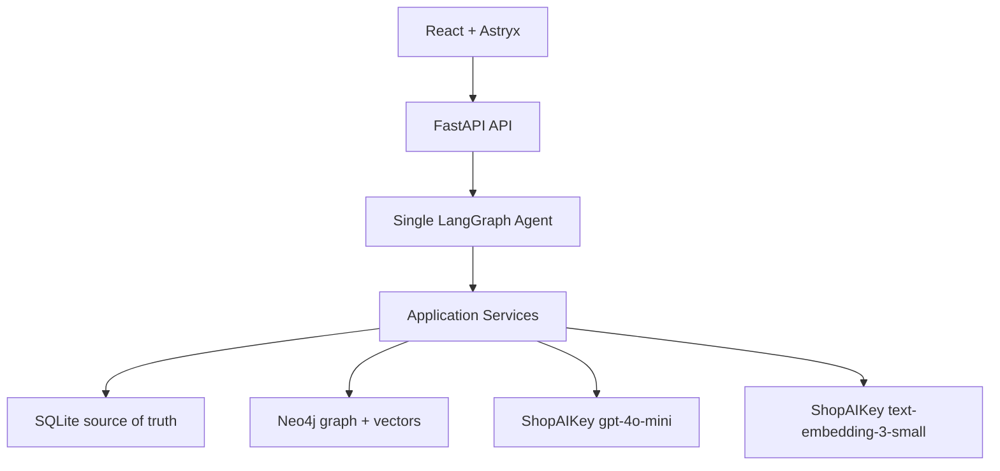
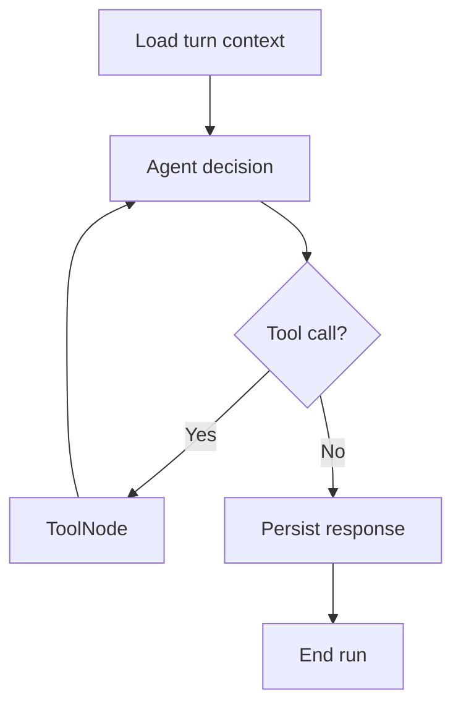

# JobAgent Master Plan

**Version:** 2.2
**Date:** 2026-07-22
**Status:** Amended for Plan 16 profession-neutral semantic skill labels, verbatim source evidence, and the selected-JD compatibility map
**Project type:** Single-user, local-first AI/NLP portfolio project

---

## 1. Project Objective

JobAgent is a chat-first job matching assistant. The user primarily works through a ChatGPT-like conversation instead of editing complex forms or dashboards.

The system must let the user:

1. Chat naturally with the LLM about greetings, general questions, or job-related topics.
2. Upload a PDF CV from the sidebar or attach it in chat.
3. Let the Agent call tools to parse, extract, normalize, and stage a Candidate Profile.
4. Review the extracted profile inside chat and choose **Save Profile** or **Request Changes**.
5. Send a public JD URL or paste JD text.
6. Let the Agent save every accepted JD input, extract structured fields, normalize skills, and synchronize derived graph data.
7. Rank saved jobs against the active profile.
8. Explain semantic similarity, matched/related/missing skills, and the simple seniority, experience, location, and work-mode components.
9. Persist chat history while keeping structured long-term memory focused on the active profile, preferences, corrections, and saved jobs.
10. Manage retained CVs, reprocess and approve an archived CV as the active source, and delete non-active CVs with their owned data.
11. Preserve every detected CV section in a document-first extraction, including headings such as Certifications, Projects, Awards, or Publications that are not fields in the Candidate Profile schema.
12. Let the Agent inspect only the active CV through bounded, explicit retrieval instead of injecting the whole document into every prompt.
13. Keep a compact saved-JD library with detail, explicit evaluation, and complete deletion actions in the existing sidebar.
14. Persist at most one evaluation for the same JD and active CV/profile/preferences/scoring revision, mark older results as **Cần đánh giá lại**, and recompute only after an explicit user action.
15. Render Agent answers as readable, conclusion-first Markdown and show an exact active-CV source dialog only when durable `read_active_cv` evidence exists.
16. Recognize a passively pasted raw JD, show a concise preview, and require an explicit **Save JD** or **Not save** decision before any persistence, extraction, embedding, evaluation, or graph mutation.
17. Validate extracted JD facts against their retained source, keep skill labels atomic, render the complete existing extraction contract, and let the user safely re-extract a retained JD without changing its identity or automatically evaluating it.
18. Extract, normalize, match, synchronize, and display source-grounded skills from any profession without requiring profession-specific code, frontend dictionaries, or seed-taxonomy expansion.
19. Show a non-technical compatibility map for the active CV and one selected saved JD, while retaining the existing bounded Neo4j snapshot as an explicit technical view.

The goal is to demonstrate practical AI/NLP engineering through structured extraction, multilingual embeddings, entity normalization, a knowledge graph, tool calling, human approval, transparent matching, and failure handling.

### Complexity guardrail

> JobAgent must not become too complex for an AI/NLP Engineer Intern portfolio project.

Every new dependency or feature must satisfy at least one of these conditions:

- It is required for a locked user flow.
- It clearly improves a locked user flow.
- It removes a known reliability risk in the locked demo flow.

Otherwise, it remains outside the MVP.

---

## 2. Locked Product Scope

### 2.1 In scope

- Single user.
- No authentication.
- One persistent application conversation.
- Natural general conversation without requiring a job-related intent.
- React chat-first interface using Astryx.
- Upload one active PDF CV and retain multiple archived PDF CVs.
- CV Manager actions to reprocess an archived CV for approval, activate only the approved result, and delete a non-active CV with its owned records.
- Document-first extraction that retains ordered known and unknown sections before deriving the canonical Candidate Profile.
- Domain-neutral Candidate skill projection from the complete validated CV document, including explicit capabilities mentioned outside a dedicated Skills section.
- Bounded Agent retrieval of the active CV by outline, section, search, or chunk.
- Read-only history of Agent runs for the single local user.
- Candidate Profile draft and approval flow.
- Structured long-term memory for profile corrections and job preferences.
- Manual JD input through public URL or raw text.
- Conditional in-chat confirmation for passively pasted raw JD text before the input becomes an accepted Job.
- JD persistence, quality classification, duplicate handling, and extraction.
- Deterministic source-grounding, atomic-skill, duplicate, and required/preferred-group guards inside the existing single-pass JD extraction contract.
- A compact saved-JD sidebar tab with detail, explicit evaluate/re-evaluate, and complete delete actions.
- Explicit in-place re-extraction of one retained JD with compare-and-swap replacement, pre-commit preservation, stale evaluation projection, and rebuild guidance after post-commit graph failure.
- Revision-keyed persisted JD evaluations that are reused for the same current context and become visibly stale after CV, profile, preference, or scoring-contract changes.
- Vietnamese and English CV/JD content.
- JD inputs from any job family, not only AI/NLP roles.
- Deterministic atomic-skill normalization in which unknown skills are first-class and the small seed taxonomy is optional alias/relationship knowledge, never an extraction whitelist or parser.
- A selected-saved-JD compatibility read model with backend-owned direct/related/missing/additional classifications, source evidence, cross-store integrity checks, and user-facing display labels.
- Neo4j skill graph and Neo4j vector search.
- Transparent hybrid scoring.
- Skill-gap and score-breakdown explanation.
- Visible tool activity in chat.
- Readable assistant-only Markdown plus evidence-backed active-CV source citations/dialogs.
- Local Docker Compose deployment.
- Local automated tests and a manual demo checklist.

### 2.2 Explicitly out of scope

- Multi-user accounts, login, roles, and permissions.
- Multiple conversations.
- Direct profile rollback or activation without reprocessing and explicit approval.
- Editing archived CV content in place.
- Injecting an entire CV or all retained documents into every Agent prompt.
- DOCX, image CVs, or OCR.
- Automatic job discovery or crawling.
- Authenticated, paywalled, cookie-dependent, or JavaScript-only job pages.
- LinkedIn/Facebook browser automation.
- Auto-apply.
- Application tracking.
- Cover-letter generation.
- Interview preparation.
- Public cloud deployment.
- Qdrant.
- Jina or ShopAIKey reranking in the MVP.
- Redis, Celery, Kafka, or a separate worker service.
- Multiple agents or agent handoffs.
- 64K conversation memory injection.
- LangSmith cloud dependency.
- GitHub Actions or other CI workflows.
- General-purpose external tools or long-term structured memory for unrelated conversation.
- New JD fields for education, benefits, languages, compensation, employment type, hiring stages, or a generic JD document/section model.
- Model comparison or upgrade, broad taxonomy expansion, blind delimiter-based skill splitting, or score-weight changes for JD extraction repair.
- Automatic or bulk JD re-extraction, background extraction migration, and automatic evaluation after re-extraction.

---

## 3. Locked Technology Stack

| Layer | Technology | Purpose |
|---|---|---|
| Frontend | React + TypeScript + Vite | Chat-first web client |
| Design system | Astryx + neutral theme | App shell, chat, tool calls, buttons, feedback states |
| Backend | Python + FastAPI | REST, file upload, SSE, application services |
| Validation | Pydantic v2 | Tool and extraction contracts |
| Agent orchestration | LangGraph | One controlled tool loop with interrupt/resume |
| LLM adapter | `langchain-openai` `ChatOpenAI` | OpenAI-format tool calling through ShopAIKey |
| LLM provider | ShopAIKey | OpenAI-compatible API |
| LLM model | `gpt-4o-mini` | Tool choice and structured extraction |
| Relational data | SQLite + SQLAlchemy 2 + aiosqlite | Source of truth |
| Migrations | Alembic | SQLite schema management |
| Graph/vector data | Neo4j Community | Derived skill graph and job vector index |
| Embeddings | ShopAIKey `text-embedding-3-small` (1536 dimensions) | OpenAI-compatible hosted embeddings |
| PDF parser baseline | pypdf | Digitally born PDF text extraction |
| Web extraction | Trafilatura | Public HTML main-text extraction |
| HTTP client | httpx | Controlled URL download and ShopAIKey connectivity checks |
| Local deployment | Docker Compose | Frontend, backend, Neo4j, and persistent volumes |

The exact dependency versions are pinned after Phase 0 compatibility checks. FastAPI must be at least `0.135.0` to use its native SSE response support.

---

## 4. High-Level Architecture



### 4.1 Ownership rules

- SQLite owns raw inputs, application state, conversation state, tool logs, and structured canonical records.
- Neo4j is a rebuildable derived index.
- Uploaded PDF bytes live in a persistent Docker volume, not in SQLite blobs.
- The frontend never accesses SQLite, Neo4j, or ShopAIKey directly.
- LangGraph tools call Python application services directly; they do not make HTTP calls back into FastAPI.

---

## 5. Repository Structure

```text
JobAgent/
├── frontend/
│   ├── src/
│   │   ├── app/
│   │   ├── components/
│   │   ├── features/chat/
│   │   ├── features/profile/
│   │   ├── features/jobs/
│   │   ├── lib/api/
│   │   ├── lib/sse/
│   │   ├── test/
│   │   └── main.tsx
│   ├── package.json
│   ├── package-lock.json
│   ├── tsconfig.json
│   └── vite.config.ts
│
├── backend/
│   ├── app/
│   │   ├── api/
│   │   ├── agent/
│   │   ├── tools/
│   │   ├── services/
│   │   ├── repositories/
│   │   ├── db/
│   │   ├── graph/
│   │   ├── schemas/
│   │   └── main.py
│   ├── migrations/
│   ├── tests/
│   ├── pyproject.toml
│   └── alembic.ini
│
├── infrastructure/
│   ├── docker-compose.yml
│   ├── docker/
│   │   ├── backend.Dockerfile
│   │   └── frontend.Dockerfile
│   ├── neo4j/
│   └── scripts/
│
├── .env
├── .env.example
├── .gitignore
├── README.md
└── docs/
    └── plans/
        └── Master_plan.md
```

The three runtime folders are `frontend`, `backend`, and `infrastructure`; `docs` contains planning and project documentation only. Root files hold project-wide configuration. Automated-test fixtures live under `backend/tests/fixtures/` and use synthetic data. Runtime CV/JD files use Docker volumes and are not stored in the repository.

---

## 6. SQLite Database Contract

### 6.1 Global conventions

- Use one SQLite file at `SQLITE_PATH` through SQLAlchemy 2 async sessions and `aiosqlite`.
- Alembic owns every application table, constraint, and index listed in this section. LangGraph owns only its package-created checkpoint tables.
- Enable `PRAGMA foreign_keys=ON`, `PRAGMA journal_mode=WAL`, and `PRAGMA busy_timeout=5000` on application connections.
- Non-singleton entity IDs are lowercase UUID v4 strings stored as `TEXT`.
- Fixed singleton IDs are `candidate_profile.id='active'`, `profile_drafts.id='current'`, `job_preferences.id='active'`, and `conversation.id='main'`.
- Store timestamps as timezone-aware UTC `DATETIME` values. Every application table has `created_at` and `updated_at`; the application, not a database trigger, updates them.
- SQLAlchemy `JSON` values are stored as SQLite text and must pass the corresponding Pydantic model before every write. Do not query inside JSON documents in the MVP.
- Store enums as `TEXT` with named `CHECK` constraints. Store booleans as SQLite `INTEGER` through SQLAlchemy `Boolean`.
- Use constraint names `pk_<table>`, `fk_<table>__<column>`, `uq_<table>__<columns>`, `ck_<table>__<rule>`, and index names `ix_<table>__<columns>`.
- Enforce static enums, scalar ranges, singleton IDs, and simple null-coupling rules with named `CHECK` constraints. Pydantic/application services enforce JSON shape, finite embedding values, configuration-dependent limits, and cross-row invariants.
- Do not add generic soft-delete columns, audit-history tables, database triggers, or generic key-value storage. The attachment `deleting` lifecycle state is allowed only for retryable cross-store CV deletion.
- Never hold a SQLite transaction open while calling ShopAIKey, reading a remote URL, writing Neo4j, or streaming an SSE response.

### 6.2 Application table schemas

#### `attachments`

| Column | SQLite type | Null | Rules |
|---|---|---:|---|
| `id` | `TEXT` | No | UUID v4 primary key |
| `file_hash` | `TEXT` | No | SHA-256; unique |
| `original_name` | `TEXT` | No | Display filename |
| `mime_type` | `TEXT` | No | Must equal `application/pdf` |
| `size_bytes` | `INTEGER` | No | `> 0` |
| `page_count` | `INTEGER` | Yes | `> 0` after parsing; service enforces `MAX_PDF_PAGES` |
| `storage_path` | `TEXT` | No | Unique path relative to `FILES_DIR` |
| `state` | `TEXT` | No | `staged | active | archived | failed | deleting`; defaults to `staged` |
| `failure_code` | `TEXT` | Yes | Stable application error code |
| `created_at`, `updated_at` | `DATETIME` | No | UTC |

Add `uq_attachments__file_hash`, `uq_attachments__storage_path`, and partial unique index `uq_attachments__single_active` on `state` where `state='active'`.

`failure_code` is required only for `state='failed'`. An active attachment must have a non-null `page_count`. Attachment/profile cross-row state is validated at the final Section 6.4 transaction boundary, not by a database `CHECK`.

Allowed transitions are `staged → active`, `staged → failed`, `failed → staged` for an explicit same-file retry, `active → archived` after an approved replacement, `archived → active` only inside approval of a freshly reprocessed archived CV, and `archived | failed | staged → deleting` for explicit deletion. Exactly one row may be active. Archived rows cannot be edited in place; they may be reprocessed into a new draft or deleted. The active row cannot enter `deleting`. If a retained file is missing from local storage, its metadata remains selectable for deletion but reprocessing/file streaming reports `CV_FILE_UNAVAILABLE`.

The unique hash rule remains global. Uploading a hash already held by an archived row returns `ARCHIVED_ATTACHMENT_EXISTS` with that row's safe metadata and points the user to CV Manager. Reprocessing that existing row is an explicit action and never creates a duplicate attachment. A successfully deleted row releases its hash for a future upload.

#### `attachment_text_chunks`

| Column | SQLite type | Null | Rules |
|---|---|---:|---|
| `id` | `TEXT` | No | UUID v4 primary key |
| `attachment_id` | `TEXT` | No | FK to `attachments.id`; `ON DELETE CASCADE` |
| `ordinal` | `INTEGER` | No | Zero-based deterministic source order |
| `text` | `TEXT` | No | Parsed CV text segment sent to the profile-extraction boundary |
| `preview` | `TEXT` | No | Fixed bounded projection of `text` for list responses |
| `char_count` | `INTEGER` | No | `> 0` |
| `token_estimate` | `INTEGER` | No | Deterministic local estimate; not provider usage |
| `created_at` | `DATETIME` | No | UTC |

Add `uq_attachment_text_chunks__attachment_ordinal` on `(attachment_id, ordinal)`.
Chunk rows are the complete ordered local text source for document extraction and bounded Agent reads. The deterministic chunker emits non-empty `text` values in ascending `ordinal`; document extraction must cover the full sequence, but may send bounded batches and a final consolidation request instead of one unbounded prompt. Reprocessing replaces a CV's chunk set only after parsing succeeds. Rows remain read only between reprocessing attempts and cascade only when their non-active attachment is deleted.

#### `cv_documents`

| Column | SQLite type | Null | Rules |
|---|---|---:|---|
| `attachment_id` | `TEXT` | No | Primary key and FK to `attachments.id`; `ON DELETE CASCADE` |
| `document_json` | `JSON` | No | Validated `CVDocument`; complete ordered heading/section/entry extraction |
| `profile_json` | `JSON` | No | Validated `CandidateProfile` projection derived only from `document_json` |
| `outline_json` | `JSON` | No | Bounded section IDs, headings, kinds, entry counts, and source chunk ranges |
| `extraction_version` | `TEXT` | No | Versioned document-first extractor contract |
| `source_hash` | `TEXT` | No | SHA-256 of the canonical ordered chunk text |
| `created_at`, `updated_at` | `DATETIME` | No | UTC |

`document_json` is the latest approved per-CV structured source of truth. It preserves every detected section and entry, including unknown headings, without adding a database column or Candidate Profile field. `profile_json` and `outline_json` are deterministic validated projections of that document, not independent extraction inputs. Reprocessing never overwrites this approved row before approval.

#### `cv_document_drafts`

| Column | SQLite type | Null | Rules |
|---|---|---:|---|
| `attachment_id` | `TEXT` | No | Primary key and FK to `attachments.id`; `ON DELETE CASCADE` |
| `document_json` | `JSON` | No | Validated pending `CVDocument` |
| `profile_json` | `JSON` | No | Candidate projection derived from the pending document |
| `outline_json` | `JSON` | No | Bounded pending outline |
| `extraction_version` | `TEXT` | No | Versioned extractor contract |
| `source_hash` | `TEXT` | No | SHA-256 of pending canonical chunk text |
| `created_at`, `updated_at` | `DATETIME` | No | UTC |

There is at most one document draft for the singleton profile draft. It may belong to a staged, archived, or active attachment explicitly reprocessed through CV Manager. Approval upserts its values into `cv_documents` and deletes it; request changes preserves it. The previously approved `cv_documents` row and active profile remain unchanged while the draft is pending.

#### `candidate_profile`

| Column | SQLite type | Null | Rules |
|---|---|---:|---|
| `id` | `TEXT` | No | Primary key; `CHECK (id='active')` |
| `active_attachment_id` | `TEXT` | No | Unique FK to `attachments.id`; `ON DELETE RESTRICT` |
| `profile_json` | `JSON` | No | Validated `CandidateProfile` |
| `created_at`, `updated_at` | `DATETIME` | No | UTC |

The table contains zero or one row. It is the current active projection and points to the approved per-CV document. Historical approved content lives only with each retained `cv_documents` row; there is no independently editable profile-history table.

Outside the approved-replacement transaction, the service verifies that `active_attachment_id` references an active attachment. During replacement it may temporarily reference the validated staged attachment, but the transaction must end with exactly one active attachment and the profile pointing to it.

#### `profile_drafts`

| Column | SQLite type | Null | Rules |
|---|---|---:|---|
| `id` | `TEXT` | No | Primary key; `CHECK (id='current')` |
| `source_attachment_id` | `TEXT` | Yes | Unique FK to `attachments.id`; `ON DELETE CASCADE`; null for profile/preference-only updates |
| `draft_json` | `JSON` | No | Validated profile/preferences proposal |
| `created_at`, `updated_at` | `DATETIME` | No | UTC |

The table contains zero or one row. Draft existence means approval is pending or the user is preparing a correction. Request Changes leaves the row intact; the next correction updates it. Successful Save Profile deletes it. Do not add a draft-history or draft-status table.

When `source_attachment_id` is non-null, the service verifies that it references a `staged`, `archived`, or explicitly reprocessed `active` attachment with a validated `cv_document_drafts` row.

#### `job_preferences`

| Column | SQLite type | Null | Rules |
|---|---|---:|---|
| `id` | `TEXT` | No | Primary key; `CHECK (id='active')` |
| `preferences_json` | `JSON` | No | Validated `JobPreferences`; defaults to four empty lists |
| `created_at`, `updated_at` | `DATETIME` | No | UTC |

The table contains exactly one row after application initialization.

#### `job_posts`

| Column | SQLite type | Null | Rules |
|---|---|---:|---|
| `id` | `TEXT` | No | UUID v4 primary key |
| `source_type` | `TEXT` | No | `url | text` |
| `source_url` | `TEXT` | Yes | Original URL; required only when `source_type='url'` |
| `raw_content` | `TEXT` | Yes | Pasted or fetched JD text; null only while a URL fetch is pending or failed |
| `raw_content_hash` | `TEXT` | Yes | SHA-256 unique exact-dedup key when content exists |
| `extraction_json` | `JSON` | Yes | Validated `JobPostExtraction` after success |
| `processing_status` | `TEXT` | No | `received | processing | processed | failed`; defaults to `received` |
| `jd_quality` | `TEXT` | Yes | `full | partial | unscorable` after extraction |
| `failure_code` | `TEXT` | Yes | Stable application error code |
| `embedding_json` | `JSON` | Yes | Finite floats for scorable jobs |
| `embedding_model` | `TEXT` | Yes | Must match configured model when embedding exists |
| `embedding_dimensions` | `INTEGER` | Yes | `> 0`; service enforces configured dimensions |
| `created_at`, `updated_at` | `DATETIME` | No | UTC |

Constraints:

- URL records require `source_url`; text records require non-null `raw_content` and null `source_url`.
- `raw_content_hash` is non-null exactly when `raw_content` is non-null.
- `processing_status='processed'` requires non-null `extraction_json` and `jd_quality`; `failure_code` is non-null exactly when `processing_status='failed'`.
- `embedding_json`, `embedding_model`, and `embedding_dimensions` are either all null or all non-null.
- Embeddings are permitted and required only for processed `full` or `partial` jobs; every other status/quality combination requires all three embedding fields to be null.
- The service validates that `embedding_json` contains exactly `EMBEDDING_DIMENSIONS` finite floats.
- Add `uq_job_posts__raw_content_hash` and `ix_job_posts__processing_quality` on `(processing_status, jd_quality)`.
- Do not persist transient top-N query pages or retrieval rankings. The dedicated `job_evaluations` table below is the only persisted score/explanation record and is keyed to an exact evaluation context.

A scorable Job is exactly a row with `processing_status='processed'`, `jd_quality in ('full', 'partial')`, and embedding model/dimensions matching the locked runtime configuration; the database rules above guarantee that its embedding fields are present.

Ordinary ingestion transitions are `received → processing → processed | failed`, `received → failed` for fetch failure, and `failed → processing` only when the user resubmits the same content. An explicit retained-JD re-extraction does not move the durable row into `processing`: it stages extraction and embedding outside a transaction, then compare-and-swap replaces only the processing result fields when the captured `updated_at` still matches and the new quality is `full` or `partial`. This permits failed, unscorable, partial, or full rows to become a new processed/scorable revision while preserving Job identity, source metadata, raw content/hash, and the current durable result on every pre-commit failure. A temporary URL placeholder may be deleted after its fetched hash selects an existing Job.

#### `job_evaluations`

| Column | SQLite type | Null | Rules |
|---|---|---:|---|
| `id` | `TEXT` | No | UUID v4 primary key |
| `job_id` | `TEXT` | No | FK to `job_posts.id`; `ON DELETE CASCADE` |
| `active_attachment_id` | `TEXT` | No | FK to `attachments.id`; `ON DELETE CASCADE` |
| `evaluation_context_hash` | `TEXT` | No | SHA-256 of the canonical revision tuple below |
| `job_revision` | `DATETIME` | No | `job_posts.updated_at` used for this evaluation |
| `profile_revision` | `DATETIME` | No | `candidate_profile.updated_at` used for this evaluation |
| `preferences_revision` | `DATETIME` | No | `job_preferences.updated_at` used for this evaluation |
| `cv_source_hash` | `TEXT` | No | Approved `cv_documents.source_hash` used for this evaluation |
| `matching_contract_version` | `TEXT` | No | Version of candidate/job representation, scoring, and explanation contract |
| `result_json` | `JSON` | No | Validated compact `MatchResult` for exactly this Job and context |
| `created_at`, `updated_at` | `DATETIME` | No | UTC |

Add `uq_job_evaluations__job_context` on `(job_id, evaluation_context_hash)` and `ix_job_evaluations__job_created_at` on `(job_id, created_at)`.

Build `evaluation_context_hash` from canonical sorted JSON containing `job_id`, `job_posts.updated_at`, active attachment ID, approved CV source hash, `candidate_profile.updated_at`, `job_preferences.updated_at`, and `matching_contract_version`, then SHA-256 that byte representation. The service computes this tuple from SQLite; clients never provide revision fields or hashes. A row is **current** only when its hash equals the hash derived from the current approved context. Older rows are **stale** and render as **Cần đánh giá lại**; changing the active CV, approved profile, preferences, Job revision, or matching contract does not rewrite historical rows or trigger evaluation automatically.

Evaluation is explicit and idempotent. For the same `(job_id, evaluation_context_hash)`, return the existing validated row without calling ShopAIKey, Neo4j scoring, or the explanation pipeline again. For a new context, run the existing consistency, exact-Job semantic/skill scoring, and deterministic explanation owners outside a transaction, then insert once in a short transaction; a uniqueness race reloads the winner. Store no raw CV, raw JD, embedding, prompt, or provider response in `result_json`.

Deleting a Job cascades every evaluation for that Job. Deleting a non-active CV cascades evaluations derived from that attachment, consistent with complete CV-owned-data deletion; shared Jobs remain and show no/current-stale evaluation as applicable.

#### `conversation`

| Column | SQLite type | Null | Rules |
|---|---|---:|---|
| `id` | `TEXT` | No | Primary key; `CHECK (id='main')` |
| `created_at`, `updated_at` | `DATETIME` | No | UTC |

The table contains exactly one row after application initialization.

#### `chat_messages`

| Column | SQLite type | Null | Rules |
|---|---|---:|---|
| `id` | `TEXT` | No | UUID v4 primary key |
| `conversation_id` | `TEXT` | No | FK to `conversation.id`; `ON DELETE CASCADE` |
| `role` | `TEXT` | No | `user | assistant | system` |
| `content` | `TEXT` | No | May be empty only when `structured_payload` is present |
| `structured_payload` | `JSON` | Yes | Profile/JD confirmation card or match card payload |
| `source_attachment_id` | `TEXT` | Yes | FK to `attachments.id`; `ON DELETE SET NULL`; set on CV extraction/approval messages |
| `redacted_at` | `DATETIME` | Yes | Set only when CV deletion replaces content with the fixed deleted-CV marker |
| `created_at`, `updated_at` | `DATETIME` | No | UTC |

Add `ix_chat_messages__conversation_created_at` on `(conversation_id, created_at, id)` for deterministic history pagination.

Every message whose text or structured payload identifies or summarizes a CV must carry `source_attachment_id`. Deleting that CV replaces `content` with the locale-neutral marker `[CV deleted]`, clears `structured_payload`, sets `redacted_at`, and then allows the FK to become null. Unrelated conversation messages remain unchanged.

#### `agent_runs`

| Column | SQLite type | Null | Rules |
|---|---|---:|---|
| `id` | `TEXT` | No | UUID v4 primary key; also used as LangGraph `thread_id` |
| `user_message_id` | `TEXT` | No | Unique FK to `chat_messages.id`; `ON DELETE CASCADE` |
| `source_attachment_id` | `TEXT` | Yes | FK to `attachments.id`; `ON DELETE CASCADE`; set for CV extraction/reprocessing runs |
| `state` | `TEXT` | No | `running | interrupted | completed | failed`; defaults to `running` |
| `pending_approval_json` | `JSON` | Yes | Present only while `state='interrupted'` |
| `error_code` | `TEXT` | Yes | Stable application error code |
| `completed_at` | `DATETIME` | Yes | Set for completed or failed runs |
| `created_at`, `updated_at` | `DATETIME` | No | UTC |

Add `uq_agent_runs__user_message_id` and `ix_agent_runs__state`.

Deleting a non-active CV removes its CV-scoped Agent runs and cascades their tool executions after associated chat messages have been redacted. The checkpoint service deletes each matching LangGraph checkpoint before the final attachment row is removed. Runs not scoped to that attachment are preserved.

`pending_approval_json` is non-null exactly when `state='interrupted'`. It may contain a compact profile-commit or pasted-JD-save confirmation projection, never a raw CV/JD body. `completed_at` is non-null exactly when `state in ('completed', 'failed')`.

#### `tool_executions`

| Column | SQLite type | Null | Rules |
|---|---|---:|---|
| `id` | `TEXT` | No | UUID v4 primary key |
| `run_id` | `TEXT` | No | FK to `agent_runs.id`; `ON DELETE CASCADE` |
| `source_attachment_id` | `TEXT` | Yes | FK to `attachments.id`; `ON DELETE CASCADE`; required for CV extraction/read tools |
| `tool_call_id` | `TEXT` | No | Provider/tool-loop identifier |
| `tool_name` | `TEXT` | No | One of the registered JobAgent tool names |
| `arguments_summary_json` | `JSON` | Yes | Short non-document argument summary |
| `status` | `TEXT` | No | `pending | running | completed | failed`; defaults to `pending` |
| `duration_ms` | `INTEGER` | Yes | `>= 0` for a terminal execution |
| `error_code` | `TEXT` | Yes | Stable application error code |
| `result_json` | `JSON` | Yes | Validated `ToolResult` reused for idempotent replay |
| `created_at`, `updated_at` | `DATETIME` | No | UTC |

Add `uq_tool_executions__run_tool_call` on `(run_id, tool_call_id)` and `ix_tool_executions__run_status` on `(run_id, status)`.

`duration_ms` and `result_json` are required for completed or failed executions. `error_code` is required only for failed executions. A repeated `(run_id, tool_call_id)` returns the stored result instead of repeating a side effect; do not add a second idempotency-key mechanism. An interrupted `save_job` confirmation keeps the same execution at `running`, exactly like the guarded profile commit.

Allowed transitions are `pending → running → completed | failed`. An interrupted approval keeps its existing tool execution at `running`; it does not create a second execution row.

`tool_executions` is the only durable tool-status and tool-result record. Do not copy tool results into `chat_messages`. Provider `ToolMessage` objects live only in the active LangGraph state/checkpoint. Chat-history responses attach tool activity to the initiating user turn by joining `agent_runs.user_message_id` to `tool_executions`.

CV tools set `source_attachment_id` before persisting arguments/results. If a final assistant message uses any CV tool result, the runner also sets that message's `source_attachment_id`, so later deletion removes the tool record and redacts every durable CV-derived message even when the containing run was not an extraction run.

### 6.3 Foreign-key and deletion rules

| Parent | Child FK | On delete | Reason |
|---|---|---|---|
| `attachments` | `candidate_profile.active_attachment_id` | `RESTRICT` | Never delete the active CV metadata |
| `attachments` | `attachment_text_chunks.attachment_id` | `CASCADE` | Delete text owned by an explicitly deleted non-active CV |
| `attachments` | `cv_documents.attachment_id` | `CASCADE` | Delete document/profile projections owned by that CV |
| `attachments` | `cv_document_drafts.attachment_id` | `CASCADE` | Delete pending document extraction owned by that CV |
| `attachments` | `profile_drafts.source_attachment_id` | `CASCADE` | Removing a staged upload removes a CV-backed draft; null is allowed for text-only updates |
| `attachments` | `chat_messages.source_attachment_id` | `SET NULL` | Preserve only the fixed redacted chat marker after CV deletion |
| `attachments` | `agent_runs.source_attachment_id` | `CASCADE` | CV-scoped runs and their tool records are deleted with the CV |
| `attachments` | `tool_executions.source_attachment_id` | `CASCADE` | Delete bounded CV excerpts/results even when the parent run is otherwise unrelated |
| `attachments` | `job_evaluations.active_attachment_id` | `CASCADE` | Delete persisted results derived from an explicitly deleted non-active CV |
| `job_posts` | `job_evaluations.job_id` | `CASCADE` | Complete Job deletion removes all persisted evaluations |
| `conversation` | `chat_messages.conversation_id` | `CASCADE` | Test cleanup may remove the complete conversation |
| `chat_messages` | `agent_runs.user_message_id` | `CASCADE` | A run cannot exist without its initiating turn |
| `agent_runs` | `tool_executions.run_id` | `CASCADE` | Tool logs belong to one run |

Application startup inserts missing singleton rows for `conversation('main')` and `job_preferences('active')` in one idempotent transaction. The empty preferences document contains `target_roles`, `preferred_locations`, `acceptable_work_modes`, and `target_seniority` as empty lists. `candidate_profile('active')` is created only after the first approved CV.

### 6.4 Transaction boundaries

- **CV upload:** write the PDF once to its UUID-based path under `FILES_DIR`, then create the staged `attachments` row. Approval changes database state; it does not move the file again.
- **Document extraction/reprocessing:** parse and chunk outside a transaction, extract every bounded batch into ordered `CVSection`/`CVEntry` data, run one consolidation pass for section continuity and omissions, derive `CandidateProfile` only from the validated complete `CVDocument`, then atomically replace the attachment's chunks and `cv_document_drafts` row and upsert `profile_drafts('current')`. A failed attempt leaves the current chunks, approved document, and active profile intact.
- **Profile approval:** validate the profile/document drafts, their staged/archived/active attachment, stored file, source hash, and derived profile before opening the transaction. In one SQLite transaction, archive the previous active attachment only when selecting a different CV, mark the selected attachment active, upsert its `cv_documents` row from `cv_document_drafts`, upsert `candidate_profile('active')`, update preferences when changed, delete both draft rows, and verify one active attachment/document/profile before commit. Re-extracting the current active CV changes no attachment state. Direct active-CV Neo4j synchronization occurs after commit.
- **CV deletion:** reject the active attachment. Mark an eligible attachment `deleting`, redact its linked chat messages, and clear any draft in a short transaction; delete matching checkpoints, its retained file, and only its CV-owned Neo4j subgraph with idempotent operations; then delete CV-scoped runs plus every directly CV-owned tool execution and delete the attachment in a final transaction so chunks/documents cascade. Retrying `DELETE` resumes a `deleting` row. Shared `Job`, `Skill`, seed relationships, unrelated runs/messages, and the active Candidate projection are never deleted. A partial failure keeps the row in `deleting` with a stable safe code and retry guidance; the UI must not report success until the row and file are gone and the CV subgraph delete succeeded.
- **Profile approval decision:** both profile buttons resume the interrupted run. `request_changes` completes that run without deleting the draft; the following correction belongs to a new run.
- **Pasted-JD confirmation:** a passive raw-JD paste first calls `save_job` with the durable current-message source. Validate and interrupt before any Job row, JD extraction/embedding provider call, evaluation, or graph write. The Agent's recognition decision may use its normal LLM call. `save_job` resumes the same `(run_id, tool_call_id)` and only then enters normal ingestion; `cancel_save_job` completes with `committed=false` and performs no ingestion side effect.
- **JD ingestion:** for pasted text, compute the hash before insert; for a URL, commit a `received` placeholder, fetch outside a transaction, then compute the fetched-content hash. An exact match reuses the existing row: return it immediately when it is not failed, or clear its failure fields and retry it in place when `processing_status='failed'`; delete the temporary URL placeholder in either case. If no match exists, commit the raw text/hash with `processing_status='received'`. Set the selected row to `processing` in a short transaction, perform extraction and embedding calls without an open transaction, then persist the processed or failed terminal state in another short transaction. Direct Neo4j sync runs only after a scorable terminal commit.
- **Retained-JD re-extraction:** load one Job and capture its `updated_at`; require its retained non-blank `raw_content`; then run guarded extraction, normalization, quality classification, and embedding outside a transaction without changing the row. If and only if the result is `full` or `partial`, atomically replace `processing_status`, `extraction_json`, `jd_quality`, `failure_code`, the embedding triplet, and `updated_at` where the captured revision still matches. A mismatch returns `JOB_REEXTRACT_CONFLICT`; provider, guard, normalization, quality, embedding, conflict, or SQLite failure preserves the prior Job and evaluation currentness. After commit, sync the same Job ID to Neo4j. A graph failure keeps the new SQLite truth, returns `NEO4J_SYNC_FAILED` plus rebuild guidance, and never rolls SQLite back. Re-extraction never changes source/raw identity and never invokes evaluation.
- **JD evaluation:** resolve the current evaluation context from SQLite. Return a current persisted evaluation before any provider or graph scoring call. Otherwise compute one exact-Job result outside a transaction and insert it in a short transaction under the unique context key; a concurrent duplicate reloads the committed row. CV/profile/preference changes only alter the derived current hash and never launch background recomputation.
- **JD deletion:** reject an unknown ID without mutation; idempotently delete only the exact Neo4j `Job.id` node and its incident Job relationships first, then delete the SQLite `job_posts` row in a short transaction so `job_evaluations` cascade. Preserve every shared `Skill` node, seed `RELATED_TO` relationship, Candidate/CV branch, and unrelated Job. Return success only after both stores confirm completion; a graph failure keeps SQLite data available for retry.
- **Chat turn:** create the user message and `agent_runs` row together. Persist tool status transitions in short transactions. Persist the final assistant message and terminal run state together.
- A failed external call updates only the relevant status and `error_code`; it does not roll back previously accepted raw input.

### 6.5 Migration and checkpoint ownership

- Alembic migrations live under `backend/migrations/` and create all application tables, named constraints, indexes, and singleton seed rows.
- Configure Alembic SQLite migrations with batch mode for future constraint or column changes.
- `alembic upgrade head` must work on an empty database and an existing initialized database.
- Normal application startup does not call `Base.metadata.create_all()`.
- `langgraph-checkpoint-sqlite` creates and manages its own checkpoint tables in the same file. Alembic must not alter or drop them.
- Tests use a temporary SQLite file and run migrations before integration cases; they do not share the developer database.

### 6.6 Neo4j identity mapping

| SQLite source | Neo4j identity |
|---|---|
| `candidate_profile.id='active'` | `Candidate.id='active'` |
| `attachments.id` with `cv_documents` | `CV.id` |
| `CVDocument.sections[*].id` scoped by attachment | `CVSection.id='<attachment_id>:<section_id>'` |
| `CVSection.entries[*].id` scoped by section | `CVEntry.id='<attachment_id>:<section_id>:<entry_id>'` |
| `job_posts.id` UUID | `Job.id` |
| Normalized skill key in JSON/seed data | `Skill.canonical_key` |

Neo4j stores no independent application IDs and never becomes the source of truth for CV documents, profile, job, conversation, or status data.

---

## 7. Pydantic Data Contracts

### 7.1 Shared skill contract

```text
SkillRef
- canonical_key: str
- display_name: str
- aliases: list[str]
- category: str | None
```

`SkillRef` contains normalized identity only. The deterministic normalizer populates aliases and category from `skills_seed.yaml`; an unresolved skill has an empty alias list and may have no category. The LLM must not invent aliases or relationships.

`canonical_key` is an opaque stable identity and `display_name` is the user-facing label. Every profession must work when none of its skills exists in `skills_seed.yaml`: an unknown atomic label is normalized deterministically, retains its source display label, can direct-match the same normalized label, and receives no automatic alias or `RELATED_TO` edge. The seed is optional curated knowledge only; backend extraction/guard logic and frontend presentation must not use seed membership to decide whether text is a skill, split grouped text, format a label, or repair a persisted assertion.

### 7.2 Candidate Profile

The extractor first produces the complete per-CV document below. It must not ask the model to emit `CandidateProfile` directly from raw chunks.

```text
CVDocument
- attachment_id: UUID
- detected_languages: list[str]
- sections: list[CVSection]
- extraction_warnings: list[str]
- extraction_confidence: float [0, 1]

CVSection
- id: str
- ordinal: int >= 0
- heading: str
- kind: summary | experience | education | skills | languages | certifications |
        projects | awards | publications | volunteering | interests | references | other
- entries: list[CVEntry]
- source_chunk_ordinals: list[int]

CVEntry
- id: str
- ordinal: int >= 0
- title: str | None
- subtitle: str | None
- date_text: str | None
- location: str | None
- body: str
- bullets: list[str]
- attributes: dict[str, str | list[str]]
- source_chunk_ordinals: list[int]
```

Section and entry IDs are deterministic within one extraction version. The original heading is always preserved. A heading unknown to the enum uses `kind='other'`; its entries and attributes are still retained, so adding a new CV section never requires a database or Candidate Profile schema change. Empty decorative headings may be omitted, but no meaningful source text may be silently dropped: content that cannot be classified belongs to an `other` section and extraction warnings identify uncertain boundaries. Attribute names are normalized display labels from that entry only, not a global schema.

`CandidateProfile` is then derived from the validated `CVDocument`. Known profile facts are projections; dynamic sections such as certifications remain in `CVDocument` and are available to Neo4j and bounded Agent retrieval even when they have no Candidate Profile field.

```text
CandidateProfile
- summary: str
- current_title: str | None
- total_experience_years: float | None
- skills: list[CandidateSkill]
- experiences: list[ExperienceItem]
- education: list[EducationItem]
- languages: list[LanguageItem]
- extraction_confidence: float
```

```text
CandidateSkill
- skill: SkillRef
- confidence: float [0, 1]
- proficiency: beginner | intermediate | advanced | unknown
- years: float | None
- source: cv | user_correction
- excluded: bool
- evidence: list[str]
```

Candidate skills are projected through one bounded internal assertion stage after `CVDocument` validation and before `CandidateProfile` persistence:

```text
ExtractedCandidateSkillAssertion (internal provider/guard contract only)
- name: str
- confidence: float [0, 1]
- proficiency: beginner | intermediate | advanced | unknown
- years: float | None
- evidence: list[str]
- source_entry_ids: list[str]
```

The stage examines all source-ordered entries from every section kind, not only `kind='skills'`. It extracts source-supported professional capabilities, tools, methods, platforms, and domain practices; a section heading, category heading, certificate title, employer, degree, achievement, or general noun phrase is not a skill by itself. Every assertion must reference existing entry IDs and every evidence snippet must occur in those entries under NFKC/whitespace/casefold comparison. The provider emits one concise semantic label for each atomic capability, supported by that verbatim evidence; the label need not repeat the source wording and must not invent an unsupported capability. The deterministic guard rejects missing entry ownership, ungrounded evidence, heading-only labels, obvious multi-skill rows, and duplicate normalized keys; it returns only bounded code/path/count issues and permits at most the existing one repair. Only accepted atomic assertions reach `SkillNormalizer` and `CandidateProfile`.

Document headings and list formatting are never parsed into skills with profession-specific dictionaries, colon-prefix recovery, or blind delimiter splitting. Matching, Candidate Neo4j synchronization, the selected-JD map, and explanations all consume the exact approved `CandidateProfile.skills` collection; no downstream owner expands or repairs it differently.

```text
ExperienceItem
- title: str
- company: str | None
- start_date_text: str | None
- end_date_text: str | present | None
- summary: str

EducationItem
- institution: str
- degree: str | None
- field: str | None
- graduation_year: int | None

LanguageItem
- name: str
- proficiency: str | None
```

Proficiency and years may be `unknown`. The model must not infer precise years without timeline evidence. GPA may be retained as an Education entry attribute without becoming a skill; certificates remain certification entries and must not be coerced into skills.

### 7.3 Job Preferences

```text
JobPreferences
- target_roles: list[str]
- preferred_locations: list[str]
- acceptable_work_modes: list[remote | hybrid | onsite]
- target_seniority: list[intern | junior | mid | senior | lead | unknown]
```

Profile facts and job preferences are separate. A CV address is not automatically a preferred work location.

```text
ProfileDraftPayload
- candidate_profile: CandidateProfile
- job_preferences: JobPreferences
```

### 7.4 Job extraction

```text
JobPostExtraction
- title: str | None
- company: str | None
- summary: str
- responsibilities: list[str]
- required_skills: list[JobSkill]
- preferred_skills: list[JobSkill]
- seniority: intern | junior | mid | senior | lead | unknown
- min_experience_years: float | None
- max_experience_years: float | None
- location: str | None
- work_mode: remote | hybrid | onsite | unknown
- extraction_confidence: float

JobSkill
- skill: SkillRef
- confidence: float [0, 1]
- evidence: list[str]
```

`JobPostExtraction` contains extracted facts only. Its field set remains unchanged for this increment. The locked structured provider remains `gpt-4o-mini`; the ingestion or re-extraction service assigns the authoritative `job_posts.jd_quality` column only after the semantic guard accepts the extraction.

All evidence snippets must be short, relevant to the associated Candidate or Job skill, and copied from the source document. The LLM must not invent evidence. JD extraction asks for professional capabilities across any occupation; it must not restrict recall to technical skills, frameworks, models, software platforms, or a seeded industry vocabulary.

Before normalization or quality classification, one pure deterministic guard compares source facts using Unicode NFKC, collapsed whitespace, and Unicode casefold without removing punctuation or transliterating text. Every non-blank skill evidence snippet and responsibility, plus every non-null title, company, and location, must occur in the normalized retained JD. Summary remains a concise synthesis; seniority, work mode, and experience bounds remain schema-constrained model facts in this phase.

Every provider skill label must name one atomic professional capability and be semantically supported by its verbatim source evidence. The provider owns semantic labeling and atomic emission; the guard never silently splits or rewrites a label. Its compound check is profession-neutral and structural: exact approved aliases remain atomic, punctuation internal to a contiguous label remains valid, and only an unambiguous enumeration of multiple non-empty skill-like labels is rejected. No code-level allowlist of technical, marketing, finance, healthcare, sales, or other profession names is permitted, and seed membership cannot turn category prefixes into skills. Unknown atomic punctuation-bearing labels remain valid. Tentatively normalized canonical keys must be unique within each group and disjoint across required/preferred groups. Mandatory or neutral requirements remain required; preferred classification requires explicit optional/preferred wording in the source.

The ordered internal guard vocabulary is exactly `EVIDENCE_NOT_IN_SOURCE`, `RESPONSIBILITY_NOT_IN_SOURCE`, `METADATA_NOT_IN_SOURCE`, `COMPOUND_SKILL_LABEL`, `DUPLICATE_SKILL`, and `SKILL_GROUP_CONFLICT`. At most 20 sanitized issues containing only code, field path, and safe structural counts may enter the existing single repair instruction. The complete raw JD remains only in the transient extraction messages; issue reports and logs contain no source/evidence values or provider payload. A second invalid result after that one repair fails safely as `INVALID_STRUCTURED_OUTPUT`; only an accepted extraction reaches `SkillNormalizer`, quality classification, embedding, persistence, graph synchronization, or scoring.

### 7.5 Tool execution result

```text
ToolResult
- ok: bool
- code: str | None
- summary: str
- data: dict[str, JSONValue] | None
```

Every terminal `tool_executions.result_json` must validate as `ToolResult`. `JSONValue` means a JSON scalar, list, or object. `ok=true` requires `code=null` and database status `completed`; `ok=false` requires a stable failure `code`, matching `error_code`, and database status `failed`. `data` uses the tool's compact output schema and may contain IDs, counts, or card payloads. The sole document-body exception is the bounded page explicitly returned by `read_active_cv`; no other tool returns raw CV/JD bodies. This same validated object is returned during idempotent replay.

### 7.6 JD quality rules

- `full`: sufficient title/description plus usable skill or responsibility evidence and most scoring fields.
- `partial`: enough content to compute at least semantic and skill signals, but one or more important fields are missing.
- `unscorable`: no meaningful job responsibilities/skills, contact-only content, or extraction contains insufficient evidence.

Do not duplicate `jd_quality` inside `extraction_json`.

### 7.7 Saved JD and evaluation views

```text
SavedJobListItem
- id, title, company, processing_status, jd_quality
- source_type, source_url, created_at, updated_at
- evaluation_state: none | current | stale
- latest_score: float | None

SavedJobDetail
- compact: SavedJobListItem
- extraction: JobPostExtraction | None
- raw_content: str | None
- latest_evaluation: JobEvaluationView | None

JobEvaluationView
- id, job_id, evaluation_state: current | stale
- evaluation_context_hash
- result: MatchResult
- created_at, updated_at

SaveAndEvaluateRequest
- source_message_id: UUID

EvaluateJobResponse
- outcome: created | reused
- job: SavedJobListItem
- evaluation: JobEvaluationView

SaveAndEvaluateResponse
- ingest_outcome: created | existing | retried
- job: SavedJobListItem
- evaluation_outcome: created | reused | unavailable
- evaluation: JobEvaluationView | None
- code: str | None

ReextractJobResponse
- outcome: updated
- job: SavedJobListItem
- sync_ok: bool
- code: null | NEO4J_SYNC_FAILED
- rebuild_instruction: str | None
```

List responses never include raw JD text, extraction evidence bodies, embeddings, prompts, or provider payloads. Detail returns the validated extraction and may return the selected persisted raw JD within the existing accepted-input size bound. `evaluation_context_hash` is opaque comparison metadata; clients cannot submit or override it. `SaveAndEvaluateRequest` names only the initiating chat message; the server loads that exact durable content, treats a sole validated public HTTP(S) URL as URL input and otherwise treats the complete bounded message as raw JD text. It never accepts a client-supplied replacement body or infers from the latest message. A persisted but failed/unscorable JD returns `evaluation_outcome='unavailable'` plus a stable safe code rather than claiming that evaluation succeeded.

Re-extraction accepts no request body containing replacement source, extraction, embedding, quality, or evaluation data. `sync_ok=true` requires null `code` and `rebuild_instruction`. A post-commit graph failure still returns HTTP 200 with `outcome='updated'`, `sync_ok=false`, `code='NEO4J_SYNC_FAILED'`, and the existing safe rebuild instruction because SQLite replacement succeeded. Every pre-commit failure uses the existing `detail={code, summary}` envelope and no response model; re-extraction adds `JOB_REEXTRACT_CONFLICT`, reuses the existing `JD_SOURCE_NOT_RECOVERABLE` with a path-appropriate safe summary, and preserves existing provider, embedding, `INVALID_STRUCTURED_OUTPUT`, `JOB_NOT_FOUND`, and `JOB_NOT_SCORABLE` codes.

---

## 8. Neo4j Derived Model

### 8.1 Nodes

```text
(:Candidate {id, source_updated_at})
(:CV {id, original_name, source_updated_at, extraction_version})
(:CVSection {id, heading, kind, ordinal, entry_count})
(:CVEntry {id, ordinal, title, subtitle, date_text, preview})
(:Job {id, title, company, location, work_mode, seniority, quality, embedding, source_updated_at})
(:Skill {canonical_key, display_name, aliases, category})
```

`CVEntry.preview` is bounded and display-safe. Full entry bodies, bullets, arbitrary attributes, chunk text, and PDF text remain in SQLite and are not copied into Neo4j.

### 8.2 Relationships

```text
(CV)-[:PROJECTS_TO]->(Candidate)
(CV)-[:HAS_SECTION]->(CVSection)
(CVSection)-[:HAS_ENTRY]->(CVEntry)
(Candidate)-[:HAS_SKILL {confidence, years, proficiency, evidence}]->(Skill)
(Job)-[:REQUIRES {confidence, evidence}]->(Skill)
(Job)-[:PREFERS {confidence, evidence}]->(Skill)
(Skill)-[:RELATED_TO {weight, source}]->(Skill)
```

### 8.3 Constraints and indexes

- Unique constraint on `Candidate.id`.
- Unique constraint on `CV.id`.
- Unique constraint on `CVSection.id`.
- Unique constraint on `CVEntry.id`.
- Unique constraint on `Job.id`.
- Unique constraint on `Skill.canonical_key`.
- Vector index on `Job.embedding` using cosine similarity.
- Vector dimension is fixed at 1536 by the locked embedding contract and must be recorded in application settings.

Changing the embedding model or dimensions is outside the MVP. It requires an explicit full re-embedding migration and vector-index rebuild; the ordinary graph rebuild command does not make this change.

### 8.4 Graph safety rules

- Alias strings are properties on the canonical `Skill`; do not create separate alias nodes in the MVP.
- A new unknown skill may be stored as a canonical `Skill`, but it receives no `RELATED_TO` edges automatically.
- Only aliases and `RELATED_TO` relationships from `skills_seed.yaml` contribute to related-skill scoring.
- An exact content match creates no new Job row or Neo4j node; the existing Job is returned or, when failed, retried in place.
- Every approved CV document is projected under its owning `CV` node with fixed allowlisted labels. The observability graph selects only the active CV branch, but archived branches remain addressable by attachment ID for idempotent deletion and rebuild.
- CV deletion matches the exact `CV.id`, deletes its owned `CVSection`/`CVEntry` nodes and connecting relationships, and never deletes shared `Skill`, `Job`, seed `RELATED_TO`, or unrelated Candidate data. The active CV is rejected before graph mutation.
- Neo4j remains fully rebuildable through one local command using SQLite records.

### 8.5 Selected-JD compatibility projection

The default non-technical graph experience is a separate bounded read model for the active Candidate and one selected saved Job. It does not expose the global seed graph and does not ask React to infer matching from relationship topology.

```text
SkillAssertionView
- canonical_key: str                  # opaque identity; hidden in normal UI
- display_name: str                   # source-context user label
- confidence: float [0, 1]
- evidence: list[str]

SkillCompatibilityItem
- match_type: direct | related | missing_required | missing_preferred | candidate_only
- requirement: required | preferred | none
- strength: 1.0 | 0.6 | 0.0
- candidate_skill: SkillAssertionView | None
- job_skill: SkillAssertionView | None
- relationship: {from_key, to_key, weight, source} | None

SelectedJobSkillMap
- status: ready | stale | unavailable
- code: str | None
- summary: str
- rebuild_instruction: str | None
- candidate: bounded active-CV/Candidate identity and display metadata | None
- job: bounded selected-Job identity/title/company/revision | None
- items: list[SkillCompatibilityItem]
- counts: backend-computed counts by match_type
- checked_at: aware UTC datetime
```

The backend builds match facts by reusing the existing deterministic skill-coverage owner over authoritative SQLite `CandidateProfile.skills` and `JobPostExtraction` skills. Direct and related winners, missing required/preferred skills, and Candidate-only skills are derived once on the server. Source-context display names and evidence stay on each Candidate/Job assertion; the shared Neo4j Skill node's last writer never chooses the UI label.

Before returning `ready`, the service runs the normal Candidate/Job revision gate and compares the selected `HAS_SKILL`, `REQUIRES`, and `PREFERS` relationship payloads against the complete expected SQLite projection, including canonical keys and allowlisted assertion properties. Missing, extra, or mismatched selected relationships return `stale` with `NEO4J_REBUILD_REQUIRED` and no partial map. Unavailable Neo4j returns `unavailable`. The check is bounded to one active Candidate and one saved Job, performs no repair, and does not replace the existing pre-match revision rule.

Only Skills connected to that Candidate or Job may appear. `RELATED_TO` is included only for a backend-selected related winner whose two endpoints are already in the map. The response contains at most 200 compatibility items; exceeding the bound fails explicitly as `SKILL_MAP_LIMIT_EXCEEDED` rather than silently omitting skills. Loading the map is read-only and never creates or refreshes a persisted evaluation.

The existing global bounded graph endpoint remains the explicit technical view. Its Skill DTO carries both opaque `canonical_key` and `display_name` (plus optional category); React displays `display_name` and reserves raw relationship codes, IDs, revisions, and canonical keys for technical mode only.

---

## 9. Skill Normalization

### 9.1 Normalization pipeline

1. Unicode normalize.
2. Trim and collapse whitespace.
3. Lowercase for canonical comparison.
4. Normalize punctuation and common separators.
5. Resolve against aliases in a small `skills_seed.yaml`.
6. If unresolved, create a deterministic canonical key without related-skill edges.

The input to this pipeline is already one guarded atomic assertion. The normalizer does not split category prefixes, delimiters, headings, or grouped values and does not expand a stored Candidate skill at matching time. Significant punctuation must be handled consistently enough that the same unknown atomic semantic label receives the same key, while the normalized provider label remains `display_name` and its source evidence remains attached.

### 9.2 Seed taxonomy

The MVP does not attempt a global job ontology. The seed contains only a small set of manually approved aliases and relationships for common skills used in the demo. It is not required for extraction, direct matching, graph selection, or display. A seed entry or alias added solely to repair one observed CV/JD is invalid unless it is independently reviewed as reusable alias/relatedness knowledge. Tests for a new profession must pass with an empty or minimal injected taxonomy rather than modifying the production seed.

### 9.3 User corrections

When the user says a skill is incorrect or excluded:

- Store the current correction in the approved Candidate Profile.
- Mark the skill source as `user_correction`.
- Do not re-add it from the same CV without a new explicit approval.
- Do not keep old profile versions.

---

## 10. CV Ingestion and Approval Flow

### 10.1 Upload

Both sidebar upload and chat attachment call the same endpoint and produce an `attachment_id`.

Validation:

- MIME must be `application/pdf`.
- Magic bytes must begin with `%PDF-`.
- Maximum size: 10 MB.
- Maximum pages: 10.

File-hash duplicate policy:

- If the hash belongs to the active attachment, return that attachment/profile and do not extract again.
- If the hash belongs to the current staged attachment, return the existing attachment/draft.
- Uploading the same file again when its attachment is `failed` is the explicit retry signal: reuse the same file/row, change it to staged, clear `failure_code`, and process it again. Do not add a retry endpoint or flag.
- If the hash belongs to an archived attachment, return `ARCHIVED_ATTACHMENT_EXISTS` and the archived metadata plus the CV Manager reprocess action. Do not duplicate it or activate it directly.
- Processing a different staged CV while a CV-backed draft exists replaces the singleton draft, removes the previous unreferenced staged row, and cleans up its file on a best-effort basis.
- A parsing or extraction failure after staging changes the attachment to `failed` with a stable `failure_code`; the stored file is retained for an explicit retry or deletion.

### 10.2 Processing

```text
attachment_id
→ file-hash duplicate check
→ pypdf layout text extraction
→ extractable-text validation and deterministic chunking
→ bounded gpt-4o-mini section/entry extraction over every ordered chunk batch
→ one document consolidation and omission audit
→ CVDocument validation, with at most one repair for each invalid model boundary
→ bounded all-section Candidate-skill assertion extraction from CVDocument entries
→ source/entry ownership, atomicity, heading-only, and duplicate guard with at most one repair
→ deterministic normalization of accepted atomic skill assertions
→ derive and validate CandidateProfile from CVDocument plus the accepted skills
→ atomically persist chunks, cv_document_drafts, and profile draft
→ LangGraph interrupt
```

If no meaningful digital text is available, return `NO_EXTRACTABLE_TEXT`. Do not add OCR fallback.

The extractable-text gate is profession- and language-neutral: after Unicode/whitespace normalization, either pypdf mode must contain at least the existing minimum number of non-whitespace characters and at least one Unicode letter or number. It must not require English identity terms, software-role titles, `skills` headings, programming languages, tools, or any other profession marker. The user explicitly chose the CV upload path; semantic CV structure is validated by the bounded document pipeline rather than a keyword allowlist. Image-only, empty, punctuation-only, and below-threshold digital text still return `NO_EXTRACTABLE_TEXT` with no OCR.

The ordered chunks own the exact document-extraction input. The service partitions them into bounded batches with explicit ordinal ranges, extracts section fragments from every batch, and performs one bounded consolidation over fragment metadata and content. It may split consolidation recursively when configured prompt limits would be exceeded, but it must preserve source order and use no unbounded prompt. A final deterministic coverage audit verifies that every source chunk is referenced by at least one section or recorded in an `other` section/warning. The Candidate-skill stage then reads bounded entry projections from every section, returns explicit source-entry ownership, and never reparses headings or delimiters locally. A failed parse, model call, repair, document validation, skill assertion/guard, profile derivation, or coverage audit publishes none of the new draft rows. Historical attachments without chunks may be deleted but cannot be reprocessed and return `CHUNKS_UNAVAILABLE`/`CV_FILE_UNAVAILABLE` as appropriate.

### 10.3 Chat approval

The assistant renders a profile summary card with Astryx `ButtonGroup`:

```text
[Save Profile] [Request Changes]
```

- Both buttons call `POST /api/chat/runs/{run_id}/resume` with exactly one action: `save_profile` or `request_changes`.
- `Save Profile` resumes the existing interrupted invocation of `commit_profile_draft`; it does not create a second commit tool call.
- `Request Changes` resumes the interrupted run with `action=request_changes`, completes that run without committing, deletes its checkpoint, and then focuses the composer. The next correction starts a new run, updates the same draft, and creates a new approval interrupt.
- The existing `commit_profile_draft` execution remains `running` while the run is interrupted. `save_profile` ends it as `completed` with `ToolResult(ok=true)` after commit. `request_changes` also ends it as `completed` with `ToolResult(ok=true, data={"committed": false})` while preserving the draft. An execution error ends it as `failed`.
- Every profile or preference change creates or updates a draft and requires approval.
- Both buttons become disabled after either accepted action. Repeating resume for a terminal run emits only the persisted terminal run state as a no-op SSE response; it does not replay text, execute the graph, or require another result column.

`agent_runs.pending_approval_json` is a UI/recovery projection containing `kind='profile_commit'`, `draft_id='current'`, and allowed actions `save_profile | request_changes`. The LangGraph checkpoint is the resumable execution state; both records are cleared when either action completes the run.

### 10.4 Approved replacement

The old active profile and CV remain usable until the new draft is approved. On approval:

1. Confirm that the staged attachment and its UUID-based file already exist.
2. Run the Section 6.4 SQLite transaction in constraint-safe order: archive the old active attachment, mark the staged or reprocessed archived attachment active, mark its document approved, repoint the profile to its derived projection, update preferences when present, and delete the draft. Before commit, verify that the selected attachment is the only active attachment and is referenced by `candidate_profile('active')`.
3. If the transaction fails, roll it back. The old profile remains active and the new attachment remains staged for retry or deletion.
4. After commit, retain the previous archived PDF, chunks, and document until an explicit CV Manager deletion.
5. Synchronize the active Candidate/Skill projection and selected CV document branch directly to Neo4j. The graph view must identify the selected active CV.

If the later Neo4j sync fails, the approved SQLite profile remains committed. Return `NEO4J_SYNC_FAILED` with the rebuild instruction instead of rolling the profile back.

### 10.5 CV Manager reprocessing and deletion

- Selecting **Make active** on an archived CV never flips state directly. It starts the same document-first extraction pipeline against that attachment's retained PDF, creates a new draft document/profile, and renders the existing approval card. The current CV remains active until **Save Profile** succeeds; **Request Changes** leaves the archived CV non-active.
- Selecting **Re-extract** on the active CV uses the same draft/approval path without changing attachment state. This is the explicit upgrade path for pre-Phase-8 CVs that have chunks/profile data but no approved `cv_documents` row.
- Only one CV-backed draft/approval may exist. Starting archived reprocessing obeys the existing `APPROVAL_ACTION_REQUIRED` lock and replaces only an un-interrupted draft through the existing draft ownership rules.
- **Delete** is available only for `archived`, `failed`, or unreferenced `staged` attachments. The active attachment returns `CV_ACTIVE_DELETE_FORBIDDEN`; deleting a CV under a pending approval cancels and removes only that CV-scoped draft/run/checkpoint after confirmation.
- The retryable Section 6.4 deletion coordinator removes the retained file, chunks, document/profile snapshot, attachment metadata, CV-owned Neo4j branch, CV-scoped runs/tools, and CV-linked chat content. The chat timeline retains only `[CV deleted]` markers. Shared Job/Skill data and unrelated conversation history are preserved.

---

## 11. JD Ingestion Flow

### 11.1 Accepted inputs

- Public HTTP/HTTPS URL.
- Raw JD text pasted into chat.

### 11.2 Pasted-text confirmation boundary

A user message that is predominantly a recognizable raw JD is not yet an accepted
Job input. The Agent uses the existing `save_job` tool with
`source='current_message'`; the tool resolves the exact initiating durable user
message from `run_id`, validates it, and interrupts before mutation. The compact
confirmation card contains only bounded best-effort title/company/skill preview
fields and text length, never the raw JD or message ID.

`save_job` resumes the same run/tool identity and accepts the message only after
**Lưu JD**. **Không lưu** (`cancel_save_job`) creates no Job row and makes no
extraction, embedding, evaluation, or Neo4j call. A sole public URL and an explicit
direct save request keep their existing direct tool path. The deterministic public
**Lưu JD & đánh giá lại** action is already explicit and does not add this
confirmation.

### 11.3 Simple URL fetching

- Allow only HTTP and HTTPS.
- Ten-second download timeout.
- Maximum response body: 5 MB.
- Allow only `text/html` and `text/plain`.
- No cookies, authentication, browser session, or JavaScript renderer.

If Trafilatura cannot obtain meaningful text, ask the user to paste the JD text.

### 11.4 Persistence-first processing

```text
accepted URL/text
→ for URL, save a source_url placeholder with processing_status=received and fetch it
→ compute and check raw_content_hash before inserting text or updating the URL placeholder
→ on an exact match, return the existing non-failed job or reuse the failed row for retry
→ delete the temporary URL placeholder when an existing row was selected
→ otherwise persist the unique pasted/fetched raw_content and hash before extraction
→ set processing_status=processing
→ one strict structured extraction with the locked provider
→ Pydantic validation plus source/atomicity/group guard and at most one sanitized repair
→ normalize skills
→ classify quality
→ persist the terminal result
→ synchronize directly to Neo4j if processed and scorable
```

The submitted URL or pasted text is retained when fetching fails. Fetched/pasted `raw_content` is retained when extraction later fails.

### 11.5 Exact duplicate policy

1. Exact `raw_content_hash` match:
   - If the existing row is not failed, return it without extraction or embedding.
   - If `processing_status='failed'`, reuse that row; clear `failure_code`, `extraction_json`, `jd_quality`, and all embedding fields; set it back to `processing`; then retry once through the normal pipeline.
   - For text, do not insert a new row. For URL, delete the received placeholder before returning or retrying the existing row.

Different content is always a new Job in the MVP. Do not add normalized-duplicate state or a `force_new` override.

### 11.6 Retained-JD re-extraction

The user may explicitly re-extract one retained failed, unscorable, partial, or full Job by ID. The server reloads its exact retained raw content and stages the same guarded extraction, deterministic normalization, quality classification, and embedding pipeline without mutating the current row or holding a transaction. A result replaces the existing processing fields only when it is `full` or `partial` and a repository compare-and-swap confirms the captured Job revision is still current.

Replacement preserves Job ID, source type/URL, raw content/hash, and original identity. A successful SQLite replacement changes `updated_at`, so existing evaluations remain stored but become stale through the existing evaluation-context derivation; it never evaluates automatically. Every pre-commit failure leaves the previous extraction and evaluation state untouched. Neo4j synchronization occurs only after the SQLite commit and uses the existing same-ID Job sync; failure returns rebuild guidance while SQLite remains authoritative.

---

## 12. Agent Architecture

### 12.1 One Agent, one controlled loop

The system uses one `StateGraph` with one LLM decision node and one `ToolNode`. It is not a multi-agent architecture.



Profile approval and passive pasted-JD save confirmation are implemented with `interrupt()` inside their guarded tool paths.

### 12.2 Per-turn runs

- The application has one persistent conversation in SQLite.
- Every user turn creates a new `agent_run_id` and LangGraph `thread_id`.
- An interrupted run uses the same ID when resumed.
- While a run is interrupted, reject a new chat turn with `APPROVAL_ACTION_REQUIRED`; the user must choose the pending profile or JD confirmation action first.
- `request_changes` completes the interrupted run without committing the draft; the correction itself is a new user turn/run.
- After a run reaches `completed` or `failed`, delete only that run's checkpoint data.
- Conversation continuity comes from application data, not permanent LangGraph checkpoints.

Allowed transitions:

```text
running → interrupted → running → completed
running → interrupted → running → failed
running → completed
running → failed
```

Entering `interrupted` stores `pending_approval_json`. Resume atomically returns the same run to `running` and clears that projection before graph execution continues. The LangGraph checkpoint is the resumable state; `agent_runs` is durable UI/recovery metadata. No guarded profile/preference or pasted-JD save side effect occurs before `interrupt()` returns an allowed action.

### 12.3 Agent state

```text
AgentState
- conversation_id
- run_id
- messages_for_this_turn
- recent_context
- candidate_context
- active_cv_context
- attachment_ids
- pending_approval
- tool_iteration_count
- error
```

Large stored PDF/JD bodies are not copied into Agent state and are referenced by IDs; the initiating chat text remains the existing current-turn message supplied to the LLM. For passive pasted-JD confirmation, the `save_job` tool call and pending projection add only `source='current_message'` plus bounded preview metadata, never a second JD-body copy, and the tool reloads the exact durable initiating message by `run_id` after confirmation. `active_cv_context` contains only active attachment ID, extraction version/source hash, and a compact section outline; it never contains section bodies or chunks.

### 12.4 Memory policy

The model receives:

- Current approved Candidate Profile.
- Current Job Preferences.
- Active CV identity and bounded outline containing section IDs/headings/kinds/entry counts.
- Current turn.
- A bounded recent message window that fits the prompt budget.

It does not receive the entire conversation, a fixed 64K-token history, full CV sections, or all chunks. Profile and preference corrections are remembered through structured state, not by relying on old chat text. When the question needs document evidence beyond the outline, the Agent calls `read_active_cv` narrowly and may paginate; it must not walk every cursor unless the user explicitly asks for a whole-document task.

General conversation remains available through persisted chat history and the bounded recent-message window. Do not add a separate memory-fact table or a general-purpose memory extraction pipeline.

### 12.5 Conversation and tool policy

The Agent may answer greetings, casual conversation, and general knowledge questions naturally through the LLM. A user message does not need to be related to jobs.

- Answer directly without tools when no JobAgent capability is needed.
- Call JobAgent tools only for CVs, Candidate Profile, job preferences, JDs, saved jobs, matching, and skill gaps.
- Do not invent or expose general-purpose tools for unrelated requests.
- Keep the response language aligned with the user's language when practical.
- When the current message is predominantly a passively pasted raw JD, call `save_job` with `source='current_message'` to show confirmation instead of claiming it was saved or invoking ingestion directly.
- Respect an explicit `không lưu`/`do not save` instruction and do not create a confirmation or mutation.
- Lead with the direct answer; simple answers need no heading, and longer answers use at most three short user-facing groups.

Example:

```text
User: Xin chào
JobAgent: Chào bạn! Bạn muốn tôi giúp gì hôm nay?
```

Do not add a separate classifier model. The LLM chooses between a direct response and the existing JobAgent tools; tool preconditions remain the deterministic boundary for writes.

A greeting or general-question turn creates user and assistant messages plus one completed `agent_run`, creates zero `tool_executions`, emits no `tool_status` or `approval_required` event, and does not mutate profile, preferences, drafts, or jobs.

### 12.6 Tool loop limits

- Maximum six tool iterations per user turn.
- No tool retry loops controlled by the LLM.
- Application services own deterministic retry behavior.
- A tool may return structured failure; the Agent must not claim success afterward.

---

## 13. Agent-Facing Tool Contracts

The Agent sees exactly seven job-specific tools. Before graph execution, the application injects compact `candidate_context` plus `active_cv_context`; raw CV text is never injected. `read_active_cv` is the only Agent-facing path to CV document bodies or raw chunks and can access only the currently active attachment.

`(run_id, tool_call_id)` is the durable identity of one tool invocation. Re-entering a terminal invocation returns its stored `result_json`; it never repeats a completed side effect. The LLM and frontend do not generate separate idempotency keys.

### 13.1 `propose_profile_from_cv`

Input: `attachment_id` and optional `reprocess=false`.

- Validates attachment ownership/state.
- For a staged attachment already referenced by `profile_drafts('current')`, returns the existing draft without processing again.
- For any other staged attachment, parses, extracts, validates, and creates a draft.
- With `reprocess=true`, an archived or active attachment selected through CV Manager re-runs document-first extraction and creates a fresh draft without changing active state.
- For the already active attachment with `reprocess=false`, returns the existing approved profile without extraction or a new draft.
- Returns either the new `draft_id` or the existing profile ID with a short summary.
- Never commits the profile.

### 13.2 `propose_profile_update`

Input: current `draft_id` or active context plus requested profile/preference changes.

- Applies changes through Pydantic validation.
- Produces a new/updated draft.
- Covers both Candidate Profile facts and Job Preferences so another tool is unnecessary.

### 13.3 `commit_profile_draft`

Input: `draft_id`.

- Write tool guarded by LangGraph interrupt approval.
- Refuses execution without valid approval state.
- Updates the active profile/preferences and replaces the CV only when the draft references a staged attachment.

### 13.4 `save_job`

Input: exactly one of public URL, explicit raw text, or
`source='current_message'`, plus optional bounded presentation-only preview fields.

- A URL or explicit direct raw-text save keeps the current persistence-first path.
- `source='current_message'` resolves the initiating durable user message
  server-side and interrupts before persistence with
  `kind='job_save_confirmation'` and actions
  `save_job | cancel_save_job`.
- The pending card may contain bounded best-effort title, company, and at most
  five skill labels. It never contains the raw JD, message ID, prompt, or
  provider data, and preview values are never canonical Job facts.
- `save_job` resumes the same invocation and then persists the accepted text
  before extraction. `cancel_save_job` completes with `committed=false` and
  performs no Job ingestion/extraction/embedding/graph side effect.
- Handles fetch, extraction, validation, exact-hash deduplication, and direct Neo4j synchronization.
- Requires confirmation only for the passive current-message source. Existing
  direct URL/text tool requests and deterministic public saved-JD actions remain
  explicit and do not add another approval.

### 13.5 `query_jobs`

Input: optional job ID, `processing_status`, `jd_quality`, and `limit` in `1..50`.

- Read-only.
- Returns compact saved-job data and processing/quality status.
- Does not return every raw JD by default.

### 13.6 `match_jobs`

Input: optional result limit in `1..10`; current approved `JobPreferences` are read from SQLite.

- Requires an active Candidate Profile.
- Runs retrieval, graph features, scoring, and explanation.
- Defaults to final top 10.

### 13.7 `read_active_cv`

Input: exactly one mode plus bounded selectors.

```text
mode: section | search | chunk
section_id: str | None
query: str | None
chunk_ordinal: int | None
cursor: opaque str | None
max_results: int = 5, range 1..10
max_chars: int = 6000, range 500..12000
```

- Resolves the active attachment server-side and rejects any caller-supplied archived/staged attachment ID; the Agent cannot read another CV through this tool.
- `section` returns ordered entries from one outline section, `search` returns bounded matching entry/chunk excerpts, and `chunk` returns one requested raw chunk page. It does not expose PDF bytes or storage paths.
- Every success returns `attachment_id`, `extraction_version`, `source_hash`, `mode`, selected records, `returned_chars`, `truncated`, and `next_cursor`. Cursors are bound to the active CV revision and mode/query; activation invalidates old cursors with `ACTIVE_CV_CHANGED`.
- The service applies both result and character caps before creating `ToolResult`. An oversized single record is safely truncated with source IDs so the Agent can request the next page or exact chunk.
- This read-only tool uses the existing tool loop and durable execution contract. It adds no second Agent, retrieval model, vector store, or automatic whole-CV preload.

### 13.8 Tool authorization matrix

| State | Write tools | Read/compute tools |
|---|---|---|
| No active profile, no draft | `propose_profile_from_cv`, `save_job` | `query_jobs` |
| Draft pending, no active profile | `propose_profile_from_cv`, `propose_profile_update`, guarded `commit_profile_draft`, `save_job` | `query_jobs` |
| Active profile, no draft | `propose_profile_from_cv`, `propose_profile_update`, `save_job` | `query_jobs`, `match_jobs`, `read_active_cv` |
| Active profile with draft pending | `propose_profile_from_cv`, `propose_profile_update`, guarded `commit_profile_draft`, `save_job` | `query_jobs`, `match_jobs`, `read_active_cv` against the approved active CV only |

---

## 14. Public FastAPI Boundary

Expose the existing chat/profile endpoints, two explicit CV Manager mutations, bounded saved-JD actions, and local observability reads.

```text
GET  /api/health

POST /api/attachments/cv
GET  /api/profile
GET  /api/profile/cv

POST   /api/cvs/{attachment_id}/reprocess
DELETE /api/cvs/{attachment_id}

GET    /api/jobs?limit=<n>&before=<opaque_cursor>
GET    /api/jobs/{job_id}
POST   /api/jobs/save-and-evaluate
POST   /api/jobs/{job_id}/evaluate
POST   /api/jobs/{job_id}/reextract
DELETE /api/jobs/{job_id}

GET  /api/chat/history?limit=50&before=<opaque_cursor>
POST /api/chat/turns
POST /api/chat/runs/{run_id}/resume

GET  /api/observability/cvs?limit=<n>&before=<opaque_cursor>
GET  /api/observability/cvs/{attachment_id}/file
GET  /api/observability/cvs/{attachment_id}/chunks?limit=<n>&before=<opaque_cursor>
GET  /api/observability/cvs/{attachment_id}/chunks/{ordinal}
GET  /api/observability/runs?limit=<n>&before=<opaque_cursor>
GET  /api/observability/skill-map?job_id=<job_uuid>
GET  /api/observability/graph
```

### 14.1 API rules

- No public profile CRUD endpoints. The only direct CV writes are the named reprocess and delete actions; approval still uses the Agent interrupt/resume contract. Saved-JD routes are the only public Job write boundary and expose only save-and-evaluate, evaluate, retained-source re-extract, and complete delete actions required by the sidebar/empty-state UX.
- Agent Job tools and public saved-JD routes are thin adapters over the same guarded JD extraction/ingestion, exact deduplication, matching/scoring, evaluation repository, graph synchronization/deletion, and safe-error services. Neither boundary duplicates business logic, and the deterministic public API does not depend on the LLM choosing or chaining `save_job → match_jobs`.
- File upload and chat messages remain separate requests.
- Sidebar upload immediately starts a chat turn containing the returned attachment ID.
- `POST /api/chat/turns` returns an SSE stream.
- Resume also returns an SSE stream.
- Chat history `limit` is `1..100`. The opaque `before` cursor encodes `(created_at, id)` from the oldest returned item. Query newest-first with `limit+1`, reverse the page for chronological output, and return `{items, next_cursor}`. A malformed cursor returns `422`.
- While a run is interrupted for approval, both a new chat turn and a new CV upload return `APPROVAL_ACTION_REQUIRED` before persisting new input. The frontend disables the composer and upload controls until either approval action completes the run.
- Observability endpoints remain read-only and cursor-bounded. CV Manager composes its list/detail views from those reads and uses only the two dedicated mutation routes. Responses expose no filesystem paths, prompts, checkpoints, stack traces, embeddings, credentials, arbitrary Cypher, or unrelated Neo4j labels.
- `POST /api/cvs/{attachment_id}/reprocess` accepts an active or archived attachment with an available retained PDF, invokes the existing proposal tool/service with `reprocess=true` in a CV-scoped run, and returns the normal SSE stream through extraction and approval interrupt. It returns `APPROVAL_ACTION_REQUIRED`, `CV_NOT_REPROCESSABLE`, `CV_FILE_UNAVAILABLE`, or `CHUNKS_UNAVAILABLE` without changing active selection when preconditions fail.
- `DELETE /api/cvs/{attachment_id}` rejects the active row with `409 CV_ACTIVE_DELETE_FORBIDDEN`, runs the retryable deletion coordinator for eligible non-active rows, and returns `204` only after SQLite metadata/owned records, retained file, and CV-owned Neo4j data are gone. A partial cleanup returns a stable safe failure with retry guidance; repeating DELETE is idempotent for `deleting` rows and returns `404 CV_ATTACHMENT_NOT_FOUND` only after completion.
- `GET /api/observability/cvs/{attachment_id}/file` validates an `active` or `archived` attachment, checks retained local-file availability, and streams only `application/pdf` with a sanitized `Content-Disposition` filename. Unknown IDs return `CV_ATTACHMENT_NOT_FOUND`; a missing retained file returns `CV_FILE_UNAVAILABLE`. Both are safe JSON errors and never reveal a storage path.
- Observability cursors have no expiry. A cursor is valid while its encoded tuple decodes and its row ordering remains queryable; malformed cursors return `422`, and a well-formed cursor past the final page returns an empty page with `next_cursor=null`.
- `GET /api/observability/graph` exposes a bounded snapshot rooted at the active CV plus Candidate/Job/Skill data and a typed unavailable or stale state. It never mutates the graph or accepts a client query. A `ready` response contains at most one active CV, one Candidate, 20 CVSections, 60 CVEntries, 20 Jobs, and 40 Skills; only `PROJECTS_TO`, `HAS_SECTION`, `HAS_ENTRY`, `HAS_SKILL`, `REQUIRES`, `PREFERS`, and `RELATED_TO` edges are returned. Node/edge caps, stable ordering, omission counts, and truncation flags remain mandatory. Full CV bodies and arbitrary attributes are never serialized. With no active Candidate/CV, return `status='ready'`, an empty projection, and `NO_ACTIVE_PROFILE`.
- `GET /api/observability/skill-map?job_id=<job_uuid>` validates one saved scorable Job and returns the Section 8.5 read model only after active-Candidate/Job revision and selected relationship-integrity checks pass. It loads no global seed-only Skill nodes, exposes no raw CV/JD body, embedding, arbitrary property, or Cypher, and never evaluates or mutates either store. Unknown/non-scorable Jobs use `JOB_NOT_FOUND`/`JOB_NOT_SCORABLE`; no active profile uses `ACTIVE_PROFILE_REQUIRED`; a projection larger than the hard bound uses `SKILL_MAP_LIMIT_EXCEEDED` without silent truncation.
- `GET /api/jobs` is cursor-paginated with `limit` in `1..50`, stable `(created_at, id)` ordering, and compact `none | current | stale` evaluation state derived against the current server-side context. It omits raw JD, extraction evidence bodies, embeddings, and historical evaluation arrays. `GET /api/jobs/{job_id}` returns one selected validated detail and its latest evaluation; unknown IDs return `JOB_NOT_FOUND`.
- `POST /api/jobs/save-and-evaluate` requires the exact initiating `source_message_id` from a completed run whose durable `match_jobs` result succeeded with `count=0`. The server loads that user message, resolves a sole validated public HTTP(S) URL or otherwise uses the complete bounded message as raw text, then reuses JD ingestion/exact deduplication and evaluates the resulting scorable Job. It returns an existing current evaluation when present. It never accepts replacement JD text from the client, selects the latest chat message, or asks the Agent to make a second tool decision.
- `POST /api/jobs/{job_id}/evaluate` requires an active approved profile and a scorable Job. It returns `outcome='reused'` for the current context without provider/graph scoring calls, otherwise computes and persists exactly one result after the normal graph consistency gate. Stale rows remain immutable. No evaluation runs merely because a CV/profile/preference revision changed.
- `DELETE /api/jobs/{job_id}` invokes the one complete deletion coordinator. It removes only exact Neo4j `Job.id` plus incident Job relationships, then the SQLite Job/evaluation rows, and returns `204` only after both stores succeed. It preserves shared Skill nodes, seed relationships, Candidate/CV data, and every unrelated Job; retry after a graph failure is safe.

- `POST /api/jobs/{job_id}/reextract` accepts no replacement body, reloads the exact retained source, and stages guarded extraction/embedding before one compare-and-swap replacement. It returns `ReextractJobResponse` only after SQLite replacement; successful replacement preserves identity/source/raw fields, changes the Job revision, makes prior evaluations stale, and never evaluates. Pre-commit failure preserves the current Job. Post-commit graph failure returns HTTP 200 with `sync_ok=false`, `NEO4J_SYNC_FAILED`, and rebuild guidance. Unknown IDs, missing retained source, unscorable candidates, and revision conflicts use the safe typed errors in Section 7.7.

### 14.2 SSE contract

```text
run_started
assistant_status
tool_status
approval_required
text_delta
run_completed
run_failed
```

Every event includes `event_id`, `run_id`, `timestamp`, and an event-specific validated payload.

`tool_status.payload.status` and the frontend state use exactly `pending | running | completed | failed`; do not introduce aliases such as `complete` or `error`. `run_started` carries `state='running'` and `resumed: bool`; `approval_required` carries `state='interrupted'` plus a compact kind/action/card projection for profile commit or JD save confirmation; terminal events carry their matching run state. A failed tool may still lead to a completed run that explains the failure, but the Agent must not claim the operation succeeded.

FastAPI, not ShopAIKey, owns the client-facing stream. Tool decision calls may be non-streaming. The final text may stream from ShopAIKey when compatibility is confirmed.

---

## 15. Frontend UX Plan

### 15.1 Layout

- Preserve the implemented resizable Astryx shell and vertical observability tab rail from `docs/superpowers/plans/2026-07-16-observability-sidebar-ui-refresh.md`.
- Preserve the current desktop proportions (approximately `13% / 47% / 40%` for rail/sidebar/chat composition), drag constraints, mobile drawer, and full-height chat behavior.
- Phases 8-9 may change panel content density and action layout only as needed for CV Manager and the saved-JD library; they must not redesign colors, graph controls, navigation primitives, or the established responsive shell.

### 15.2 Sidebar

The expanded sidebar contains `Overview`, `CV Manager`, `LLM chunks`, `Bản đồ CV–JD`, `Agent runs`, and `JD đã lưu` tabs in that order. `JD đã lưu` appears directly below `Agent runs` in the vertical rail.

- `Overview` retains active-CV filename, profile state, upload/replace, and view/download actions.
- `CV Manager` lists active and archived attachment metadata, retained-file availability, extraction state, and active badge. An archived CV offers Open/Download, **Make active**, and **Delete**; the active row offers Open/Download and **Re-extract**, but no delete action. Reprocessing streams the normal extraction/approval workflow and does not change the badge before approval. **Delete** requires explicit confirmation naming the file and refreshes CV/chunk/graph/run caches only after the API confirms completion.
- `LLM chunks` lists fixed previews for a selected attachment; full chunk text is fetched only after that row is expanded.
- `Bản đồ CV–JD` defaults to a non-technical compatibility view for the active CV and the existing selected saved JD. It shows backend-provided counts and filters for exact matches, approved related matches, missing required skills, missing preferred skills, and additional Candidate skills. User-visible nodes/cards use source-context `display_name`; selecting an item opens the Candidate/JD evidence, required/preferred meaning, and related-skill reason. The default view never displays UUIDs, canonical keys, raw `HAS_SKILL`/`REQUIRES` codes, or unrelated seed-only Skills.
- The same panel offers an explicit `Kỹ thuật` mode containing the existing bounded active-CV/Candidate/Job/Skill Neo4j snapshot, truncation metadata, pan/zoom/fit/reset controls, raw relationship codes, and technical identifiers. After approval it changes to the newly active CV; after archived deletion it contains no nodes owned by the deleted CV. Technical mode also renders Skill `display_name` as the primary label and keeps `canonical_key` in metadata only.
- `Agent runs` lists durable run/tool status and safe summaries, not arguments or internal traces.
- `JD đã lưu` uses one sidebar-local compact list plus a selected detail view. Each row keeps title and company concise, shows processing/quality state and `none | current | stale` evaluation state, and may show the latest score. Selecting a row opens validated JD details and the persisted score/evidence breakdown. Per-JD actions are **Xem chi tiết**, **Đánh giá với CV** when no current result exists, **Đánh giá lại** only when stale, and **Xoá JD** behind an explicit confirmation. Use short one-line headings, existing typography/tokens/components, truncation with accessible full labels, and no overlapping or redundant titles.
- The selected JD detail renders the complete existing extraction contract in four bounded areas: metadata (title, company, summary, seniority, experience range, location, work mode, and extraction confidence), ordered responsibilities, required skills, and preferred skills. Each skill shows its canonical display label and confidence; source evidence is expandable and collapsed by default. Empty lists render an explicit concise unavailable/none state, and raw source remains only in its existing bounded detail section.
- The selected detail adds **Re-extract JD** behind a confirmation that states identity/raw source are preserved, pre-commit failure preserves the current extraction, successful replacement makes existing evaluation stale, and evaluation is never automatic. Disable the action while pending, never optimistically replace extraction state, refresh list/detail after success, surface a post-commit graph warning separately, and keep the displayed extraction on failure.
- Collapsed state retains a keyboard-accessible expand control and compact active-profile/CV status. Responsive behavior must not hide the chat composer or trap focus.

Do not add a full profile editor, arbitrary graph-query UI, a developer console, or direct activation that bypasses extraction and approval.

### 15.3 Chat components

| Need | Astryx component |
|---|---|
| Conversation layout | `ChatLayout` |
| Messages | `ChatMessageList`, `ChatMessage` |
| Composer and PDF token | `ChatComposer` |
| Tool activity | `ChatToolCalls` |
| Profile/JD confirmation actions | `ButtonGroup`, `Button` |
| System status | `ChatSystemMessage` |
| Structured job details | `Card`, `MetadataList`, `Badge` |
| Score details | `Collapsible`, `ProgressBar` |
| Notifications | `Banner`, `Toast` |
| Assistant rich text | `Markdown` |
| Active-CV provenance | `Citation`, `Dialog`, `DialogHeader` |

Before implementing any Astryx component, run its CLI documentation command against the pinned package version. Do not invent props or depend on undocumented internals.

### 15.4 Tool activity display

Display concise user-facing statuses:

- Friendly tool label.
- `pending`, `running`, `completed`, or `failed`.
- Duration.
- Short outcome summary.
- An interrupted passive JD save uses the friendly label **Review JD** and never implies that a Job already exists.

The activity component does not need a developer-oriented arguments or stack-trace view.

### 15.5 Match result card

Each top result shows:

- Title, company, location, work mode.
- Final score.
- Matched required skills.
- Related skills from the seed taxonomy.
- Missing required skills.
- Expandable component score breakdown.
- Original source URL when available.

When a successful `match_jobs` result has `count=0`, render one visible empty-state card instead of mapping an empty result array to no UI. Its heading is exactly **Chưa có kết quả đánh giá**, its explanation states that the initiating JD has not yet produced a saved evaluation, and its one-click primary CTA is exactly **Lưu JD & đánh giá lại**. Bind the CTA to that row's initiating message/source; while pending it is disabled and visibly busy, success replaces or supplements the empty state with the saved evaluation and invalidates the saved-JD list/detail, and failure keeps the card with a safe retry message. Do not show the CTA for a malformed tool payload or failed `match_jobs` result.

### 15.6 Observability sidebar boundaries

The observability tabs and CV Manager are sidebar-local read models plus two explicit CV action states. They load on tab selection,
cache successful pages by query, and keep independent loading, empty, and error
states. The graph panel renders the Master allowlisted bounded snapshot and its
truncation metadata; it does not infer hidden properties or query for more nodes.
Reprocessing delegates its SSE events to the existing chat reducer; it does not add a second chat/SSE store. Saved-JD reads/actions extend the same sidebar-local request/cache pattern with independent list/detail/action state. Successful activation/deletion invalidates only affected CV, chunk, profile, graph, run, and evaluation-currentness caches; saved-JD evaluate/delete invalidates only affected job list/detail, graph, and visible chat-card state. Successful JD re-extraction refreshes the affected list/detail and evaluation-currentness projection, invalidates the bounded graph view, and never dispatches evaluate; a pre-commit error retains the current cached detail, while post-commit `NEO4J_SYNC_FAILED` refreshes SQLite-backed views and shows rebuild guidance.

`useSavedJobsState` remains the sole owner of `selectedJobId`, the selected Job detail, and the selected compatibility-map resource keyed by Job ID. `ObservabilitySidebar` passes that existing selection/resource into the map panel; graph/observability state must not create another JD selector, alias map, skill formatter, or match classifier. The frontend strictly parses and renders backend-provided assertion labels, evidence, requirement kind, and match type. Fixed UI copy, accessibility labels, status colors, score-component names, and contract vocabularies are allowed presentation constants; profession names, skill names, aliases, categories, acronym expansions, canonical-key formatters, or rules based on known skills are forbidden in production React code.

### 15.7 Readable Agent responses and pasted-JD confirmation

Assistant messages render with the pinned Astryx `Markdown` component using
compact density, shifted heading levels, and the existing streaming flag. User
and system messages remain literal. The Agent puts the direct answer first; a
simple answer uses no heading, and a longer answer uses no more than three clear
groups.

When the same durable run contains successful bounded `read_active_cv` evidence,
show one adjacent **Nguồn** citation. Its dialog renders exactly the returned
entry/chunk records, discloses partial/truncated evidence, and provides
**Mở CV gốc** for that evidence attachment. No successful durable evidence means
no citation, and the dialog fetches no additional chunks.

A passive pasted raw JD renders one `job_save_confirmation` card while the
existing `save_job` execution remains `running`. The card states
**JD này chưa được lưu. Bạn có muốn lưu JD này không?**, may show bounded
best-effort title/company/skill preview, and exposes exactly **Lưu JD** and
**Không lưu**. It contains no raw JD or message identifier. The first accepted
action disables both buttons. Save resumes existing ingestion; cancel completes
without a Job or JD extraction/embedding/graph work. Do not add a second chat reducer, approval
endpoint, or frontend confirmation store.

---

## 16. ShopAIKey Integration

### 16.1 Configuration

```text
SHOPAIKEY_BASE_URL=https://api.shopaikey.com/v1
LLM_MODEL=gpt-4o-mini
EMBEDDING_MODEL=text-embedding-3-small
EMBEDDING_DIMENSIONS=1536
```

Use `ChatOpenAI` with the custom base URL and `bind_tools()` for chat. Use an OpenAI-compatible embeddings client with the same base URL and API key for `POST /v1/embeddings`.

### 16.2 Startup/diagnostic compatibility checks

Phase 0 must verify:

1. `/v1/models` contains the requested chat and embedding model IDs or explicitly approved equivalent IDs.
2. Basic Chat Completions.
3. Function calling.
4. Tool-result round trip.
5. Structured tool schema behavior.
6. Streaming text behavior.
7. Embedding request/response behavior for string and batch inputs, fixed 1536-dimensional float output, input ordering, and provider error handling.

`strict=True` remains disabled until verified. If strict schemas fail:

- Use ordinary function schema or JSON mode.
- Validate with Pydantic.
- Allow exactly one schema-repair request.

Do not silently switch either provider model or change embedding dimensions.

---

## 17. Embedding and Retrieval

### 17.1 Locked embedding contract

Use only ShopAIKey `text-embedding-3-small` through `POST /v1/embeddings`, with `dimensions=1536` and float encoding. Candidate and Job embeddings must use the same model, dimensions, normalization policy, and versioned text-builder contract. Do not add a local embedding runtime or silently substitute another model.

### 17.2 Provider compatibility gate

Phase 0 must verify model availability, scalar and batch input support, stable input/output ordering, exactly 1536 finite float values per input, and clear timeout/rate-limit/invalid-response behavior. This is a compatibility check for the locked adapter, not a model or retrieval benchmark.

### 17.3 Text representations

Candidate representation:

```text
target roles + profile summary + normalized skills + experience titles + preferences
```

Build the Candidate representation from the approved structured profile rather than the raw CV text. Candidate and Job representations use the same whitespace normalization and versioned text-builder contract.

Job representation:

```text
title + summary + responsibilities + required skills + preferred skills
```

No E5 query/passage prefixes are used. Apply the same documented whitespace normalization and versioned representation builders before sending text to ShopAIKey.

### 17.4 Retrieval flow

1. Run the Section 21 pre-match consistency check against the current SQLite Candidate and scorable Jobs.
2. Embed the active Candidate representation.
3. Query the Neo4j vector index for up to 50 scorable jobs.
4. Compute direct, alias, and seed-related skill features.
5. Compute seniority, experience, location, and work-mode features.
6. Calculate the transparent hybrid score.
7. Return up to the requested top 10 with explanations.

### 17.5 Explicit saved-JD evaluation flow

1. Resolve the exact saved Job and current evaluation context from SQLite.
2. Return the current persisted `job_evaluations` row immediately when the unique context exists.
3. Otherwise run the Section 21 Candidate/Job consistency gate; never repair Neo4j inside evaluation.
4. Embed the current approved Candidate representation once for this new context and read the exact `Job.id` semantic score from Neo4j, without depending on top-50 retrieval membership.
5. Reuse the existing skill, seniority, experience, location, work-mode, quality multiplier, and deterministic explanation owners to build one `MatchResult`.
6. Persist the validated compact result under the unique context key and return `created`; on a uniqueness race, reload and return `reused`.

The combined save-and-evaluate route first delegates to the existing JD ingestion/exact-dedup service, then runs this same flow for the resulting Job. It is an explicit user action and not an Agent loop, background refresh, or second scoring implementation.

---

## 18. Matching Formula

### 18.1 Skill coverage

```text
skill_score =
    0.80 × required_skill_coverage
  + 0.20 × preferred_skill_coverage
```

Match strengths:

| Match type | Strength |
|---|---:|
| Direct canonical match | 1.0 |
| Seed alias match | 1.0 |
| Seed related skill | 0.6 |
| No match | 0.0 |

For each Job skill, take the strongest match against non-excluded Candidate skills. Coverage is the arithmetic mean of these best strengths. A non-empty Job skill list with no Candidate match has coverage `0`; an empty Job skill list makes that coverage unavailable. When only required or preferred skills exist, renormalize the `0.80/0.20` weights over the available list. `skill_score` is unavailable only when both lists are empty.

Coverage consumes persisted, guarded atomic `CandidateSkill` and `JobSkill` rows exactly as written. It must not parse headings, split labels, promote seed prefixes, or expand Candidate skills at scoring time. Direct matching uses `canonical_key`; explanations and the selected-JD map retain the separate Candidate and Job `display_name`/evidence values. The Phase 12 change bumps `matching_contract_version`, so prior saved evaluations become stale until the user explicitly re-evaluates after any required CV/JD reprocessing.

### 18.2 Initial hybrid seed

```text
base_score =
    0.30 × semantic_similarity
  + 0.40 × skill_score
  + 0.10 × seniority_score
  + 0.10 × experience_score
  + 0.05 × location_score
  + 0.05 × work_mode_score
```

Component rules are deterministic and return normalized scores in `[0, 1]`.

- `semantic_similarity = clamp(neo4j_cosine_score, 0, 1)`.
- `seniority_score` is unavailable when JD seniority is `unknown` or `target_seniority` is empty; otherwise it is `1` for membership and `0` for mismatch.
- `experience_score` is unavailable when Candidate years or JD minimum years is missing. It is `1` when Candidate years meet the minimum; otherwise use `clamp(candidate_years / minimum_years, 0, 1)`. A zero minimum yields `1`; maximum years are descriptive only.
- `location_score` is unavailable when JD location is missing or preferred locations are empty; otherwise normalized exact membership is `1` and mismatch is `0`.
- `work_mode_score` is unavailable when JD work mode is `unknown` or acceptable modes are empty; otherwise membership is `1` and mismatch is `0`.

### 18.3 Missing fields

If an optional component cannot be computed, renormalize the weights of available components. Then apply the JD quality multiplier:

```text
full       → 1.00
partial    → 0.85
unscorable → final_score = null
```

Sort with unrounded values by `final_score DESC`, `skill_score DESC NULLS LAST`, `semantic_similarity DESC`, then `job.id ASC`. Round only for UI display.

### 18.4 Fixed MVP weights

- Use the documented weights as simple, deterministic defaults for the portfolio demo.
- Do not claim that the weights are statistically optimal or generally applicable.
- The developer may adjust them manually only when the demo consistently produces obviously unreasonable ordering.
- Do not use `gpt-4o-mini` to produce the final numerical score.

---

## 19. Manual JD Acceptance

The developer validates JD behavior directly during local testing. No broad labeled JD dataset, benchmark suite, ranking metric, grid search, ablation, model comparison, or evaluation report is required. Plans 15-16 require a small repository-owned cross-profession synthetic English/Vietnamese semantic corpus and bounded explicit live-provider diagnostics because schema-only tests cannot prove source grounding, atomic skills, required/preferred grouping, or profession-neutral recall.

Use a small, disposable set of representative JDs to check:

- A public URL and confirmed pasted text both create a saved Job; cancelling a
  passive paste creates none and performs no JD extraction/embedding/graph/
  evaluation work.
- Full, partial, and unscorable JDs receive the expected quality status.
- Title, required/preferred skills, seniority, location, and work mode look reasonable in the saved result.
- Every guarded responsibility, title/company/location value, and skill evidence is grounded in the retained source under the NFKC/whitespace/casefold comparison contract; summary remains a synthesis.
- Compound lists and alternatives become separate atomic skill rows, punctuation-bearing unknown names from multiple professions remain atomic, unknown atomic skills remain valid without seed additions, and canonical duplicates/cross-group conflicts are rejected rather than silently rewritten.
- A processed exact duplicate returns the existing Job without reprocessing; a failed exact match retries the same row.
- Re-extracting one retained synthetic JD preserves its ID/source/raw hash, replaces only with `full` or `partial`, makes an existing evaluation stale without evaluating, and leaves the prior extraction unchanged on a pre-commit failure.
- Saved-JD detail displays metadata, experience, confidence, ordered responsibilities, distinct required/preferred skills, and expandable grounded evidence.
- Matching returns plausible ordering for the active profile.
- Score breakdown, matched skills, and missing skills agree with the displayed Candidate Profile and JD.
- URL, extraction, provider, and Neo4j failures produce the documented fallback instead of false success.

These checks are manual product acceptance only. Automated functional tests remain required under Section 24.

---

## 20. Failure and Recovery Policy

| Failure | Required behavior |
|---|---|
| ShopAIKey timeout/rate limit | Retry once, then persist failure |
| Invalid structured output | One repair request, then fail safely |
| No PDF text | `NO_EXTRACTABLE_TEXT`; no OCR |
| Sufficient digital CV text from an unseeded profession | Continue to bounded document/skill extraction; do not reject by identity, role, heading, language, or tool keywords |
| CV batch/consolidation omission or invalid document | Keep current active CV; publish no partial draft; return stable extraction failure |
| Archived CV selected without retained file/chunks | Keep active CV unchanged; return `CV_FILE_UNAVAILABLE` or `CHUNKS_UNAVAILABLE` |
| Active CV deletion | Reject with `CV_ACTIVE_DELETE_FORBIDDEN`; require another approved active CV first |
| Partial CV deletion | Keep attachment in `deleting`; return safe retry guidance and never report success |
| Unsupported/oversized PDF | Reject before creating a persistent file or attachment row |
| URL unsupported or unavailable | Ask user to paste JD text |
| Passive pasted JD awaiting confirmation | Keep `save_job` running with no Job/JD-extraction/embedding/graph side effect; the normal Agent recognition call is allowed; require one allowed resume action |
| User chooses **Không lưu** | Complete with `committed=false`; create no Job and make no extraction, embedding, evaluation, or Neo4j call |
| JD extraction failure | Keep raw record with failed status |
| Guarded output fails source/atomicity/group validation twice | Return `INVALID_STRUCTURED_OUTPUT`; persist no candidate replacement and expose no raw issue values |
| Exact JD content match | Return an existing non-failed job; retry a failed row in place |
| Retained Job has no recoverable raw source | Return `JD_SOURCE_NOT_RECOVERABLE`; preserve the Job |
| Re-extraction result is unscorable | Return `JOB_NOT_SCORABLE`; preserve the current extraction and evaluation currentness |
| Re-extraction snapshot changed before commit | Return `JOB_REEXTRACT_CONFLICT`; discard the staged result and never overwrite the newer revision |
| Re-extraction provider/guard/embedding/SQLite failure | Preserve the exact current Job and evaluation currentness; return the existing safe typed error |
| Neo4j unavailable after re-extraction SQLite commit | Keep the new SQLite revision; return HTTP 200 with `sync_ok=false`, `NEO4J_SYNC_FAILED`, and the rebuild instruction |
| Neo4j unavailable during sync | Keep SQLite data; report `NEO4J_SYNC_FAILED` and offer the local rebuild command |
| Neo4j unavailable during matching | Return `NEO4J_UNAVAILABLE`; do not return partial ranking |
| Selected Candidate/Job skill relationships differ from SQLite | Return `NEO4J_REBUILD_REQUIRED`; withhold the compatibility map and perform no read-time repair |
| SQLite/Neo4j revision mismatch | Return `NEO4J_REBUILD_REQUIRED`; do not rank stale graph data |
| Match without profile | Ask user to upload/approve CV first |
| Unauthorized profile commit | Reject tool execution |
| Tool loop exceeds six iterations | End run with controlled failure |

No unlimited retries, automatic model switching, or hidden fallback features.

---

## 21. Direct SQLite-to-Neo4j Synchronization

### 21.1 Direct sync rule

- SQLite commits first and remains the source of truth.
- After a successful profile/CV or job write, call a focused Neo4j sync function immediately.
- Use `Candidate.id='active'`, attachment UUID for `CV.id`, scoped deterministic CV section/entry IDs, the SQLite Job UUID, and `Skill.canonical_key` as Neo4j identities.
- Copy the SQLite row's `updated_at` into Neo4j as `source_updated_at` on Candidate and Job nodes.
- Use Neo4j uniqueness constraints and `MERGE` so rerunning the same sync is safe.
- Candidate and Job synchronization project the exact approved SQLite atomic skill assertions, display metadata, confidence/proficiency/years, and bounded evidence. Sync must not normalize, split, expand, classify, or repair a skill independently.
- A successful retained-JD re-extraction synchronizes the same `Job.id`, replaces that Job's metadata plus `REQUIRES`/`PREFERS` edges from the committed SQLite extraction, and preserves shared Skill nodes, seed relationships, Candidate/CV data, and unrelated Jobs.
- Do not add an outbox table, background worker, retry queue, or graph-sync state machine.

### 21.2 Local failure behavior

If direct synchronization fails, keep the committed SQLite data and return `NEO4J_SYNC_FAILED`. The UI tells the developer to restore Neo4j and run the rebuild command. The application does not retry continuously or hide the failure.

Before matching, compare the SQLite Candidate `(id, updated_at)` and the full local set of scorable Job `(id, updated_at)` pairs against Neo4j `source_updated_at`. Any missing, extra, or mismatched node returns `NEO4J_REBUILD_REQUIRED`; unavailable Neo4j returns `NEO4J_UNAVAILABLE`. Do not repair or upsert graph data inside the matching path because that would hide a stale derived index.

The selected-JD compatibility endpoint additionally compares the complete selected Candidate/Job skill relationship payload against SQLite as specified in Section 8.5. This narrower integrity check exists because matching explanations and Neo4j observability must not disagree while node timestamps still match. It returns rebuild guidance and no partial map; it does not add a sync ledger, automatic retry, or read-time repair.

`ponytail:` this O(n) ID/revision comparison is intentional for the small local corpus. If the project later grows beyond portfolio scale, replace it with a sync ledger rather than silently adding one to the MVP.

### 21.3 Rebuild command

Provide one local command that:

1. Validates that every processed `full` or `partial` Job has a stored embedding matching the locked model and dimensions; exits non-zero with a configuration-restoration instruction on mismatch.
2. Clears only JobAgent nodes and relationships.
3. Recreates constraints and the vector index.
4. Reads every retained approved CV document, the active Candidate, and all scorable Jobs from SQLite.
5. Rebuilds CV/CVSection/CVEntry, Candidate, Job, Skill, and seed `RELATED_TO` data using stored documents/embeddings without calling ShopAIKey or mutating SQLite; only the active CV receives `PROJECTS_TO` to Candidate.
6. Prints rebuilt entity counts and exits non-zero on failure.

---

## 22. Local Demo Safeguards

JobAgent is a single-user portfolio demo running locally, not a production or public-facing service. The MVP keeps only a small baseline:

- Store configuration in the root `.env`; do not commit it or hard-code API keys.
- Do not print API keys or authorization headers in logs.
- Keep the existing PDF and URL size, type, and timeout limits so invalid input cannot stall the demo.
- Let services listen on `0.0.0.0` inside their containers, and publish application/Neo4j host ports only on `127.0.0.1` through Docker Compose.

Authentication, role-based authorization, PII-redaction pipelines, SSRF/IP-range defenses, redirect validation, prompt-injection hardening, and a production threat model are explicitly outside the MVP. These may be documented as limitations, but they must not expand the implementation phases.

---

## 23. Environment Configuration

All configurable runtime values live in the single root `.env` and are documented by the non-runtime template `.env.example`.

```text
APP_ENV=local
FRONTEND_ORIGIN=http://localhost:5173
VITE_API_BASE_URL=http://localhost:8000

SQLITE_PATH=/data/jobagent.db
FILES_DIR=/data/files

NEO4J_URI=bolt://neo4j:7687
NEO4J_USER=neo4j
NEO4J_PASSWORD=

SHOPAIKEY_BASE_URL=https://api.shopaikey.com/v1
SHOPAIKEY_API_KEY=
LLM_MODEL=gpt-4o-mini
LLM_TEMPERATURE=0

EMBEDDING_MODEL=text-embedding-3-small
EMBEDDING_DIMENSIONS=1536

MAX_PDF_SIZE_MB=10
MAX_PDF_PAGES=10
CV_EXTRACT_BATCH_MAX_CHARS=12000
CV_CONSOLIDATE_BATCH_MAX_CHARS=12000
CV_READ_DEFAULT_MAX_CHARS=6000
CV_READ_HARD_MAX_CHARS=12000
CV_READ_MAX_RESULTS=10
URL_FETCH_TIMEOUT_SECONDS=10
URL_MAX_RESPONSE_MB=5
TOOL_LOOP_LIMIT=6
```

Docker Compose loads this root file. Do not create separate frontend/backend `.env` files.

---

## 24. Local Testing Strategy

The user explicitly chose local testing only. Do not create GitHub Actions workflows in the MVP.

### 24.1 Backend unit tests

- Pydantic validation.
- Dynamic `CVDocument` section/entry validation, unknown-heading retention, deterministic IDs, and document-to-profile projection.
- Profession-neutral PDF extractability with no identity/role/tool keyword requirement; image-only, empty, punctuation-only, and below-threshold failures remain exact.
- All-section Candidate skill assertion extraction with source-entry ownership, semantic labels backed by grounded evidence, heading/category rejection, atomicity, duplicate handling, and no delimiter/grouped-name recovery.
- Bounded extraction batching/consolidation coverage and `read_active_cv` mode/cursor/character caps.
- `ToolResult` success/failure coupling with tool status and `error_code`.
- UUID, UTC timestamp, enum, and singleton-ID conventions from Section 6.1.
- Settings-dependent PDF/embedding limits are enforced by services rather than migration constants.
- JD extraction and field validation.
- NFKC/whitespace/casefold source comparison for evidence/responsibility/direct metadata; semantic skill labels backed by verbatim evidence; profession-neutral structural atomicity; unknown punctuation-bearing atomic acceptance; deterministic duplicate/cross-group issue ordering; and the exact six-code JD guard vocabulary.
- One invalid semantic output sends at most 20 sanitized issues through the existing single repair, and a second invalid result fails without leaking source/evidence/provider values.
- Skill canonicalization and alias resolution.
- Empty/minimal-taxonomy normalization and direct matching for synthetic software, marketing, sales/operations, finance/healthcare, bilingual, and unknown atomic skills without production-seed edits.
- Exact-hash return and failed-row retry policies.
- JD quality classification.
- Score components and weight renormalization.
- Empty skill lists, excluded skills, seed-related best matches, quality multipliers, unavailable components, and exact-score ties.
- Matching order and deterministic explanations.
- Evaluation-context canonicalization, current/stale derivation, unique-row reuse, and scoring-contract invalidation.
- Exact saved-Job evaluation reuses matching components/explanations and does not require top-50 retrieval membership.
- General conversation produces a direct answer without JobAgent tool calls.
- Pasted-JD recognition fallback, opt-out handling, current-message source selection, bounded preview validation, and one-repair limit.
- Tool preconditions for approval and required state.
- Idempotent Neo4j `MERGE` payloads.

### 24.2 Backend integration tests

- FastAPI PDF upload and validation.
- Archived-CV reprocessing keeps the prior active CV until approval and switches profile/graph only after approval.
- Active-delete rejection and idempotent non-active deletion across chunks, documents, drafts, runs/tools, redacted chat markers, storage, and CV-owned graph nodes while preserving shared Jobs/Skills.
- SSE event schema/order.
- LangGraph interrupt/resume.
- `request_changes` completes the original run, deletes its checkpoint, preserves the draft, and lets the next correction start a new run.
- `commit_profile_draft` remains `running` at interrupt; both approval actions emit one terminal `completed` tool status, while execution errors emit `failed`.
- Passive pasted-JD `save_job` remains `running` at confirmation; **Lưu JD** resumes existing persistence-first ingestion and **Không lưu** creates no Job/JD-extraction/embedding/graph side effect.
- An interrupted approval blocks new chat turns and CV uploads with `APPROVAL_ACTION_REQUIRED` before any new input is persisted.
- Re-entering the same `(run_id, tool_call_id)` replays one stored ToolResult and one SQLite side effect.
- Chat-history hydration joins tool activity from `tool_executions` without persisted `role='tool'` messages.
- SQLite PRAGMAs, named constraints, indexes, foreign-key cascades, singleton seeding, and Alembic migrations.
- Direct Neo4j synchronization and the local rebuild command.
- Exact Candidate/Job skill-set and relationship-payload parity from approved SQLite assertions through direct sync and rebuild; matching has no private expansion path.
- URL and raw-text JD ingestion.
- Exact initiating-message resolution for pasted-JD confirmation, both resume actions, duplicate-click/terminal replay, cancellation call counts, and direct URL/text compatibility.
- Active, staged, and failed CV hash reuse plus exact JD return/retry behavior.
- `match_jobs` with deterministic fake embeddings.
- Saved-JD list/detail pagination and redaction, one-click message/source binding, exact-hash save reuse, current evaluation reuse without provider calls, explicit stale re-evaluation, and no automatic recomputation after CV/profile/preference changes.
- Retained-JD re-extraction success preserves identity/source/raw hash, replaces extraction/embedding under compare-and-swap, changes the revision, projects prior evaluation as stale, and makes zero evaluation calls. Provider, guard, embedding, unscorable, SQLite, and conflict failures preserve the prior row/currentness; post-commit Neo4j failure returns rebuildable partial success.
- Text and URL ingestion use the same guarded extractor; exact non-failed duplicates still make zero provider, embedding, graph, or evaluation calls.
- Same-ID Job graph synchronization replaces metadata and required/preferred edges while preserving shared Skills and unrelated graph branches.
- Complete Job deletion removes SQLite evaluations and only the exact Neo4j Job branch while preserving shared Skill/seed/Candidate/CV data; graph failure retains SQLite state for retry.
- Candidate/Job revision mismatch returns `NEO4J_REBUILD_REQUIRED`; unavailable Neo4j returns `NEO4J_UNAVAILABLE`.
- Greeting and general-question turns persist messages and complete without tool events.
- Chat-history cursor pagination and malformed-cursor `422` behavior.
- Database and SSE payloads accept only `pending | running | completed | failed` for tools.
- Fake ShopAIKey adapter for tool calls and invalid schema.
- Attachment chunk persistence, cursor pagination, detail authorization, preview
  bounds, and redaction of PDF bytes/provider data from observability responses.
- Bounded Neo4j graph snapshot with unavailable/stale typed states and no graph mutation.
- Selected-JD compatibility-map ready/stale/unavailable states, backend-owned match classes/evidence, connected-skill-only selection, 200-item fail-fast bound, and relationship mismatch withholding with `NEO4J_REBUILD_REQUIRED`.
- Active-CV graph projection includes dynamic sections/entries and changes with approved selection.
- Agent prompt contains only the active CV outline; bounded `read_active_cv` cannot access archived IDs and invalidates cursors after active selection changes.

Normal automated tests must not call the real ShopAIKey API.

### 24.3 Frontend tests

- SSE reducer.
- `ChatToolCalls` event mapping.
- Frontend tool state accepts only `pending | running | completed | failed`.
- Approval buttons and idempotent disable state.
- Pasted-JD confirmation card preview, exact **Lưu JD**/**Không lưu** actions, composer lock, restart hydration, cancellation without SavedJobCard, and save success reuse.
- Sidebar attachment state.
- Chat history hydration.
- Load-older chat history pagination.
- Match-card score breakdown.
- Zero-result card with **Chưa có kết quả đánh giá**, one-click **Lưu JD & đánh giá lại**, pending/error/retry behavior, and no blank successful state.
- Assistant-only Markdown, literal user/system text, active-CV **Nguồn** gating/dialog, and exact durable evidence projection.
- Error and disconnected stream states.
- Observability tabs: lazy load, cache, collapsed/expanded accessibility, chunk
  preview-to-detail expansion, empty/loading/error states, and narrow layouts.
- CV Manager active badge, reprocess/approval flow, active-delete guard, confirmed archived deletion, cache invalidation, and partial-cleanup errors within the existing refreshed layout.
- `JD đã lưu` tab order, compact list/selected detail, current/stale labels, persisted evaluation rendering, explicit evaluate/re-evaluate/delete actions, concise headings, confirmation, and narrow-layout behavior.
- Saved-JD detail renders metadata/experience/confidence, ordered responsibilities, distinct required/preferred skills, expandable evidence, and explicit empty states. Re-extract confirmation copy, request lock/cancel, success refresh/stale projection, graph warning, and pre-commit failure preservation are covered without optimistic replacement or raw-data leakage.
- `Bản đồ CV–JD` reuses the sole saved-JD selection/cache owner, renders server `display_name`/evidence/status for cross-domain fixtures, exposes no skill-name/acronym/category dictionaries, and retains the raw graph only behind `Kỹ thuật` mode.

### 24.4 End-to-end smoke test

```text
Send greeting
→ receive a natural response without tool calls
→ continue in the same conversation
→ upload synthetic PDF
→ create profile draft
→ approve profile
→ upload and approve a second CV
→ reprocess the archived first CV and approve it active
→ verify Neo4j and Agent bounded reads use the first CV
→ delete the now-archived second CV and verify owned SQLite/file/graph/run data is gone
→ paste synthetic JD text
→ receive a preview stating the JD is not saved
→ click Không lưu and verify no Job/JD-extraction/embedding/graph/evaluation side effect
→ paste the same JD again
→ click Lưu JD once
→ save/deduplicate/sync the exact initiating message without automatic evaluation
→ explicitly evaluate the saved JD with the active CV and display its persisted score and skill gaps
→ open Bản đồ CV–JD for that selected Job and verify exact/related/missing/additional groups use source display names and evidence
→ switch to Kỹ thuật and verify only the raw bounded graph exposes canonical IDs/relationship codes
→ repeat evaluation with the same active context and verify the stored result is reused without provider scoring
→ re-extract the retained synthetic JD and verify Job ID/source/raw hash stay unchanged while structured fields refresh
→ verify the existing evaluation becomes stale and no evaluate request occurs
→ inspect responsibilities, experience, confidence, required/preferred skills, and collapsed grounded evidence
→ activate an approved different CV and verify the saved JD shows Cần đánh giá lại without automatic recomputation
→ click Đánh giá lại and verify one new revision-keyed result
→ delete the JD and verify its SQLite evaluations and exact Neo4j Job branch are gone while shared Skills remain
```

The committed E2E fixtures include at least two professions whose skill labels are absent from the production seed, one bilingual case, and punctuation-bearing unknown atomic labels. They prove both profession families pass the same PDF/CV/JD/normalization/matching/sync/display owners. Local acceptance may additionally reprocess the developer's existing CV/JD records by hash/ID, but no real document text, evidence, filename, or screenshot is committed.

### 24.5 Local verification commands

The final README must provide single-purpose commands for:

- Backend lint/type-check/test.
- Frontend lint/type-check/test.
- Neo4j integration tests.
- ShopAIKey compatibility smoke test.
- Bounded guarded-JD synthetic live-provider diagnostic.
- Manual JD acceptance checklist.
- Full Docker Compose startup.

---

## 25. Implementation Phases

### Phase 0 — Feasibility and compatibility gates

**Purpose:** eliminate provider, UI-library, parsing, and embedding uncertainty before implementation expands.

Tasks:

- [ ] Create the three-folder scaffold and root configuration placeholders.
- [ ] Pin a stable Astryx version and run `npx astryx init --features agents --agent codex`.
- [ ] Inspect exact Astryx APIs for AppShell, ChatLayout, ChatComposer, ChatToolCalls, ChatMessage, ButtonGroup, Card, Collapsible, and ProgressBar.
- [ ] Implement and run a reusable local ShopAIKey diagnostic script for model listing, chat completion, function calling, tool-result round trip, structured schema, streaming, and scalar/batch 1536-dimensional embeddings.
- [ ] Verify pypdf normal/layout extraction on five representative digital CV fixtures.
- [ ] Verify `NO_EXTRACTABLE_TEXT` behavior on an image-only PDF fixture.

Exit gate:

- ShopAIKey can complete a valid tool-call round trip with `gpt-4o-mini`.
- At least one schema strategy passes Pydantic validation reliably.
- Astryx has all required public components or a documented composition path.
- pypdf succeeds on at least four of five representative digital CV fixtures.
- ShopAIKey `text-embedding-3-small` passes the compatibility contract.

If any gate fails, revise the affected adapter only. Do not add broad fallback stacks.

### Phase 1 — Foundation, Docker, and source-of-truth data

Tasks:

- [ ] Configure backend project, FastAPI, Pydantic, SQLAlchemy async, Alembic, and settings.
- [ ] Configure React/TypeScript/Vite and Astryx neutral theme.
- [ ] Create infrastructure Dockerfiles and Docker Compose.
- [ ] Configure one root `.env` and `.env.example`.
- [ ] Add persistent volumes for SQLite/files and Neo4j.
- [ ] Implement the Section 6 SQLAlchemy models, connection PRAGMAs, named constraints, and indexes.
- [ ] Implement Alembic migrations and idempotent singleton seeding without `create_all()`.
- [ ] Implement attachment storage abstraction.
- [ ] Implement Neo4j driver, health check, idempotent constraints, and the 1536-dimensional vector index.
- [ ] Add local lint, type-check, migration, and test commands.

Exit gate:

- `docker compose` starts frontend, backend, and Neo4j locally.
- Health endpoint reports SQLite, filesystem, and Neo4j status.
- `alembic upgrade head` works on an empty and already-initialized volume.
- Integration tests prove foreign keys, singleton checks, partial unique indexes, cascades, and required connection PRAGMAs.
- Neo4j constraints/index setup is idempotent.

### Phase 2 — Chat transport, Agent runtime, and persistence

Tasks:

- [ ] Implement conversation/message repositories for one conversation, including history joins for tool activity.
- [ ] Implement agent-run and tool-execution repositories with ToolResult replay by `(run_id, tool_call_id)`.
- [ ] Define SSE Pydantic event contracts.
- [ ] Implement `POST /api/chat/turns`, cursor-paginated history, and resume endpoints.
- [ ] Implement per-turn AsyncSqliteSaver lifecycle and checkpoint cleanup.
- [ ] Build the single LangGraph loop with `ToolNode`, iteration limit, error boundary, and interrupt support.
- [ ] Implement ShopAIKey `ChatOpenAI` adapter using the verified Phase 0 mode.
- [ ] Implement a conversation-first system prompt with explicit JobAgent tool boundaries.
- [ ] Implement frontend SSE reducer and base Astryx chat shell.
- [ ] Render concise tool status through `ChatToolCalls`.
- [ ] Implement generic interrupt/resume decisions, terminal no-op replay, and checkpoint cleanup using a synthetic tool.

Exit gate:

- A local synthetic tool can run through the full frontend–FastAPI–LangGraph–SSE path.
- Both branches of a synthetic interrupt/resume survive a backend request boundary and terminate without replaying the tool call.
- Completed and failed run checkpoints are cleaned while conversation messages and run metadata remain.
- Greetings and general questions receive natural direct answers without tool calls.

### Phase 3 — CV, Candidate Profile, and approval workflow

Tasks:

- [ ] Implement PDF upload endpoint and file validation.
- [ ] Implement file-hash duplicate handling and staging lifecycle.
- [ ] Implement shared deterministic skill normalization and the small `skills_seed.yaml` taxonomy.
- [ ] Implement pypdf extraction and text-quality validation.
- [ ] Implement Candidate/Profile/Preference Pydantic schemas.
- [ ] Implement `propose_profile_from_cv`.
- [ ] Implement `propose_profile_update` for profile and preference changes.
- [ ] Implement interrupt-protected `commit_profile_draft`.
- [ ] Implement terminal `save_profile`/`request_changes` semantics, ToolResult statuses, and profile checkpoint cleanup.
- [ ] Implement the Section 6.4 approval transaction and staged-file cleanup with no profile history.
- [ ] Implement sidebar CV upload/view/download state.
- [ ] Implement Astryx approval card and request-change loop.
- [ ] Synchronize Candidate/Skill nodes directly after profile commit.

Exit gate:

- Sidebar and chat uploads use the same pipeline.
- No profile write occurs without approval.
- `request_changes` completes the old run, preserves the singleton draft, and lets the next correction start a new run.
- User corrections persist across backend restarts.
- A failed pre-commit replacement leaves the previous profile intact; post-commit cleanup failure does not corrupt database state.

### Phase 4 — JD ingestion, extraction, exact deduplication, and graph sync

Tasks:

- [ ] Implement a basic HTTP/HTTPS downloader with timeout, response-size, and content-type limits.
- [ ] Implement Trafilatura extraction and text fallback request.
- [ ] Implement raw-text input path.
- [ ] Implement JobPost Pydantic extraction and one-repair policy.
- [ ] Implement full/partial/unscorable classification.
- [ ] Implement the exact content-hash duplicate policy and reuse the Phase 3 skill normalizer.
- [ ] Implement `save_job` and `query_jobs`.
- [ ] Implement the production ShopAIKey embedding adapter, shared whitespace normalization, the versioned Job text builder, and embeddings for scorable records.
- [ ] Synchronize Job and Skill graph data directly after SQLite persistence.
- [ ] Complete the local rebuild command after Candidate and Job sync paths exist.
- [ ] Add concise Job tool status and saved-job card to chat.

Exit gate:

- Raw JD is retained across extraction failures.
- Non-failed exact matches do not reprocess; failed matches retry without creating a new row.
- Supported HTTP/HTTPS URLs can be fetched; unavailable pages fall back to pasted text.
- Full and partial scorable jobs are queryable in Neo4j with matching IDs and `source_updated_at`.

### Phase 5 — Matching, explanation, and manual acceptance

Tasks:

- [ ] Implement the versioned Candidate embedding text builder by reusing the Phase 4 embedding adapter and whitespace normalizer.
- [ ] Implement Neo4j top-50 vector retrieval.
- [ ] Implement direct, alias, and seed-related skill features.
- [ ] Implement seniority, experience, location, and work-mode components.
- [ ] Implement missing-field weight renormalization and quality multiplier.
- [ ] Implement deterministic score explanation.
- [ ] Implement `match_jobs` and top-10 response.
- [ ] Implement the pre-match Candidate/Job revision check without a sync ledger.
- [ ] Implement Astryx match cards and collapsible breakdown.
- [ ] Complete the manual JD acceptance checklist in Section 19.

Exit gate:

- Matching unit and integration tests pass locally.
- The developer confirms representative JD inputs are extracted and ranked plausibly.
- Top results expose evidence-backed explanations consistent with the stored profile and JD.

### Phase 6 — Polish and local release

Tasks:

- [ ] Complete unit, integration, frontend, and end-to-end local tests.
- [ ] Test ShopAIKey outage, Neo4j outage, invalid schema, disconnect, and duplicate scenarios.
- [ ] Verify idempotency of approval buttons and all write tools.
- [ ] Verify graph rebuild from a fresh Neo4j volume.
- [ ] Verify root `.env` is the only runtime environment file; `.env.example` remains documentation only.
- [ ] Verify no secrets or real data are tracked by Git.
- [ ] Add README architecture, setup, commands, demo flow, manual verification checklist, and limitations.
- [ ] Perform final scope audit against the out-of-scope list.

Exit gate:

- Fresh clone plus root `.env` starts successfully with documented local commands.
- The complete E2E flow works without manual database edits.
- Real CV/JD data remains outside Git.
- No out-of-scope infrastructure or feature has entered the MVP.

---

### Phase 7 - Read-only observability sidebar

Tasks:

- [ ] Persist deterministic parsed-CV chunk projections with an Alembic migration.
- [ ] Add bounded read-only observability APIs for CV history, chunk list/detail,
  Agent runs, and the derived Neo4j snapshot.
- [ ] Extend the existing sidebar with accessible expanded/collapsed inspector tabs.
- [ ] Verify redaction, pagination, Neo4j fallback, and direct local FE inspection.

Exit gate:

- Historical CV uploads and Agent runs are visible without changing source-of-truth
  records or active-profile selection.
- Full CV chunk text requires an explicit row expansion; list responses remain
  bounded previews.
- The graph view is bounded, read-only, and safely reports unavailable/stale data.
- Existing chat, CV approval, matching, and local-release tests remain green.

---

### Phase 8 - CV Manager, document-first extraction, and bounded active-CV reads

Tasks:

- [ ] Add `cv_documents`, CV/run/message ownership fields, deletion lifecycle, and migrations while preserving existing local data.
- [ ] Replace profile-first extraction with bounded full-document section/entry extraction, consolidation/coverage audit, and document-to-profile projection.
- [ ] Support archived-CV reprocessing through the existing Agent approval flow without changing active state before approval.
- [ ] Add retryable non-active CV deletion with chat redaction, run/tool/checkpoint cleanup, file removal, and CV-owned graph deletion.
- [ ] Extend Neo4j projection/rebuild/observability with active `CV`, `CVSection`, and `CVEntry` nodes while preserving shared Job/Skill data.
- [ ] Add compact active-CV outline context and the bounded `read_active_cv` seventh tool.
- [ ] Convert the implemented `CV history` panel to `CV Manager` actions while preserving the completed resizable UI refresh, colors, components, graph interactions, and responsive layout.
- [ ] Verify unknown-section retention using a synthetic CV with Certifications and another unmodeled heading; verify active selection, deletion, graph ownership, and bounded Agent retrieval end to end.

Exit gate:

- Certificates and every meaningful unknown section survive document extraction and are queryable through the active CV tool and visible as bounded Neo4j nodes.
- Reprocessing an archive requires approval and never disrupts the current active CV on failure or request changes.
- The active CV cannot be deleted; deleting an archived CV removes all CV-owned data and redacts linked chat content without deleting shared Jobs/Skills.
- Agent prompts contain only a compact outline by default, and all document reads enforce active-only result/character/cursor bounds.
- Existing chat, matching, observability interactions, refreshed desktop/mobile layout, and local-release tests remain green.

---

### Phase 9 - Saved JD library and revision-keyed evaluations

Tasks:

- [ ] Add `job_evaluations` with the exact context key, revision metadata, compact validated result, cascade rules, migration, and repository contracts.
- [ ] Refactor the existing matching pipeline so top-N matching and exact saved-Job evaluation share consistency, semantic, component, ordering, and explanation owners.
- [ ] Add thin saved-JD list/detail, combined save-and-evaluate, explicit evaluate, and complete delete API routes with safe typed errors and no duplicated ingestion/scoring/graph logic.
- [ ] Render the successful zero-match empty card with **Chưa có kết quả đánh giá** and the one-click **Lưu JD & đánh giá lại** action bound to the initiating message/source.
- [ ] Add `JD đã lưu` directly below `Agent runs`, using a compact list plus selected detail, persisted score evidence, current/stale state, and explicit evaluate/re-evaluate/delete actions.
- [ ] Implement exact Job graph deletion and SQLite evaluation cascade while preserving shared Skills, seed relationships, Candidate/CV branches, and unrelated Jobs.
- [ ] Verify duplicate JD/context reuse, stale-on-revision behavior without automatic recompute, concise responsive labels, recovery states, and the complete local flow.

Exit gate:

- A zero-result `match_jobs` success always gives the user a visible recovery card; one click deterministically saves/deduplicates the initiating JD and evaluates it without relying on another Agent tool decision.
- The same Job and evaluation context returns one stored result and performs no repeated provider/graph scoring; changing CV/profile/preferences/scoring revision marks it **Cần đánh giá lại** until the user explicitly acts.
- `JD đã lưu` presents bounded compact rows and selected details with clear actions and no raw JD in list payloads or layout/title overlap.
- Complete Job deletion removes its SQLite row/evaluations and exact Neo4j Job branch while preserving all shared graph data; partial failure never reports false success.
- Existing chat, Agent, CV Manager, matching, graph rebuild, observability, desktop/mobile shell, and release suites remain green.

---

### Phase 10 - Readable Agent responses, active-CV sources, and pasted-JD save confirmation

Tasks:

- [ ] Render assistant-only output with pinned compact Astryx Markdown while user/system text remains literal, and enforce direct-answer-first low-clutter prompt policy.
- [ ] Project successful durable `read_active_cv` records through a strict frontend allowlist and show one adjacent **Nguồn** citation plus exact evidence/original-CV dialog.
- [ ] Recognize passively pasted English/Vietnamese JD text and use `save_job(source='current_message')` to create one pre-mutation confirmation interrupt.
- [ ] Reuse the existing run/tool/checkpoint/resume path for **Lưu JD** and **Không lưu**, preserving exact source binding, replay, direct ingestion, and cancellation with zero side effects.
- [ ] Add the focused Astryx JD preview card without raw JD/message IDs and preserve current direct URL/text, saved-JD, evaluation, and zero-result actions.
- [ ] Verify prompt/tool topology, both confirmation branches, history/restart, readable output, CV provenance, no automatic evaluation, and desktop-only local acceptance.

Exit gate:

- Simple/long Agent answers are readable for non-technical users and raw Markdown markers no longer clutter assistant output.
- Active-CV source controls appear only for successful durable `read_active_cv` evidence and display exactly what the Agent read.
- A passive JD paste visibly remains unsaved until one confirmation action; cancel creates no Job/JD-extraction/embedding/graph side effect, while save processes the exact durable initiating message once.
- The same Job content still deduplicates, save does not evaluate automatically, and existing explicit evaluation/delete/recovery actions remain intact.
- One Agent, one decision node, one ToolNode, seven tools, six passes, current public APIs/schema/dependencies, and desktop product flows remain green.

---

### Phase 11 - Guarded JD extraction and safe retained-JD re-extraction

Tasks:

- [ ] Strengthen the existing `gpt-4o-mini` structured-extraction prompt for source facts, atomic skills, and required/preferred semantics without changing `JobPostExtraction`.
- [ ] Add the pure deterministic source/atomicity/duplicate/group guard, exact six issue codes, punctuation exceptions, sanitized 20-issue cap, and reuse of the one existing repair attempt before normalization.
- [ ] Route ordinary text/URL ingestion through the guarded extractor while preserving exact duplicate, quality, embedding, persistence-first, graph-sync, and safe-failure behavior.
- [ ] Add the retained-JD re-extraction service and repository compare-and-swap replacement, preserving identity/raw source on pre-commit failure, invalidating evaluation currentness only through Job revision, and synchronizing the committed same-ID Job to Neo4j.
- [ ] Add `POST /api/jobs/{job_id}/reextract`, `ReextractJobResponse`, safe typed pre-commit errors, and SQLite-success/Neo4j-failure rebuild guidance without accepting client replacement content.
- [ ] Render the full existing saved-JD extraction contract and add a locked confirmation-based **Re-extract JD** action with strict refresh/error behavior.
- [ ] Add synthetic English/Vietnamese golden fixtures, deterministic unit/integration/frontend regressions, the bounded live-provider diagnostic, full local gates, and browser proof using synthetic content only.

Exit gate:

- Only source-grounded responsibilities/evidence/direct metadata and atomic, non-conflicting skill groups reach normalization, quality classification, embedding, persistence, graph synchronization, or scoring; a second invalid result fails safely after one sanitized repair.
- Re-extraction preserves Job identity/source/raw content, atomically replaces only with `full` or `partial`, leaves the current row untouched on every pre-commit failure, makes prior evaluations stale without evaluating, and returns truthful rebuild guidance after a post-commit graph failure.
- Saved-JD detail visibly exposes metadata, experience, confidence, ordered responsibilities, required/preferred skills, and collapsed source evidence, with usable empty states and no raw-data leakage.
- Focused and full backend/frontend gates, plan validation, Docker health, bounded synthetic live-provider acceptance, and browser re-extraction evidence all pass without a new schema field, model, dependency, taxonomy owner, blind splitter, background worker, or scoring change.

---

### Phase 12 - Domain-neutral skills and selected-JD compatibility map

Tasks:

- [ ] Replace profession-specific PDF meaningful-text markers with the domain-neutral digital-text rule while preserving pypdf-only/image-only behavior.
- [ ] Add a bounded all-section Candidate-skill assertion model/invoker/guard over validated `CVDocument` entries and make it the sole producer of persisted CV skills.
- [ ] Remove blind delimiter/category-heading projection and matching-only grouped-skill expansion; make Candidate sync, matching, explanations, and embedding text consume the same approved atomic assertions.
- [ ] Make JD prompt/repair language profession-neutral, require semantic skill labels backed by verbatim evidence, replace technology-specific exception logic with structural atomicity, and retain one bounded sanitized repair.
- [ ] Audit the production seed so it remains optional curated alias/relatedness knowledge; remove case-specific parsing aliases and prove new profession fixtures need no seed additions.
- [ ] Bump the matching/evaluation contract version and document explicit CV reprocess, JD re-extract, and Neo4j rebuild rollout without silently rewriting approved records.
- [ ] Add the selected-JD compatibility schema/service/read-only endpoint, reuse deterministic skill coverage/explanation owners, and withhold the map on revision or exact selected-relationship mismatch.
- [ ] Extend the raw technical graph DTO with Skill display metadata while keeping its allowlisted topology/caps and no arbitrary query.
- [ ] Implement `Bản đồ CV–JD` as the default graph-panel mode using the sole saved-JD selection/cache owner, backend statuses/evidence, accessible filters/details, and no profession/skill dictionaries; retain the existing canvas as `Kỹ thuật`.
- [ ] Add synthetic software, marketing, sales/operations, finance/healthcare, bilingual, unknown-skill, cross-store, frontend, Docker, and browser regression evidence.

Exit gate:

- A digital-text CV from any tested profession reaches document/skill extraction without identity, software-role, tool, or English-heading keywords.
- Candidate and JD skills are atomic and source-grounded before normalization; unknown skills persist, direct-match, synchronize, and display correctly with an empty/minimal taxonomy.
- SQLite Candidate/Job assertions, matching facts, Neo4j skill relationships, selected-map labels/evidence, and explanations agree exactly; no matching-only repair path remains.
- The default selected-JD map contains no unrelated seed skills, raw IDs, canonical-key labels, or frontend-inferred status, while technical mode preserves the bounded Neo4j inspector.
- Existing approved records are upgraded only through explicit reprocess/re-extract actions; old evaluations become stale through the version/revision contract and no evaluation runs automatically.
- Full backend/frontend/static/build/plan/Docker/browser gates pass without a new database table, provider model, dependency, Agent/tool, global taxonomy, worker, or multi-candidate scope.

---

## 26. Estimated Delivery Shape

Recommended sequence for one intern developer:

| Phase | Indicative effort |
|---|---:|
| Phase 0 | 2–3 focused days |
| Phase 1 | 3–5 days |
| Phase 2 | 4–6 days |
| Phase 3 | 3–5 days |
| Phase 4 | 3–5 days |
| Phase 5 | 3–5 days |
| Phase 6 | 2–4 days |
| Phase 7 | 4–6 days |
| Phase 8 | 5–8 days |
| Phase 9 | 4–6 days |
| Phase 10 | 5–8 days |
| Phase 11 | 4–7 days |
| Phase 12 | 5–8 days |

This is approximately 6–9 weeks part-time including the guarded-extraction and domain-neutral skill-map increments. Scope should be reduced, not infrastructure added, if the schedule slips.

---

## 27. Definition of Done

JobAgent MVP is done only when all conditions are true:

- The user can upload a PDF CV from sidebar or chat.
- The user can chat naturally about general topics without triggering JobAgent tools.
- The Agent creates a validated profile draft.
- The extractor preserves all meaningful CV headings/entries in a validated per-CV document before deriving the profile, including unknown sections such as Certifications.
- Profession-neutral digital-text validation accepts sufficiently meaningful CV text without requiring English identity, software-role, programming-language, or tool markers.
- Candidate skills are source-entry-owned, grounded, atomic assertions drawn from all CV sections; headings/group labels are not skills and no downstream owner splits or repairs them differently.
- Profile/preference writes require in-chat approval.
- Only one active CV/profile exists after commit.
- CV Manager can reprocess an archive for approval, visibly switch the active CV/profile/graph after approval, and fully delete only a non-active CV.
- Agent context carries a compact active-CV outline and bounded `read_active_cv` retrieval never exposes an archived CV or unbounded document body.
- The Agent remembers approved corrections across restarts.
- The user can submit public URL or raw JD text.
- A passively pasted raw JD shows a concise unsaved preview and requires **Lưu JD** or **Không lưu** before any Job persistence, JD extraction/embedding, evaluation, or graph side effect; the normal Agent recognition call is allowed.
- Every accepted JD is represented by a processed or failed row; an exact match returns or retries the existing row without creating another Job.
- Before a new extraction or re-extraction becomes scorable truth, guarded responsibilities/evidence/direct metadata are source-contained and skill rows are atomic, unique, and disjoint across required/preferred groups; the existing single repair is sanitized and bounded.
- CV and JD skills from any tested profession remain valid when absent from the optional seed taxonomy; the frontend contains no profession-specific skill, alias, acronym, category, or canonical-label dictionary.
- A successful zero-result match renders **Chưa có kết quả đánh giá** with a deterministic one-click **Lưu JD & đánh giá lại** recovery path.
- The saved-JD library exposes compact list/detail and explicit evaluate/re-evaluate/delete actions directly below Agent runs.
- Saved-JD detail renders the complete existing extraction fields and offers explicit safe re-extraction that preserves identity/raw source on pre-commit failure, replaces only with a scorable revision, makes prior evaluation stale, and never evaluates automatically.
- The same JD and current evaluation context reuses one persisted result without repeat scoring; context changes show **Cần đánh giá lại** and never recompute automatically.
- Complete JD deletion removes every persisted evaluation and only that Job's Neo4j node/relationships while preserving shared Skills and seed relationships.
- Scorable jobs synchronize to Neo4j.
- Matching refuses stale Neo4j data and returns top jobs with transparent score breakdown and skill gaps after consistency passes.
- The selected-JD compatibility map reuses backend matching facts, shows source display labels/evidence and exact/related/missing/additional states, contains only connected skills, and refuses a semantically mismatched Neo4j projection even when node timestamps match.
- Tool activity is visible and concise.
- Assistant responses are readable semantic Markdown, user/system text remains literal, and active-CV source controls never appear without successful durable evidence.
- The sidebar exposes CV Manager, opt-in chunk detail, Agent-run history, and the active-CV-derived graph without exposing internal data or redesigning the implemented observability shell.
- Failure paths do not report false success.
- Automated functional tests pass, the bounded synthetic live-provider diagnostic proves semantic extraction invariants, and the developer completes the manual JD acceptance checklist.
- The project starts locally through Docker Compose and one root `.env`.
- No Qdrant, OCR, crawler, authentication, multi-agent, Redis, Celery, cloud deployment, or CI has been added.
- No broad JD benchmark/model-selection project, new JD schema field, blind skill splitter, outbox/worker/queue/sync-state machine, or production security subsystem has been added.

---

## 28. Future Work — Not MVP Commitments

Only consider these after the MVP demo flow is stable:

- Public job discovery.
- Application tracking.
- Multiple career profiles.
- Cross-document Agent search over archived CVs.
- Multiple conversations.
- DOCX support.
- Public cloud deployment and authentication.
- Qdrant comparison when corpus/retrieval requirements justify it.
- API reranking if the current ordering is consistently poor in manual use.
- Alternate embedding models or dimensions if the locked model cannot support the demo reliably.

Future work must not be silently implemented during MVP phases.

---

## 29. Final Planning Decision

Phases 0-11 plus the completed Plan 15 guarded-extraction/re-extraction boundary form the baseline. This Version 2.2 amendment locks Phase 12 profession-neutral CV/JD semantic skill extraction with verbatim source evidence, one authoritative atomic-skill path, exact selected-relationship integrity, and the non-technical selected-JD compatibility map. `Plan_16.md` remains the implementation and rollout authority for this increment.

The project remains intentionally narrow:

> One user, one natural readable conversation, one approved active CV selected through CV Manager, profession-neutral source-grounded atomic skills, one Agent with bounded evidence-backed active-document access, confirmed passive JD saving, SQLite as source of truth, Neo4j as the rebuildable graph/vector index, a non-technical selected-JD compatibility map plus explicit technical view, a complete inspectable saved-JD detail, and explicit revision-keyed transparent evaluation.

---

## 30. Evidence Sources

The following primary documentation supports the material technical decisions in this plan:

### Frontend and design system

- [Astryx Getting Started](https://astryx.atmeta.com/docs/getting-started)
- [Astryx Working with AI](https://astryx.atmeta.com/docs/working-with-ai)
- [Astryx ChatComposer](https://astryx.atmeta.com/components/ChatComposer)
- [Astryx ChatToolCalls](https://astryx.atmeta.com/components/ChatToolCalls)
- [Astryx ButtonGroup](https://astryx.atmeta.com/components/ButtonGroup)

### LLM and provider compatibility

- [ShopAIKey OpenAI Format](https://shopaikey.com/docs/openai-format)
- [OpenAI GPT-4o mini model documentation](https://developers.openai.com/api/docs/models/gpt-4o-mini)
- [OpenAI Function Calling](https://developers.openai.com/api/docs/guides/function-calling)
- [OpenAI Structured Outputs](https://developers.openai.com/api/docs/guides/structured-outputs)
- [LangChain ChatOpenAI integration](https://docs.langchain.com/oss/python/integrations/chat/openai)

### Agent orchestration and persistence

- [LangGraph Interrupts](https://docs.langchain.com/oss/python/langgraph/interrupts)
- [LangGraph Persistence](https://docs.langchain.com/oss/python/langgraph/persistence)
- [LangGraph Checkpointers](https://docs.langchain.com/oss/python/langgraph/checkpointers)
- [LangGraph Workflows and ToolNode](https://docs.langchain.com/oss/python/langgraph/workflows-agents)

### Backend transport

- [FastAPI Server-Sent Events](https://fastapi.tiangolo.com/tutorial/server-sent-events/)
- [FastAPI Request Files](https://fastapi.tiangolo.com/tutorial/request-files/)

### Graph and vector search

- [Neo4j Vector Indexes](https://neo4j.com/docs/cypher-manual/current/indexes/semantic-indexes/vector-indexes/)
- [Neo4j MERGE](https://neo4j.com/docs/cypher-manual/current/clauses/merge/)

### Extraction and embeddings

- [pypdf Text Extraction](https://pypdf.readthedocs.io/en/latest/user/extract-text.html)
- [Trafilatura Documentation](https://trafilatura.readthedocs.io/)
- [Trafilatura Core Functions](https://trafilatura.readthedocs.io/en/latest/corefunctions.html)
- [Trafilatura Troubleshooting](https://trafilatura.readthedocs.io/en/latest/troubleshooting.html)
- [ShopAIKey OpenAI Format - Embeddings API](https://shopaikey.com/docs/openai-format)
