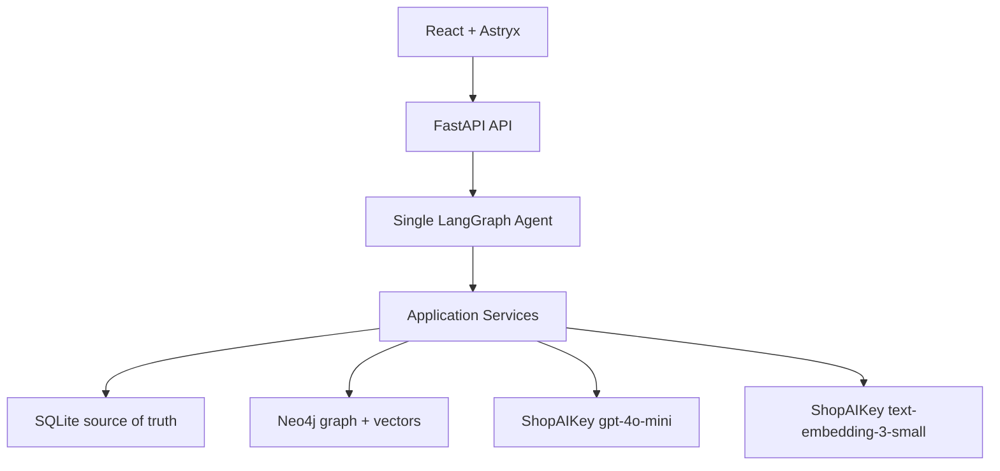
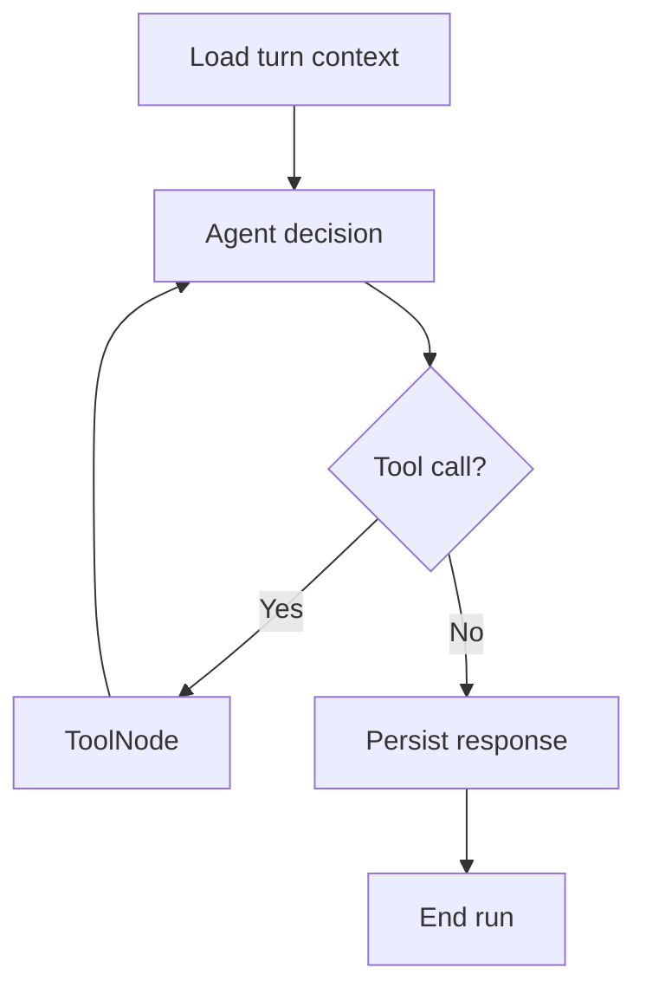

# JobAgent Master Plan

**Version:** 1.6
**Date:** 2026-07-13
**Status:** Ready for implementation after Phase 0 feasibility gates  
**Project type:** Single-user, local-first AI/NLP portfolio project  

---

## 1. Project Objective

JobAgent is a chat-first job matching assistant. The user primarily works through a ChatGPT-like conversation instead of editing complex forms or dashboards.

The system must let the user:

1. Chat naturally with the LLM about greetings, general questions, or job-related topics.
2. Upload a PDF CV from the sidebar or attach it in chat.
3. Let the Agent call tools to parse, extract, normalize, and stage a Candidate Profile.
4. Review the extracted profile inside chat and choose **Save Profile** or **Request Changes**.
5. Send a public JD URL or paste JD text.
6. Let the Agent save every accepted JD input, extract structured fields, normalize skills, and synchronize derived graph data.
7. Rank saved jobs against the active profile.
8. Explain semantic similarity, matched/related/missing skills, and the simple seniority, experience, location, and work-mode components.
9. Persist chat history while keeping structured long-term memory focused on the active profile, preferences, corrections, and saved jobs.

The goal is to demonstrate practical AI/NLP engineering through structured extraction, multilingual embeddings, entity normalization, a knowledge graph, tool calling, human approval, transparent matching, and failure handling.

### Complexity guardrail

> JobAgent must not become too complex for an AI/NLP Engineer Intern portfolio project.

Every new dependency or feature must satisfy at least one of these conditions:

- It is required for a locked user flow.
- It clearly improves a locked user flow.
- It removes a known reliability risk in the locked demo flow.

Otherwise, it remains outside the MVP.

---

## 2. Locked Product Scope

### 2.1 In scope

- Single user.
- No authentication.
- One persistent application conversation.
- Natural general conversation without requiring a job-related intent.
- React chat-first interface using Astryx.
- Upload one active PDF CV.
- Read-only history of prior CV uploads and Agent runs for the single local user.
- Candidate Profile draft and approval flow.
- Structured long-term memory for profile corrections and job preferences.
- Manual JD input through public URL or raw text.
- JD persistence, quality classification, duplicate handling, and extraction.
- Vietnamese and English CV/JD content.
- JD inputs from any job family, not only AI/NLP roles.
- Deterministic skill normalization with a small seed alias/relationship taxonomy.
- Neo4j skill graph and Neo4j vector search.
- Transparent hybrid scoring.
- Skill-gap and score-breakdown explanation.
- Visible tool activity in chat.
- Local Docker Compose deployment.
- Local automated tests and a manual demo checklist.

### 2.2 Explicitly out of scope

- Multi-user accounts, login, roles, and permissions.
- Multiple conversations.
- Mutable CV/profile versioning or rollback.
- DOCX, image CVs, or OCR.
- Automatic job discovery or crawling.
- Authenticated, paywalled, cookie-dependent, or JavaScript-only job pages.
- LinkedIn/Facebook browser automation.
- Auto-apply.
- Application tracking.
- Cover-letter generation.
- Interview preparation.
- Public cloud deployment.
- Qdrant.
- Jina or ShopAIKey reranking in the MVP.
- Redis, Celery, Kafka, or a separate worker service.
- Multiple agents or agent handoffs.
- 64K conversation memory injection.
- LangSmith cloud dependency.
- GitHub Actions or other CI workflows.
- General-purpose external tools or long-term structured memory for unrelated conversation.

---

## 3. Locked Technology Stack

| Layer | Technology | Purpose |
|---|---|---|
| Frontend | React + TypeScript + Vite | Chat-first web client |
| Design system | Astryx + neutral theme | App shell, chat, tool calls, buttons, feedback states |
| Backend | Python + FastAPI | REST, file upload, SSE, application services |
| Validation | Pydantic v2 | Tool and extraction contracts |
| Agent orchestration | LangGraph | One controlled tool loop with interrupt/resume |
| LLM adapter | `langchain-openai` `ChatOpenAI` | OpenAI-format tool calling through ShopAIKey |
| LLM provider | ShopAIKey | OpenAI-compatible API |
| LLM model | `gpt-4o-mini` | Tool choice and structured extraction |
| Relational data | SQLite + SQLAlchemy 2 + aiosqlite | Source of truth |
| Migrations | Alembic | SQLite schema management |
| Graph/vector data | Neo4j Community | Derived skill graph and job vector index |
| Embeddings | ShopAIKey `text-embedding-3-small` (1536 dimensions) | OpenAI-compatible hosted embeddings |
| PDF parser baseline | pypdf | Digitally born PDF text extraction |
| Web extraction | Trafilatura | Public HTML main-text extraction |
| HTTP client | httpx | Controlled URL download and ShopAIKey connectivity checks |
| Local deployment | Docker Compose | Frontend, backend, Neo4j, and persistent volumes |

The exact dependency versions are pinned after Phase 0 compatibility checks. FastAPI must be at least `0.135.0` to use its native SSE response support.

---

## 4. High-Level Architecture



### 4.1 Ownership rules

- SQLite owns raw inputs, application state, conversation state, tool logs, and structured canonical records.
- Neo4j is a rebuildable derived index.
- Uploaded PDF bytes live in a persistent Docker volume, not in SQLite blobs.
- The frontend never accesses SQLite, Neo4j, or ShopAIKey directly.
- LangGraph tools call Python application services directly; they do not make HTTP calls back into FastAPI.

---

## 5. Repository Structure

```text
JobAgent/
├── frontend/
│   ├── src/
│   │   ├── app/
│   │   ├── components/
│   │   ├── features/chat/
│   │   ├── features/profile/
│   │   ├── features/jobs/
│   │   ├── lib/api/
│   │   ├── lib/sse/
│   │   ├── test/
│   │   └── main.tsx
│   ├── package.json
│   ├── package-lock.json
│   ├── tsconfig.json
│   └── vite.config.ts
│
├── backend/
│   ├── app/
│   │   ├── api/
│   │   ├── agent/
│   │   ├── tools/
│   │   ├── services/
│   │   ├── repositories/
│   │   ├── db/
│   │   ├── graph/
│   │   ├── schemas/
│   │   └── main.py
│   ├── migrations/
│   ├── tests/
│   ├── pyproject.toml
│   └── alembic.ini
│
├── infrastructure/
│   ├── docker-compose.yml
│   ├── docker/
│   │   ├── backend.Dockerfile
│   │   └── frontend.Dockerfile
│   ├── neo4j/
│   └── scripts/
│
├── .env
├── .env.example
├── .gitignore
├── README.md
└── docs/
    └── plans/
        └── Master_plan.md
```

The three runtime folders are `frontend`, `backend`, and `infrastructure`; `docs` contains planning and project documentation only. Root files hold project-wide configuration. Automated-test fixtures live under `backend/tests/fixtures/` and use synthetic data. Runtime CV/JD files use Docker volumes and are not stored in the repository.

---

## 6. SQLite Database Contract

### 6.1 Global conventions

- Use one SQLite file at `SQLITE_PATH` through SQLAlchemy 2 async sessions and `aiosqlite`.
- Alembic owns every application table, constraint, and index listed in this section. LangGraph owns only its package-created checkpoint tables.
- Enable `PRAGMA foreign_keys=ON`, `PRAGMA journal_mode=WAL`, and `PRAGMA busy_timeout=5000` on application connections.
- Non-singleton entity IDs are lowercase UUID v4 strings stored as `TEXT`.
- Fixed singleton IDs are `candidate_profile.id='active'`, `profile_drafts.id='current'`, `job_preferences.id='active'`, and `conversation.id='main'`.
- Store timestamps as timezone-aware UTC `DATETIME` values. Every application table has `created_at` and `updated_at`; the application, not a database trigger, updates them.
- SQLAlchemy `JSON` values are stored as SQLite text and must pass the corresponding Pydantic model before every write. Do not query inside JSON documents in the MVP.
- Store enums as `TEXT` with named `CHECK` constraints. Store booleans as SQLite `INTEGER` through SQLAlchemy `Boolean`.
- Use constraint names `pk_<table>`, `fk_<table>__<column>`, `uq_<table>__<columns>`, `ck_<table>__<rule>`, and index names `ix_<table>__<columns>`.
- Enforce static enums, scalar ranges, singleton IDs, and simple null-coupling rules with named `CHECK` constraints. Pydantic/application services enforce JSON shape, finite embedding values, configuration-dependent limits, and cross-row invariants.
- Do not add soft-delete columns, audit-history tables, database triggers, or generic key-value storage.
- Never hold a SQLite transaction open while calling ShopAIKey, reading a remote URL, writing Neo4j, or streaming an SSE response.

### 6.2 Application table schemas

#### `attachments`

| Column | SQLite type | Null | Rules |
|---|---|---:|---|
| `id` | `TEXT` | No | UUID v4 primary key |
| `file_hash` | `TEXT` | No | SHA-256; unique |
| `original_name` | `TEXT` | No | Display filename |
| `mime_type` | `TEXT` | No | Must equal `application/pdf` |
| `size_bytes` | `INTEGER` | No | `> 0` |
| `page_count` | `INTEGER` | Yes | `> 0` after parsing; service enforces `MAX_PDF_PAGES` |
| `storage_path` | `TEXT` | No | Unique path relative to `FILES_DIR` |
| `state` | `TEXT` | No | `staged | active | archived | failed`; defaults to `staged` |
| `failure_code` | `TEXT` | Yes | Stable application error code |
| `created_at`, `updated_at` | `DATETIME` | No | UTC |

Add `uq_attachments__file_hash`, `uq_attachments__storage_path`, and partial unique index `uq_attachments__single_active` on `state` where `state='active'`.

`failure_code` is required only for `state='failed'`. An active attachment must have a non-null `page_count`. Attachment/profile cross-row state is validated at the final Section 6.4 transaction boundary, not by a database `CHECK`.

Allowed transitions are `staged → active`, `staged → failed`, `failed → staged` for an explicit same-file retry, and `active → archived` after an approved replacement. Exactly one row may be active. Archived rows are immutable history: their metadata and stored PDF remain retained, cannot become active again, and cannot be edited or deleted through a product endpoint. If a retained file is missing from local storage, its metadata remains archived and observability reports `CV_FILE_UNAVAILABLE`.

The unique hash rule remains global. Uploading a hash already held by an archived row returns `ARCHIVED_ATTACHMENT_EXISTS` with that row's safe metadata; it does not create a second row, reprocess the PDF, or restore the archived CV. This is upload history, not mutable CV/profile versioning or rollback.

#### `attachment_text_chunks`

| Column | SQLite type | Null | Rules |
|---|---|---:|---|
| `id` | `TEXT` | No | UUID v4 primary key |
| `attachment_id` | `TEXT` | No | FK to `attachments.id`; `ON DELETE RESTRICT` |
| `ordinal` | `INTEGER` | No | Zero-based deterministic source order |
| `text` | `TEXT` | No | Parsed CV text segment sent to the profile-extraction boundary |
| `preview` | `TEXT` | No | Fixed bounded projection of `text` for list responses |
| `char_count` | `INTEGER` | No | `> 0` |
| `token_estimate` | `INTEGER` | No | Deterministic local estimate; not provider usage |
| `created_at` | `DATETIME` | No | UTC |

Add `uq_attachment_text_chunks__attachment_ordinal` on `(attachment_id, ordinal)`.
Chunk rows are the canonical local projection of text sent to structured profile extraction. The deterministic chunker emits non-empty `text` values in ascending `ordinal`; the extraction service sends exactly `text[0] + "\n\n" + ... + text[n]` to the model. It persists the same ordered rows in the successful extraction/draft-input transaction, never stores PDF bytes or provider prompts, and keeps rows read only after creation.

#### `candidate_profile`

| Column | SQLite type | Null | Rules |
|---|---|---:|---|
| `id` | `TEXT` | No | Primary key; `CHECK (id='active')` |
| `active_attachment_id` | `TEXT` | No | Unique FK to `attachments.id`; `ON DELETE RESTRICT` |
| `profile_json` | `JSON` | No | Validated `CandidateProfile` |
| `created_at`, `updated_at` | `DATETIME` | No | UTC |

The table contains zero or one row. It stores only the current approved profile; no profile-history table exists.

Outside the approved-replacement transaction, the service verifies that `active_attachment_id` references an active attachment. During replacement it may temporarily reference the validated staged attachment, but the transaction must end with exactly one active attachment and the profile pointing to it.

#### `profile_drafts`

| Column | SQLite type | Null | Rules |
|---|---|---:|---|
| `id` | `TEXT` | No | Primary key; `CHECK (id='current')` |
| `source_attachment_id` | `TEXT` | Yes | Unique FK to `attachments.id`; `ON DELETE CASCADE`; null for profile/preference-only updates |
| `draft_json` | `JSON` | No | Validated profile/preferences proposal |
| `created_at`, `updated_at` | `DATETIME` | No | UTC |

The table contains zero or one row. Draft existence means approval is pending or the user is preparing a correction. Request Changes leaves the row intact; the next correction updates it. Successful Save Profile deletes it. Do not add a draft-history or draft-status table.

When `source_attachment_id` is non-null, the service verifies that it references a `staged` attachment.

#### `job_preferences`

| Column | SQLite type | Null | Rules |
|---|---|---:|---|
| `id` | `TEXT` | No | Primary key; `CHECK (id='active')` |
| `preferences_json` | `JSON` | No | Validated `JobPreferences`; defaults to four empty lists |
| `created_at`, `updated_at` | `DATETIME` | No | UTC |

The table contains exactly one row after application initialization.

#### `job_posts`

| Column | SQLite type | Null | Rules |
|---|---|---:|---|
| `id` | `TEXT` | No | UUID v4 primary key |
| `source_type` | `TEXT` | No | `url | text` |
| `source_url` | `TEXT` | Yes | Original URL; required only when `source_type='url'` |
| `raw_content` | `TEXT` | Yes | Pasted or fetched JD text; null only while a URL fetch is pending or failed |
| `raw_content_hash` | `TEXT` | Yes | SHA-256 unique exact-dedup key when content exists |
| `extraction_json` | `JSON` | Yes | Validated `JobPostExtraction` after success |
| `processing_status` | `TEXT` | No | `received | processing | processed | failed`; defaults to `received` |
| `jd_quality` | `TEXT` | Yes | `full | partial | unscorable` after extraction |
| `failure_code` | `TEXT` | Yes | Stable application error code |
| `embedding_json` | `JSON` | Yes | Finite floats for scorable jobs |
| `embedding_model` | `TEXT` | Yes | Must match configured model when embedding exists |
| `embedding_dimensions` | `INTEGER` | Yes | `> 0`; service enforces configured dimensions |
| `created_at`, `updated_at` | `DATETIME` | No | UTC |

Constraints:

- URL records require `source_url`; text records require non-null `raw_content` and null `source_url`.
- `raw_content_hash` is non-null exactly when `raw_content` is non-null.
- `processing_status='processed'` requires non-null `extraction_json` and `jd_quality`; `failure_code` is non-null exactly when `processing_status='failed'`.
- `embedding_json`, `embedding_model`, and `embedding_dimensions` are either all null or all non-null.
- Embeddings are permitted and required only for processed `full` or `partial` jobs; every other status/quality combination requires all three embedding fields to be null.
- The service validates that `embedding_json` contains exactly `EMBEDDING_DIMENSIONS` finite floats.
- Add `uq_job_posts__raw_content_hash` and `ix_job_posts__processing_quality` on `(processing_status, jd_quality)`.
- Do not persist a score cache; `match_jobs` computes scores from the current profile and preferences.

A scorable Job is exactly a row with `processing_status='processed'`, `jd_quality in ('full', 'partial')`, and embedding model/dimensions matching the locked runtime configuration; the database rules above guarantee that its embedding fields are present.

Allowed transitions are `received → processing → processed | failed`, `received → failed` for fetch failure, and `failed → processing` only when the user resubmits the same content. `processed` is terminal in the MVP. A temporary URL placeholder may be deleted after its fetched hash selects an existing Job.

#### `conversation`

| Column | SQLite type | Null | Rules |
|---|---|---:|---|
| `id` | `TEXT` | No | Primary key; `CHECK (id='main')` |
| `created_at`, `updated_at` | `DATETIME` | No | UTC |

The table contains exactly one row after application initialization.

#### `chat_messages`

| Column | SQLite type | Null | Rules |
|---|---|---:|---|
| `id` | `TEXT` | No | UUID v4 primary key |
| `conversation_id` | `TEXT` | No | FK to `conversation.id`; `ON DELETE CASCADE` |
| `role` | `TEXT` | No | `user | assistant | system` |
| `content` | `TEXT` | No | May be empty only when `structured_payload` is present |
| `structured_payload` | `JSON` | Yes | Approval card or match card payload |
| `created_at`, `updated_at` | `DATETIME` | No | UTC |

Add `ix_chat_messages__conversation_created_at` on `(conversation_id, created_at, id)` for deterministic history pagination.

#### `agent_runs`

| Column | SQLite type | Null | Rules |
|---|---|---:|---|
| `id` | `TEXT` | No | UUID v4 primary key; also used as LangGraph `thread_id` |
| `user_message_id` | `TEXT` | No | Unique FK to `chat_messages.id`; `ON DELETE CASCADE` |
| `state` | `TEXT` | No | `running | interrupted | completed | failed`; defaults to `running` |
| `pending_approval_json` | `JSON` | Yes | Present only while `state='interrupted'` |
| `error_code` | `TEXT` | Yes | Stable application error code |
| `completed_at` | `DATETIME` | Yes | Set for completed or failed runs |
| `created_at`, `updated_at` | `DATETIME` | No | UTC |

Add `uq_agent_runs__user_message_id` and `ix_agent_runs__state`.

`pending_approval_json` is non-null exactly when `state='interrupted'`. `completed_at` is non-null exactly when `state in ('completed', 'failed')`.

#### `tool_executions`

| Column | SQLite type | Null | Rules |
|---|---|---:|---|
| `id` | `TEXT` | No | UUID v4 primary key |
| `run_id` | `TEXT` | No | FK to `agent_runs.id`; `ON DELETE CASCADE` |
| `tool_call_id` | `TEXT` | No | Provider/tool-loop identifier |
| `tool_name` | `TEXT` | No | One of the registered JobAgent tool names |
| `arguments_summary_json` | `JSON` | Yes | Short non-document argument summary |
| `status` | `TEXT` | No | `pending | running | completed | failed`; defaults to `pending` |
| `duration_ms` | `INTEGER` | Yes | `>= 0` for a terminal execution |
| `error_code` | `TEXT` | Yes | Stable application error code |
| `result_json` | `JSON` | Yes | Validated `ToolResult` reused for idempotent replay |
| `created_at`, `updated_at` | `DATETIME` | No | UTC |

Add `uq_tool_executions__run_tool_call` on `(run_id, tool_call_id)` and `ix_tool_executions__run_status` on `(run_id, status)`.

`duration_ms` and `result_json` are required for completed or failed executions. `error_code` is required only for failed executions. A repeated `(run_id, tool_call_id)` returns the stored result instead of repeating a side effect; do not add a second idempotency-key mechanism.

Allowed transitions are `pending → running → completed | failed`. An interrupted approval keeps its existing tool execution at `running`; it does not create a second execution row.

`tool_executions` is the only durable tool-status and tool-result record. Do not copy tool results into `chat_messages`. Provider `ToolMessage` objects live only in the active LangGraph state/checkpoint. Chat-history responses attach tool activity to the initiating user turn by joining `agent_runs.user_message_id` to `tool_executions`.

### 6.3 Foreign-key and deletion rules

| Parent | Child FK | On delete | Reason |
|---|---|---|---|
| `attachments` | `candidate_profile.active_attachment_id` | `RESTRICT` | Never delete the active CV metadata |
| `attachments` | `attachment_text_chunks.attachment_id` | `RESTRICT` | Preserve auditable chunks with retained upload history |
| `attachments` | `profile_drafts.source_attachment_id` | `CASCADE` | Removing a staged upload removes a CV-backed draft; null is allowed for text-only updates |
| `conversation` | `chat_messages.conversation_id` | `CASCADE` | Test cleanup may remove the complete conversation |
| `chat_messages` | `agent_runs.user_message_id` | `CASCADE` | A run cannot exist without its initiating turn |
| `agent_runs` | `tool_executions.run_id` | `CASCADE` | Tool logs belong to one run |

Application startup inserts missing singleton rows for `conversation('main')` and `job_preferences('active')` in one idempotent transaction. The empty preferences document contains `target_roles`, `preferred_locations`, `acceptable_work_modes`, and `target_seniority` as empty lists. `candidate_profile('active')` is created only after the first approved CV.

### 6.4 Transaction boundaries

- **CV upload:** write the PDF once to its UUID-based path under `FILES_DIR`, then create the staged `attachments` row. Approval changes database state; it does not move the file again.
- **Profile approval:** validate the draft and, when it references a CV, the staged attachment and stored file before opening the transaction. In one SQLite transaction, upsert `candidate_profile('active')`, upsert `job_preferences('active')` when changed, and delete `profile_drafts('current')`. For a CV replacement, repoint the profile, change the previous active attachment to `archived`, mark the new attachment active, and verify the final one-active-attachment invariant before commit. Archived metadata, PDF files, and chunk rows are retained; no previous-file cleanup occurs. Direct Neo4j synchronization occurs after commit.
- **Approval decision:** both approval buttons resume the interrupted run. `request_changes` completes that run without deleting the draft; the following correction belongs to a new run.
- **JD ingestion:** for pasted text, compute the hash before insert; for a URL, commit a `received` placeholder, fetch outside a transaction, then compute the fetched-content hash. An exact match reuses the existing row: return it immediately when it is not failed, or clear its failure fields and retry it in place when `processing_status='failed'`; delete the temporary URL placeholder in either case. If no match exists, commit the raw text/hash with `processing_status='received'`. Set the selected row to `processing` in a short transaction, perform extraction and embedding calls without an open transaction, then persist the processed or failed terminal state in another short transaction. Direct Neo4j sync runs only after a scorable terminal commit.
- **Chat turn:** create the user message and `agent_runs` row together. Persist tool status transitions in short transactions. Persist the final assistant message and terminal run state together.
- A failed external call updates only the relevant status and `error_code`; it does not roll back previously accepted raw input.

### 6.5 Migration and checkpoint ownership

- Alembic migrations live under `backend/migrations/` and create all application tables, named constraints, indexes, and singleton seed rows.
- Configure Alembic SQLite migrations with batch mode for future constraint or column changes.
- `alembic upgrade head` must work on an empty database and an existing initialized database.
- Normal application startup does not call `Base.metadata.create_all()`.
- `langgraph-checkpoint-sqlite` creates and manages its own checkpoint tables in the same file. Alembic must not alter or drop them.
- Tests use a temporary SQLite file and run migrations before integration cases; they do not share the developer database.

### 6.6 Neo4j identity mapping

| SQLite source | Neo4j identity |
|---|---|
| `candidate_profile.id='active'` | `Candidate.id='active'` |
| `job_posts.id` UUID | `Job.id` |
| Normalized skill key in JSON/seed data | `Skill.canonical_key` |

Neo4j stores no independent application IDs and never becomes the source of truth for profile, job, conversation, or status data.

---

## 7. Pydantic Data Contracts

### 7.1 Shared skill contract

```text
SkillRef
- canonical_key: str
- display_name: str
- aliases: list[str]
- category: str | None
```

`SkillRef` contains normalized identity only. The deterministic normalizer populates aliases and category from `skills_seed.yaml`; an unresolved skill has an empty alias list and may have no category. The LLM must not invent aliases or relationships.

### 7.2 Candidate Profile

```text
CandidateProfile
- summary: str
- current_title: str | None
- total_experience_years: float | None
- skills: list[CandidateSkill]
- experiences: list[ExperienceItem]
- education: list[EducationItem]
- languages: list[LanguageItem]
- extraction_confidence: float
```

```text
CandidateSkill
- skill: SkillRef
- confidence: float [0, 1]
- proficiency: beginner | intermediate | advanced | unknown
- years: float | None
- source: cv | user_correction
- excluded: bool
- evidence: list[str]
```

```text
ExperienceItem
- title: str
- company: str | None
- start_date_text: str | None
- end_date_text: str | present | None
- summary: str

EducationItem
- institution: str
- degree: str | None
- field: str | None
- graduation_year: int | None

LanguageItem
- name: str
- proficiency: str | None
```

Proficiency and years may be `unknown`. The model must not infer precise years without timeline evidence.

### 7.3 Job Preferences

```text
JobPreferences
- target_roles: list[str]
- preferred_locations: list[str]
- acceptable_work_modes: list[remote | hybrid | onsite]
- target_seniority: list[intern | junior | mid | senior | lead | unknown]
```

Profile facts and job preferences are separate. A CV address is not automatically a preferred work location.

```text
ProfileDraftPayload
- candidate_profile: CandidateProfile
- job_preferences: JobPreferences
```

### 7.4 Job extraction

```text
JobPostExtraction
- title: str | None
- company: str | None
- summary: str
- responsibilities: list[str]
- required_skills: list[JobSkill]
- preferred_skills: list[JobSkill]
- seniority: intern | junior | mid | senior | lead | unknown
- min_experience_years: float | None
- max_experience_years: float | None
- location: str | None
- work_mode: remote | hybrid | onsite | unknown
- extraction_confidence: float

JobSkill
- skill: SkillRef
- confidence: float [0, 1]
- evidence: list[str]
```

`JobPostExtraction` contains extracted facts only. The ingestion service assigns the authoritative `job_posts.jd_quality` column after validating the extraction.

All evidence snippets must be short, relevant to the associated Candidate or Job skill, and copied from the source document. The LLM must not invent evidence.

### 7.5 Tool execution result

```text
ToolResult
- ok: bool
- code: str | None
- summary: str
- data: dict[str, JSONValue] | None
```

Every terminal `tool_executions.result_json` must validate as `ToolResult`. `JSONValue` means a JSON scalar, list, or object. `ok=true` requires `code=null` and database status `completed`; `ok=false` requires a stable failure `code`, matching `error_code`, and database status `failed`. `data` uses the tool's compact output schema and may contain IDs, counts, or card payloads, but never raw CV/JD bodies. This same validated object is returned during idempotent replay.

### 7.6 JD quality rules

- `full`: sufficient title/description plus usable skill or responsibility evidence and most scoring fields.
- `partial`: enough content to compute at least semantic and skill signals, but one or more important fields are missing.
- `unscorable`: no meaningful job responsibilities/skills, contact-only content, or extraction contains insufficient evidence.

Do not duplicate `jd_quality` inside `extraction_json`.

---

## 8. Neo4j Derived Model

### 8.1 Nodes

```text
(:Candidate {id, source_updated_at})
(:Job {id, title, company, location, work_mode, seniority, quality, embedding, source_updated_at})
(:Skill {canonical_key, display_name, aliases, category})
```

### 8.2 Relationships

```text
(Candidate)-[:HAS_SKILL {confidence, years, proficiency, evidence}]->(Skill)
(Job)-[:REQUIRES {confidence, evidence}]->(Skill)
(Job)-[:PREFERS {confidence, evidence}]->(Skill)
(Skill)-[:RELATED_TO {weight, source}]->(Skill)
```

### 8.3 Constraints and indexes

- Unique constraint on `Candidate.id`.
- Unique constraint on `Job.id`.
- Unique constraint on `Skill.canonical_key`.
- Vector index on `Job.embedding` using cosine similarity.
- Vector dimension is fixed at 1536 by the locked embedding contract and must be recorded in application settings.

Changing the embedding model or dimensions is outside the MVP. It requires an explicit full re-embedding migration and vector-index rebuild; the ordinary graph rebuild command does not make this change.

### 8.4 Graph safety rules

- Alias strings are properties on the canonical `Skill`; do not create separate alias nodes in the MVP.
- A new unknown skill may be stored as a canonical `Skill`, but it receives no `RELATED_TO` edges automatically.
- Only aliases and `RELATED_TO` relationships from `skills_seed.yaml` contribute to related-skill scoring.
- An exact content match creates no new Job row or Neo4j node; the existing Job is returned or, when failed, retried in place.
- Neo4j remains fully rebuildable through one local command using SQLite records.

---

## 9. Skill Normalization

### 9.1 Normalization pipeline

1. Unicode normalize.
2. Trim and collapse whitespace.
3. Lowercase for canonical comparison.
4. Normalize punctuation and common separators.
5. Resolve against aliases in a small `skills_seed.yaml`.
6. If unresolved, create a deterministic canonical key without related-skill edges.

### 9.2 Seed taxonomy

The MVP does not attempt a global job ontology. The seed contains only a small set of manually approved aliases and relationships for common skills used in the demo.

### 9.3 User corrections

When the user says a skill is incorrect or excluded:

- Store the current correction in the approved Candidate Profile.
- Mark the skill source as `user_correction`.
- Do not re-add it from the same CV without a new explicit approval.
- Do not keep old profile versions.

---

## 10. CV Ingestion and Approval Flow

### 10.1 Upload

Both sidebar upload and chat attachment call the same endpoint and produce an `attachment_id`.

Validation:

- MIME must be `application/pdf`.
- Magic bytes must begin with `%PDF-`.
- Maximum size: 10 MB.
- Maximum pages: 10.

File-hash duplicate policy:

- If the hash belongs to the active attachment, return that attachment/profile and do not extract again.
- If the hash belongs to the current staged attachment, return the existing attachment/draft.
- Uploading the same file again when its attachment is `failed` is the explicit retry signal: reuse the same file/row, change it to staged, clear `failure_code`, and process it again. Do not add a retry endpoint or flag.
- If the hash belongs to an archived attachment, return `ARCHIVED_ATTACHMENT_EXISTS` and the archived metadata. Do not reprocess, duplicate, or restore it; a user must upload a different PDF to create a new candidate profile input.
- Processing a different staged CV while a CV-backed draft exists replaces the singleton draft, removes the previous unreferenced staged row, and cleans up its file on a best-effort basis.
- A parsing or extraction failure after staging changes the attachment to `failed` with a stable `failure_code`; the stored file is retained for an explicit retry or deletion.

### 10.2 Processing

```text
attachment_id
→ file-hash duplicate check
→ pypdf layout text extraction
→ extractable-text validation
→ deterministic chunking and chunk persistence
→ gpt-4o-mini structured extraction
→ Pydantic validation, with at most one JSON repair and revalidation when invalid
→ deterministic skill normalization
→ profile draft
→ LangGraph interrupt
```

If no meaningful digital text is available, return `NO_EXTRACTABLE_TEXT`. Do not add OCR fallback.

The chunker owns the exact structured-extraction input. It emits ascending ordinals,
joins persisted chunk text with exactly `\n\n`, and sends that joined string to the
profile extractor. A failed parse, chunking operation, model call, repair, or draft
validation writes no chunk rows. Historical attachments without rows remain visible
but their chunk endpoint returns `CHUNKS_UNAVAILABLE`.

### 10.3 Chat approval

The assistant renders a profile summary card with Astryx `ButtonGroup`:

```text
[Save Profile] [Request Changes]
```

- Both buttons call `POST /api/chat/runs/{run_id}/resume` with exactly one action: `save_profile` or `request_changes`.
- `Save Profile` resumes the existing interrupted invocation of `commit_profile_draft`; it does not create a second commit tool call.
- `Request Changes` resumes the interrupted run with `action=request_changes`, completes that run without committing, deletes its checkpoint, and then focuses the composer. The next correction starts a new run, updates the same draft, and creates a new approval interrupt.
- The existing `commit_profile_draft` execution remains `running` while the run is interrupted. `save_profile` ends it as `completed` with `ToolResult(ok=true)` after commit. `request_changes` also ends it as `completed` with `ToolResult(ok=true, data={"committed": false})` while preserving the draft. An execution error ends it as `failed`.
- Every profile or preference change creates or updates a draft and requires approval.
- Both buttons become disabled after either accepted action. Repeating resume for a terminal run emits only the persisted terminal run state as a no-op SSE response; it does not replay text, execute the graph, or require another result column.

`agent_runs.pending_approval_json` is a UI/recovery projection containing `kind='profile_commit'`, `draft_id='current'`, and allowed actions `save_profile | request_changes`. The LangGraph checkpoint is the resumable execution state; both records are cleared when either action completes the run.

### 10.4 Approved replacement

The old active profile and CV remain usable until the new draft is approved. On approval:

1. Confirm that the staged attachment and its UUID-based file already exist.
2. Run the Section 6.4 SQLite transaction in constraint-safe order: repoint the profile, change the old active attachment to immutable `archived`, mark the new attachment active, update preferences when present, and delete the draft. Before commit, verify that the new attachment is the only active attachment and is referenced by `candidate_profile('active')`.
3. If the transaction fails, roll it back. The old profile remains active and the new attachment remains staged for retry or deletion.
4. After commit, retain the previous archived PDF and its chunk rows for local read-only history. Do not run automatic previous-file cleanup and do not offer restore/delete actions; a missing retained file is surfaced only as `CV_FILE_UNAVAILABLE`.
5. Synchronize Candidate and Skill nodes directly to Neo4j.

If the later Neo4j sync fails, the approved SQLite profile remains committed. Return `NEO4J_SYNC_FAILED` with the rebuild instruction instead of rolling the profile back.

---

## 11. JD Ingestion Flow

### 11.1 Accepted inputs

- Public HTTP/HTTPS URL.
- Raw JD text pasted into chat.

### 11.2 Simple URL fetching

- Allow only HTTP and HTTPS.
- Ten-second download timeout.
- Maximum response body: 5 MB.
- Allow only `text/html` and `text/plain`.
- No cookies, authentication, browser session, or JavaScript renderer.

If Trafilatura cannot obtain meaningful text, ask the user to paste the JD text.

### 11.3 Persistence-first processing

```text
URL/text
→ for URL, save a source_url placeholder with processing_status=received and fetch it
→ compute and check raw_content_hash before inserting text or updating the URL placeholder
→ on an exact match, return the existing non-failed job or reuse the failed row for retry
→ delete the temporary URL placeholder when an existing row was selected
→ otherwise persist the unique pasted/fetched raw_content and hash before extraction
→ set processing_status=processing
→ process/extract
→ Pydantic validation and one repair
→ normalize skills
→ classify quality
→ persist the terminal result
→ synchronize directly to Neo4j if processed and scorable
```

The submitted URL or pasted text is retained when fetching fails. Fetched/pasted `raw_content` is retained when extraction later fails.

### 11.4 Exact duplicate policy

1. Exact `raw_content_hash` match:
   - If the existing row is not failed, return it without extraction or embedding.
   - If `processing_status='failed'`, reuse that row; clear `failure_code`, `extraction_json`, `jd_quality`, and all embedding fields; set it back to `processing`; then retry once through the normal pipeline.
   - For text, do not insert a new row. For URL, delete the received placeholder before returning or retrying the existing row.

Different content is always a new Job in the MVP. Do not add normalized-duplicate state or a `force_new` override.

---

## 12. Agent Architecture

### 12.1 One Agent, one controlled loop

The system uses one `StateGraph` with one LLM decision node and one `ToolNode`. It is not a multi-agent architecture.



Approval is implemented with `interrupt()` inside the guarded commit path.

### 12.2 Per-turn runs

- The application has one persistent conversation in SQLite.
- Every user turn creates a new `agent_run_id` and LangGraph `thread_id`.
- An interrupted run uses the same ID when resumed.
- While a run is interrupted, reject a new chat turn with `APPROVAL_ACTION_REQUIRED`; the user must choose an approval action first.
- `request_changes` completes the interrupted run without committing the draft; the correction itself is a new user turn/run.
- After a run reaches `completed` or `failed`, delete only that run's checkpoint data.
- Conversation continuity comes from application data, not permanent LangGraph checkpoints.

Allowed transitions:

```text
running → interrupted → running → completed
running → interrupted → running → failed
running → completed
running → failed
```

Entering `interrupted` stores `pending_approval_json`. Resume atomically returns the same run to `running` and clears that projection before graph execution continues. The LangGraph checkpoint is the resumable state; `agent_runs` is durable UI/recovery metadata. No profile/preference side effect occurs before `interrupt()` returns an approval action.

### 12.3 Agent state

```text
AgentState
- conversation_id
- run_id
- messages_for_this_turn
- recent_context
- candidate_context
- attachment_ids
- pending_approval
- tool_iteration_count
- error
```

Large PDF/JD bodies are stored out of state and referenced by IDs.

### 12.4 Memory policy

The model receives:

- Current approved Candidate Profile.
- Current Job Preferences.
- Current turn.
- A bounded recent message window that fits the prompt budget.

It does not receive the entire conversation or a fixed 64K-token history. Profile and preference corrections are remembered through structured state, not by relying on old chat text.

General conversation remains available through persisted chat history and the bounded recent-message window. Do not add a separate memory-fact table or a general-purpose memory extraction pipeline.

### 12.5 Conversation and tool policy

The Agent may answer greetings, casual conversation, and general knowledge questions naturally through the LLM. A user message does not need to be related to jobs.

- Answer directly without tools when no JobAgent capability is needed.
- Call JobAgent tools only for CVs, Candidate Profile, job preferences, JDs, saved jobs, matching, and skill gaps.
- Do not invent or expose general-purpose tools for unrelated requests.
- Keep the response language aligned with the user's language when practical.

Example:

```text
User: Xin chào
JobAgent: Chào bạn! Bạn muốn tôi giúp gì hôm nay?
```

Do not add a separate classifier model. The LLM chooses between a direct response and the existing JobAgent tools; tool preconditions remain the deterministic boundary for writes.

A greeting or general-question turn creates user and assistant messages plus one completed `agent_run`, creates zero `tool_executions`, emits no `tool_status` or `approval_required` event, and does not mutate profile, preferences, drafts, or jobs.

### 12.6 Tool loop limits

- Maximum six tool iterations per user turn.
- No tool retry loops controlled by the LLM.
- Application services own deterministic retry behavior.
- A tool may return structured failure; the Agent must not claim success afterward.

---

## 13. Agent-Facing Tool Contracts

The Agent sees exactly six job-specific tools. Before graph execution, the application injects compact `candidate_context` from the approved profile and preferences; raw CV text is never injected and candidate context is not an Agent-facing tool.

`(run_id, tool_call_id)` is the durable identity of one tool invocation. Re-entering a terminal invocation returns its stored `result_json`; it never repeats a completed side effect. The LLM and frontend do not generate separate idempotency keys.

### 13.1 `propose_profile_from_cv`

Input: `attachment_id`.

- Validates attachment ownership/state.
- For a staged attachment already referenced by `profile_drafts('current')`, returns the existing draft without processing again.
- For any other staged attachment, parses, extracts, validates, and creates a draft.
- For the already active attachment, returns the existing approved profile without extraction or a new draft.
- Returns either the new `draft_id` or the existing profile ID with a short summary.
- Never commits the profile.

### 13.2 `propose_profile_update`

Input: current `draft_id` or active context plus requested profile/preference changes.

- Applies changes through Pydantic validation.
- Produces a new/updated draft.
- Covers both Candidate Profile facts and Job Preferences so another tool is unnecessary.

### 13.3 `commit_profile_draft`

Input: `draft_id`.

- Write tool guarded by LangGraph interrupt approval.
- Refuses execution without valid approval state.
- Updates the active profile/preferences and replaces the CV only when the draft references a staged attachment.

### 13.4 `save_job`

Input: exactly one of URL or raw text.

- Persists the accepted URL or text before extraction.
- Handles fetch, extraction, validation, exact-hash deduplication, and direct Neo4j synchronization.
- Does not require approval.

### 13.5 `query_jobs`

Input: optional job ID, `processing_status`, `jd_quality`, and `limit` in `1..50`.

- Read-only.
- Returns compact saved-job data and processing/quality status.
- Does not return every raw JD by default.

### 13.6 `match_jobs`

Input: optional result limit in `1..10`; current approved `JobPreferences` are read from SQLite.

- Requires an active Candidate Profile.
- Runs retrieval, graph features, scoring, and explanation.
- Defaults to final top 10.

### 13.7 Tool authorization matrix

| State | Write tools | Read/compute tools |
|---|---|---|
| No active profile, no draft | `propose_profile_from_cv`, `save_job` | `query_jobs` |
| Draft pending, no active profile | `propose_profile_from_cv`, `propose_profile_update`, guarded `commit_profile_draft`, `save_job` | `query_jobs` |
| Active profile, no draft | `propose_profile_from_cv`, `propose_profile_update`, `save_job` | `query_jobs`, `match_jobs` |
| Active profile with draft pending | `propose_profile_from_cv`, `propose_profile_update`, guarded `commit_profile_draft`, `save_job` | `query_jobs`, `match_jobs` against the approved profile only |

---

## 14. Public FastAPI Boundary

Expose the seven chat/profile endpoints plus read-only local observability endpoints.

```text
GET  /api/health

POST /api/attachments/cv
GET  /api/profile
GET  /api/profile/cv

GET  /api/chat/history?limit=50&before=<opaque_cursor>
POST /api/chat/turns
POST /api/chat/runs/{run_id}/resume

GET  /api/observability/cvs?limit=<n>&before=<opaque_cursor>
GET  /api/observability/cvs/{attachment_id}/file
GET  /api/observability/cvs/{attachment_id}/chunks?limit=<n>&before=<opaque_cursor>
GET  /api/observability/cvs/{attachment_id}/chunks/{ordinal}
GET  /api/observability/runs?limit=<n>&before=<opaque_cursor>
GET  /api/observability/graph
```

### 14.1 API rules

- No public profile/job CRUD endpoints.
- All business writes occur through Agent tool calls.
- File upload and chat messages remain separate requests.
- Sidebar upload immediately starts a chat turn containing the returned attachment ID.
- `POST /api/chat/turns` returns an SSE stream.
- Resume also returns an SSE stream.
- Chat history `limit` is `1..100`. The opaque `before` cursor encodes `(created_at, id)` from the oldest returned item. Query newest-first with `limit+1`, reverse the page for chronological output, and return `{items, next_cursor}`. A malformed cursor returns `422`.
- While a run is interrupted for approval, both a new chat turn and a new CV upload return `APPROVAL_ACTION_REQUIRED` before persisting new input. The frontend disables the composer and upload controls until either approval action completes the run.
- Observability endpoints are read-only, cursor-bounded, and validate each selected attachment, chunk, or run against the single local-user data set. They return safe summaries only: no PDF bytes, filesystem paths, prompts, checkpoints, stack traces, embeddings, credentials, arbitrary Cypher, or unrelated Neo4j labels.
- `GET /api/observability/cvs/{attachment_id}/file` validates an `active` or `archived` attachment, checks retained local-file availability, and streams only `application/pdf` with a sanitized `Content-Disposition` filename. Unknown IDs return `CV_ATTACHMENT_NOT_FOUND`; a missing retained file returns `CV_FILE_UNAVAILABLE`. Both are safe JSON errors and never reveal a storage path.
- Observability cursors have no expiry. A cursor is valid while its encoded tuple decodes and its row ordering remains queryable; malformed cursors return `422`, and a well-formed cursor past the final page returns an empty page with `next_cursor=null`.
- `GET /api/observability/graph` exposes a bounded Candidate/Job/Skill snapshot and a typed unavailable or stale state. It never mutates the derived graph or accepts a client query. A `ready` response contains at most one Candidate (`id`, `revision`), 20 Jobs (`id`, `title`, `company`, `revision`) ordered by `id ASC`, and 40 Skills (`canonical_name`) ordered by `canonical_name ASC`; only `HAS_SKILL`, `REQUIRES`, `PREFERS`, and `RELATED_TO` edges with `source_id`, `target_id`, and `type` are returned. Edges are sorted by `(type, source_id, target_id)` and capped at 100 after node selection. The response includes `nodes_truncated`, `edges_truncated`, `omitted_node_count`, and `omitted_edge_count`; no other node or edge properties are serialized. With no active Candidate, return `status='ready'`, an empty projection, and `NO_ACTIVE_PROFILE`.

### 14.2 SSE contract

```text
run_started
assistant_status
tool_status
approval_required
text_delta
run_completed
run_failed
```

Every event includes `event_id`, `run_id`, `timestamp`, and an event-specific validated payload.

`tool_status.payload.status` and the frontend state use exactly `pending | running | completed | failed`; do not introduce aliases such as `complete` or `error`. `run_started` carries `state='running'` and `resumed: bool`; `approval_required` carries `state='interrupted'`; terminal events carry their matching run state. A failed tool may still lead to a completed run that explains the failure, but the Agent must not claim the operation succeeded.

FastAPI, not ShopAIKey, owns the client-facing stream. Tool decision calls may be non-streaming. The final text may stream from ShopAIKey when compatibility is confirmed.

---

## 15. Frontend UX Plan

### 15.1 Layout

- Astryx `AppShell`.
- Left sidebar approximately 256 px.
- Main content is `ChatLayout`.
- Responsive sidebar collapses on small screens.

### 15.2 Sidebar

The expanded sidebar contains `Overview`, `CV history`, `LLM chunks`, `Neo4j graph`, and `Agent runs` tabs.

- `Overview` retains active-CV filename, profile state, upload/replace, and view/download actions.
- `CV history` lists prior attachment metadata and retained-file availability without changing which CV is active. An available active or archived PDF may open/download through the dedicated stream route; unavailable files show the stable safe error state.
- `LLM chunks` lists fixed previews for a selected attachment; full chunk text is fetched only after that row is expanded.
- `Neo4j graph` renders a bounded read-only Candidate/Job/Skill snapshot and falls back to a typed stale/unavailable state.
- `Agent runs` lists durable run/tool status and safe summaries, not arguments or internal traces.
- Collapsed state retains a keyboard-accessible expand control and compact active-profile/CV status. Responsive behavior must not hide the chat composer or trap focus.

Do not add a full profile editor, mutable profile history, arbitrary graph-query UI, or a developer console.

### 15.3 Chat components

| Need | Astryx component |
|---|---|
| Conversation layout | `ChatLayout` |
| Messages | `ChatMessageList`, `ChatMessage` |
| Composer and PDF token | `ChatComposer` |
| Tool activity | `ChatToolCalls` |
| Approval actions | `ButtonGroup`, `Button` |
| System status | `ChatSystemMessage` |
| Structured job details | `Card`, `MetadataList`, `Badge` |
| Score details | `Collapsible`, `ProgressBar` |
| Notifications | `Banner`, `Toast` |

Before implementing any Astryx component, run its CLI documentation command against the pinned package version. Do not invent props or depend on undocumented internals.

### 15.4 Tool activity display

Display concise user-facing statuses:

- Friendly tool label.
- `pending`, `running`, `completed`, or `failed`.
- Duration.
- Short outcome summary.

The activity component does not need a developer-oriented arguments or stack-trace view.

### 15.5 Match result card

Each top result shows:

- Title, company, location, work mode.
- Final score.
- Matched required skills.
- Related skills from the seed taxonomy.
- Missing required skills.
- Expandable component score breakdown.
- Original source URL when available.

### 15.6 Observability sidebar boundaries

The observability tabs are sidebar-local read models. They load on tab selection,
cache successful pages by query, and keep independent loading, empty, and error
states. The graph panel renders the Master allowlisted bounded snapshot and its
truncation metadata; it does not infer hidden properties or query for more nodes.
They do not add a second chat/SSE store or change agent tool behavior.

---

## 16. ShopAIKey Integration

### 16.1 Configuration

```text
SHOPAIKEY_BASE_URL=https://api.shopaikey.com/v1
LLM_MODEL=gpt-4o-mini
EMBEDDING_MODEL=text-embedding-3-small
EMBEDDING_DIMENSIONS=1536
```

Use `ChatOpenAI` with the custom base URL and `bind_tools()` for chat. Use an OpenAI-compatible embeddings client with the same base URL and API key for `POST /v1/embeddings`.

### 16.2 Startup/diagnostic compatibility checks

Phase 0 must verify:

1. `/v1/models` contains the requested chat and embedding model IDs or explicitly approved equivalent IDs.
2. Basic Chat Completions.
3. Function calling.
4. Tool-result round trip.
5. Structured tool schema behavior.
6. Streaming text behavior.
7. Embedding request/response behavior for string and batch inputs, fixed 1536-dimensional float output, input ordering, and provider error handling.

`strict=True` remains disabled until verified. If strict schemas fail:

- Use ordinary function schema or JSON mode.
- Validate with Pydantic.
- Allow exactly one schema-repair request.

Do not silently switch either provider model or change embedding dimensions.

---

## 17. Embedding and Retrieval

### 17.1 Locked embedding contract

Use only ShopAIKey `text-embedding-3-small` through `POST /v1/embeddings`, with `dimensions=1536` and float encoding. Candidate and Job embeddings must use the same model, dimensions, normalization policy, and versioned text-builder contract. Do not add a local embedding runtime or silently substitute another model.

### 17.2 Provider compatibility gate

Phase 0 must verify model availability, scalar and batch input support, stable input/output ordering, exactly 1536 finite float values per input, and clear timeout/rate-limit/invalid-response behavior. This is a compatibility check for the locked adapter, not a model or retrieval benchmark.

### 17.3 Text representations

Candidate representation:

```text
target roles + profile summary + normalized skills + experience titles + preferences
```

Build the Candidate representation from the approved structured profile rather than the raw CV text. Candidate and Job representations use the same whitespace normalization and versioned text-builder contract.

Job representation:

```text
title + summary + responsibilities + required skills + preferred skills
```

No E5 query/passage prefixes are used. Apply the same documented whitespace normalization and versioned representation builders before sending text to ShopAIKey.

### 17.4 Retrieval flow

1. Run the Section 21 pre-match consistency check against the current SQLite Candidate and scorable Jobs.
2. Embed the active Candidate representation.
3. Query the Neo4j vector index for up to 50 scorable jobs.
4. Compute direct, alias, and seed-related skill features.
5. Compute seniority, experience, location, and work-mode features.
6. Calculate the transparent hybrid score.
7. Return up to the requested top 10 with explanations.

---

## 18. Matching Formula

### 18.1 Skill coverage

```text
skill_score =
    0.80 × required_skill_coverage
  + 0.20 × preferred_skill_coverage
```

Match strengths:

| Match type | Strength |
|---|---:|
| Direct canonical match | 1.0 |
| Seed alias match | 1.0 |
| Seed related skill | 0.6 |
| No match | 0.0 |

For each Job skill, take the strongest match against non-excluded Candidate skills. Coverage is the arithmetic mean of these best strengths. A non-empty Job skill list with no Candidate match has coverage `0`; an empty Job skill list makes that coverage unavailable. When only required or preferred skills exist, renormalize the `0.80/0.20` weights over the available list. `skill_score` is unavailable only when both lists are empty.

### 18.2 Initial hybrid seed

```text
base_score =
    0.30 × semantic_similarity
  + 0.40 × skill_score
  + 0.10 × seniority_score
  + 0.10 × experience_score
  + 0.05 × location_score
  + 0.05 × work_mode_score
```

Component rules are deterministic and return normalized scores in `[0, 1]`.

- `semantic_similarity = clamp(neo4j_cosine_score, 0, 1)`.
- `seniority_score` is unavailable when JD seniority is `unknown` or `target_seniority` is empty; otherwise it is `1` for membership and `0` for mismatch.
- `experience_score` is unavailable when Candidate years or JD minimum years is missing. It is `1` when Candidate years meet the minimum; otherwise use `clamp(candidate_years / minimum_years, 0, 1)`. A zero minimum yields `1`; maximum years are descriptive only.
- `location_score` is unavailable when JD location is missing or preferred locations are empty; otherwise normalized exact membership is `1` and mismatch is `0`.
- `work_mode_score` is unavailable when JD work mode is `unknown` or acceptable modes are empty; otherwise membership is `1` and mismatch is `0`.

### 18.3 Missing fields

If an optional component cannot be computed, renormalize the weights of available components. Then apply the JD quality multiplier:

```text
full       → 1.00
partial    → 0.85
unscorable → final_score = null
```

Sort with unrounded values by `final_score DESC`, `skill_score DESC NULLS LAST`, `semantic_similarity DESC`, then `job.id ASC`. Round only for UI display.

### 18.4 Fixed MVP weights

- Use the documented weights as simple, deterministic defaults for the portfolio demo.
- Do not claim that the weights are statistically optimal or generally applicable.
- The developer may adjust them manually only when the demo consistently produces obviously unreasonable ordering.
- Do not use `gpt-4o-mini` to produce the final numerical score.

---

## 19. Manual JD Acceptance

The developer validates JD behavior directly during local testing. No labeled JD dataset, benchmark suite, ranking metric, grid search, ablation, or evaluation report is required.

Use a small, disposable set of representative JDs to check:

- A public URL and pasted text both create a saved job.
- Full, partial, and unscorable JDs receive the expected quality status.
- Title, required/preferred skills, seniority, location, and work mode look reasonable in the saved result.
- A processed exact duplicate returns the existing Job without reprocessing; a failed exact match retries the same row.
- Matching returns plausible ordering for the active profile.
- Score breakdown, matched skills, and missing skills agree with the displayed Candidate Profile and JD.
- URL, extraction, provider, and Neo4j failures produce the documented fallback instead of false success.

These checks are manual product acceptance only. Automated functional tests remain required under Section 24.

---

## 20. Failure and Recovery Policy

| Failure | Required behavior |
|---|---|
| ShopAIKey timeout/rate limit | Retry once, then persist failure |
| Invalid structured output | One repair request, then fail safely |
| No PDF text | `NO_EXTRACTABLE_TEXT`; no OCR |
| Unsupported/oversized PDF | Reject before creating a persistent file or attachment row |
| URL unsupported or unavailable | Ask user to paste JD text |
| JD extraction failure | Keep raw record with failed status |
| Exact JD content match | Return an existing non-failed job; retry a failed row in place |
| Neo4j unavailable during sync | Keep SQLite data; report `NEO4J_SYNC_FAILED` and offer the local rebuild command |
| Neo4j unavailable during matching | Return `NEO4J_UNAVAILABLE`; do not return partial ranking |
| SQLite/Neo4j revision mismatch | Return `NEO4J_REBUILD_REQUIRED`; do not rank stale graph data |
| Match without profile | Ask user to upload/approve CV first |
| Unauthorized profile commit | Reject tool execution |
| Tool loop exceeds six iterations | End run with controlled failure |

No unlimited retries, automatic model switching, or hidden fallback features.

---

## 21. Direct SQLite-to-Neo4j Synchronization

### 21.1 Direct sync rule

- SQLite commits first and remains the source of truth.
- After a successful profile or job write, call a focused Neo4j sync function immediately.
- Use `Candidate.id='active'`, the SQLite Job UUID, and `Skill.canonical_key` as Neo4j identities.
- Copy the SQLite row's `updated_at` into Neo4j as `source_updated_at` on Candidate and Job nodes.
- Use Neo4j uniqueness constraints and `MERGE` so rerunning the same sync is safe.
- Do not add an outbox table, background worker, retry queue, or graph-sync state machine.

### 21.2 Local failure behavior

If direct synchronization fails, keep the committed SQLite data and return `NEO4J_SYNC_FAILED`. The UI tells the developer to restore Neo4j and run the rebuild command. The application does not retry continuously or hide the failure.

Before matching, compare the SQLite Candidate `(id, updated_at)` and the full local set of scorable Job `(id, updated_at)` pairs against Neo4j `source_updated_at`. Any missing, extra, or mismatched node returns `NEO4J_REBUILD_REQUIRED`; unavailable Neo4j returns `NEO4J_UNAVAILABLE`. Do not repair or upsert graph data inside the matching path because that would hide a stale derived index.

`ponytail:` this O(n) ID/revision comparison is intentional for the small local corpus. If the project later grows beyond portfolio scale, replace it with a sync ledger rather than silently adding one to the MVP.

### 21.3 Rebuild command

Provide one local command that:

1. Validates that every processed `full` or `partial` Job has a stored embedding matching the locked model and dimensions; exits non-zero with a configuration-restoration instruction on mismatch.
2. Clears only JobAgent nodes and relationships.
3. Recreates constraints and the vector index.
4. Reads the active Candidate and all scorable Jobs from SQLite.
5. Rebuilds Candidate, Job, Skill, and seed `RELATED_TO` data using the stored embeddings without calling ShopAIKey or mutating SQLite.
6. Prints rebuilt entity counts and exits non-zero on failure.

---

## 22. Local Demo Safeguards

JobAgent is a single-user portfolio demo running locally, not a production or public-facing service. The MVP keeps only a small baseline:

- Store configuration in the root `.env`; do not commit it or hard-code API keys.
- Do not print API keys or authorization headers in logs.
- Keep the existing PDF and URL size, type, and timeout limits so invalid input cannot stall the demo.
- Let services listen on `0.0.0.0` inside their containers, and publish application/Neo4j host ports only on `127.0.0.1` through Docker Compose.

Authentication, role-based authorization, PII-redaction pipelines, SSRF/IP-range defenses, redirect validation, prompt-injection hardening, and a production threat model are explicitly outside the MVP. These may be documented as limitations, but they must not expand the implementation phases.

---

## 23. Environment Configuration

All configurable runtime values live in the single root `.env` and are documented by the non-runtime template `.env.example`.

```text
APP_ENV=local
FRONTEND_ORIGIN=http://localhost:5173
VITE_API_BASE_URL=http://localhost:8000

SQLITE_PATH=/data/jobagent.db
FILES_DIR=/data/files

NEO4J_URI=bolt://neo4j:7687
NEO4J_USER=neo4j
NEO4J_PASSWORD=

SHOPAIKEY_BASE_URL=https://api.shopaikey.com/v1
SHOPAIKEY_API_KEY=
LLM_MODEL=gpt-4o-mini
LLM_TEMPERATURE=0

EMBEDDING_MODEL=text-embedding-3-small
EMBEDDING_DIMENSIONS=1536

MAX_PDF_SIZE_MB=10
MAX_PDF_PAGES=10
URL_FETCH_TIMEOUT_SECONDS=10
URL_MAX_RESPONSE_MB=5
TOOL_LOOP_LIMIT=6
```

Docker Compose loads this root file. Do not create separate frontend/backend `.env` files.

---

## 24. Local Testing Strategy

The user explicitly chose local testing only. Do not create GitHub Actions workflows in the MVP.

### 24.1 Backend unit tests

- Pydantic validation.
- `ToolResult` success/failure coupling with tool status and `error_code`.
- UUID, UTC timestamp, enum, and singleton-ID conventions from Section 6.1.
- Settings-dependent PDF/embedding limits are enforced by services rather than migration constants.
- JD extraction and field validation.
- Skill canonicalization and alias resolution.
- Exact-hash return and failed-row retry policies.
- JD quality classification.
- Score components and weight renormalization.
- Empty skill lists, excluded skills, seed-related best matches, quality multipliers, unavailable components, and exact-score ties.
- Matching order and deterministic explanations.
- General conversation produces a direct answer without JobAgent tool calls.
- Tool preconditions for approval and required state.
- Idempotent Neo4j `MERGE` payloads.

### 24.2 Backend integration tests

- FastAPI PDF upload and validation.
- SSE event schema/order.
- LangGraph interrupt/resume.
- `request_changes` completes the original run, deletes its checkpoint, preserves the draft, and lets the next correction start a new run.
- `commit_profile_draft` remains `running` at interrupt; both approval actions emit one terminal `completed` tool status, while execution errors emit `failed`.
- An interrupted approval blocks new chat turns and CV uploads with `APPROVAL_ACTION_REQUIRED` before any new input is persisted.
- Re-entering the same `(run_id, tool_call_id)` replays one stored ToolResult and one SQLite side effect.
- Chat-history hydration joins tool activity from `tool_executions` without persisted `role='tool'` messages.
- SQLite PRAGMAs, named constraints, indexes, foreign-key cascades, singleton seeding, and Alembic migrations.
- Direct Neo4j synchronization and the local rebuild command.
- URL and raw-text JD ingestion.
- Active, staged, and failed CV hash reuse plus exact JD return/retry behavior.
- `match_jobs` with deterministic fake embeddings.
- Candidate/Job revision mismatch returns `NEO4J_REBUILD_REQUIRED`; unavailable Neo4j returns `NEO4J_UNAVAILABLE`.
- Greeting and general-question turns persist messages and complete without tool events.
- Chat-history cursor pagination and malformed-cursor `422` behavior.
- Database and SSE payloads accept only `pending | running | completed | failed` for tools.
- Fake ShopAIKey adapter for tool calls and invalid schema.
- Attachment chunk persistence, cursor pagination, detail authorization, preview
  bounds, and redaction of PDF bytes/provider data from observability responses.
- Bounded Neo4j graph snapshot with unavailable/stale typed states and no graph mutation.

Normal automated tests must not call the real ShopAIKey API.

### 24.3 Frontend tests

- SSE reducer.
- `ChatToolCalls` event mapping.
- Frontend tool state accepts only `pending | running | completed | failed`.
- Approval buttons and idempotent disable state.
- Sidebar attachment state.
- Chat history hydration.
- Load-older chat history pagination.
- Match-card score breakdown.
- Error and disconnected stream states.
- Observability tabs: lazy load, cache, collapsed/expanded accessibility, chunk
  preview-to-detail expansion, empty/loading/error states, and narrow layouts.

### 24.4 End-to-end smoke test

```text
Send greeting
→ receive a natural response without tool calls
→ continue in the same conversation
→ upload synthetic PDF
→ create profile draft
→ approve profile
→ submit JD text
→ save/sync JD
→ request matching
→ display score and skill gaps
```

### 24.5 Local verification commands

The final README must provide single-purpose commands for:

- Backend lint/type-check/test.
- Frontend lint/type-check/test.
- Neo4j integration tests.
- ShopAIKey compatibility smoke test.
- Manual JD acceptance checklist.
- Full Docker Compose startup.

---

## 25. Implementation Phases

### Phase 0 — Feasibility and compatibility gates

**Purpose:** eliminate provider, UI-library, parsing, and embedding uncertainty before implementation expands.

Tasks:

- [ ] Create the three-folder scaffold and root configuration placeholders.
- [ ] Pin a stable Astryx version and run `npx astryx init --features agents --agent codex`.
- [ ] Inspect exact Astryx APIs for AppShell, ChatLayout, ChatComposer, ChatToolCalls, ChatMessage, ButtonGroup, Card, Collapsible, and ProgressBar.
- [ ] Implement and run a reusable local ShopAIKey diagnostic script for model listing, chat completion, function calling, tool-result round trip, structured schema, streaming, and scalar/batch 1536-dimensional embeddings.
- [ ] Verify pypdf normal/layout extraction on five representative digital CV fixtures.
- [ ] Verify `NO_EXTRACTABLE_TEXT` behavior on an image-only PDF fixture.

Exit gate:

- ShopAIKey can complete a valid tool-call round trip with `gpt-4o-mini`.
- At least one schema strategy passes Pydantic validation reliably.
- Astryx has all required public components or a documented composition path.
- pypdf succeeds on at least four of five representative digital CV fixtures.
- ShopAIKey `text-embedding-3-small` passes the compatibility contract.

If any gate fails, revise the affected adapter only. Do not add broad fallback stacks.

### Phase 1 — Foundation, Docker, and source-of-truth data

Tasks:

- [ ] Configure backend project, FastAPI, Pydantic, SQLAlchemy async, Alembic, and settings.
- [ ] Configure React/TypeScript/Vite and Astryx neutral theme.
- [ ] Create infrastructure Dockerfiles and Docker Compose.
- [ ] Configure one root `.env` and `.env.example`.
- [ ] Add persistent volumes for SQLite/files and Neo4j.
- [ ] Implement the Section 6 SQLAlchemy models, connection PRAGMAs, named constraints, and indexes.
- [ ] Implement Alembic migrations and idempotent singleton seeding without `create_all()`.
- [ ] Implement attachment storage abstraction.
- [ ] Implement Neo4j driver, health check, idempotent constraints, and the 1536-dimensional vector index.
- [ ] Add local lint, type-check, migration, and test commands.

Exit gate:

- `docker compose` starts frontend, backend, and Neo4j locally.
- Health endpoint reports SQLite, filesystem, and Neo4j status.
- `alembic upgrade head` works on an empty and already-initialized volume.
- Integration tests prove foreign keys, singleton checks, partial unique indexes, cascades, and required connection PRAGMAs.
- Neo4j constraints/index setup is idempotent.

### Phase 2 — Chat transport, Agent runtime, and persistence

Tasks:

- [ ] Implement conversation/message repositories for one conversation, including history joins for tool activity.
- [ ] Implement agent-run and tool-execution repositories with ToolResult replay by `(run_id, tool_call_id)`.
- [ ] Define SSE Pydantic event contracts.
- [ ] Implement `POST /api/chat/turns`, cursor-paginated history, and resume endpoints.
- [ ] Implement per-turn AsyncSqliteSaver lifecycle and checkpoint cleanup.
- [ ] Build the single LangGraph loop with `ToolNode`, iteration limit, error boundary, and interrupt support.
- [ ] Implement ShopAIKey `ChatOpenAI` adapter using the verified Phase 0 mode.
- [ ] Implement a conversation-first system prompt with explicit JobAgent tool boundaries.
- [ ] Implement frontend SSE reducer and base Astryx chat shell.
- [ ] Render concise tool status through `ChatToolCalls`.
- [ ] Implement generic interrupt/resume decisions, terminal no-op replay, and checkpoint cleanup using a synthetic tool.

Exit gate:

- A local synthetic tool can run through the full frontend–FastAPI–LangGraph–SSE path.
- Both branches of a synthetic interrupt/resume survive a backend request boundary and terminate without replaying the tool call.
- Completed and failed run checkpoints are cleaned while conversation messages and run metadata remain.
- Greetings and general questions receive natural direct answers without tool calls.

### Phase 3 — CV, Candidate Profile, and approval workflow

Tasks:

- [ ] Implement PDF upload endpoint and file validation.
- [ ] Implement file-hash duplicate handling and staging lifecycle.
- [ ] Implement shared deterministic skill normalization and the small `skills_seed.yaml` taxonomy.
- [ ] Implement pypdf extraction and text-quality validation.
- [ ] Implement Candidate/Profile/Preference Pydantic schemas.
- [ ] Implement `propose_profile_from_cv`.
- [ ] Implement `propose_profile_update` for profile and preference changes.
- [ ] Implement interrupt-protected `commit_profile_draft`.
- [ ] Implement terminal `save_profile`/`request_changes` semantics, ToolResult statuses, and profile checkpoint cleanup.
- [ ] Implement the Section 6.4 approval transaction and staged-file cleanup with no profile history.
- [ ] Implement sidebar CV upload/view/download state.
- [ ] Implement Astryx approval card and request-change loop.
- [ ] Synchronize Candidate/Skill nodes directly after profile commit.

Exit gate:

- Sidebar and chat uploads use the same pipeline.
- No profile write occurs without approval.
- `request_changes` completes the old run, preserves the singleton draft, and lets the next correction start a new run.
- User corrections persist across backend restarts.
- A failed pre-commit replacement leaves the previous profile intact; post-commit cleanup failure does not corrupt database state.

### Phase 4 — JD ingestion, extraction, exact deduplication, and graph sync

Tasks:

- [ ] Implement a basic HTTP/HTTPS downloader with timeout, response-size, and content-type limits.
- [ ] Implement Trafilatura extraction and text fallback request.
- [ ] Implement raw-text input path.
- [ ] Implement JobPost Pydantic extraction and one-repair policy.
- [ ] Implement full/partial/unscorable classification.
- [ ] Implement the exact content-hash duplicate policy and reuse the Phase 3 skill normalizer.
- [ ] Implement `save_job` and `query_jobs`.
- [ ] Implement the production ShopAIKey embedding adapter, shared whitespace normalization, the versioned Job text builder, and embeddings for scorable records.
- [ ] Synchronize Job and Skill graph data directly after SQLite persistence.
- [ ] Complete the local rebuild command after Candidate and Job sync paths exist.
- [ ] Add concise Job tool status and saved-job card to chat.

Exit gate:

- Raw JD is retained across extraction failures.
- Non-failed exact matches do not reprocess; failed matches retry without creating a new row.
- Supported HTTP/HTTPS URLs can be fetched; unavailable pages fall back to pasted text.
- Full and partial scorable jobs are queryable in Neo4j with matching IDs and `source_updated_at`.

### Phase 5 — Matching, explanation, and manual acceptance

Tasks:

- [ ] Implement the versioned Candidate embedding text builder by reusing the Phase 4 embedding adapter and whitespace normalizer.
- [ ] Implement Neo4j top-50 vector retrieval.
- [ ] Implement direct, alias, and seed-related skill features.
- [ ] Implement seniority, experience, location, and work-mode components.
- [ ] Implement missing-field weight renormalization and quality multiplier.
- [ ] Implement deterministic score explanation.
- [ ] Implement `match_jobs` and top-10 response.
- [ ] Implement the pre-match Candidate/Job revision check without a sync ledger.
- [ ] Implement Astryx match cards and collapsible breakdown.
- [ ] Complete the manual JD acceptance checklist in Section 19.

Exit gate:

- Matching unit and integration tests pass locally.
- The developer confirms representative JD inputs are extracted and ranked plausibly.
- Top results expose evidence-backed explanations consistent with the stored profile and JD.

### Phase 6 — Polish and local release

Tasks:

- [ ] Complete unit, integration, frontend, and end-to-end local tests.
- [ ] Test ShopAIKey outage, Neo4j outage, invalid schema, disconnect, and duplicate scenarios.
- [ ] Verify idempotency of approval buttons and all write tools.
- [ ] Verify graph rebuild from a fresh Neo4j volume.
- [ ] Verify root `.env` is the only runtime environment file; `.env.example` remains documentation only.
- [ ] Verify no secrets or real data are tracked by Git.
- [ ] Add README architecture, setup, commands, demo flow, manual verification checklist, and limitations.
- [ ] Perform final scope audit against the out-of-scope list.

Exit gate:

- Fresh clone plus root `.env` starts successfully with documented local commands.
- The complete E2E flow works without manual database edits.
- Real CV/JD data remains outside Git.
- No out-of-scope infrastructure or feature has entered the MVP.

---

### Phase 7 - Read-only observability sidebar

Tasks:

- [ ] Persist deterministic parsed-CV chunk projections with an Alembic migration.
- [ ] Add bounded read-only observability APIs for CV history, chunk list/detail,
  Agent runs, and the derived Neo4j snapshot.
- [ ] Extend the existing sidebar with accessible expanded/collapsed inspector tabs.
- [ ] Verify redaction, pagination, Neo4j fallback, and direct local FE inspection.

Exit gate:

- Historical CV uploads and Agent runs are visible without changing source-of-truth
  records or active-profile selection.
- Full CV chunk text requires an explicit row expansion; list responses remain
  bounded previews.
- The graph view is bounded, read-only, and safely reports unavailable/stale data.
- Existing chat, CV approval, matching, and local-release tests remain green.

---

## 26. Estimated Delivery Shape

Recommended sequence for one intern developer:

| Phase | Indicative effort |
|---|---:|
| Phase 0 | 2–3 focused days |
| Phase 1 | 3–5 days |
| Phase 2 | 4–6 days |
| Phase 3 | 3–5 days |
| Phase 4 | 3–5 days |
| Phase 5 | 3–5 days |
| Phase 6 | 2–4 days |
| Phase 7 | 4–6 days |

This is approximately 3–5 weeks part-time. Scope should be reduced, not infrastructure added, if the schedule slips.

---

## 27. Definition of Done

JobAgent MVP is done only when all conditions are true:

- The user can upload a PDF CV from sidebar or chat.
- The user can chat naturally about general topics without triggering JobAgent tools.
- The Agent creates a validated profile draft.
- Profile/preference writes require in-chat approval.
- Only one active CV/profile exists after commit.
- The Agent remembers approved corrections across restarts.
- The user can submit public URL or raw JD text.
- Every accepted JD is represented by a processed or failed row; an exact match returns or retries the existing row without creating another Job.
- Scorable jobs synchronize to Neo4j.
- Matching refuses stale Neo4j data and returns top jobs with transparent score breakdown and skill gaps after consistency passes.
- Tool activity is visible and concise.
- The sidebar exposes bounded read-only CV upload history, opt-in chunk detail,
  Agent-run history, and derived graph status without exposing internal data.
- Failure paths do not report false success.
- Automated functional tests pass and the developer completes the manual JD acceptance checklist.
- The project starts locally through Docker Compose and one root `.env`.
- No Qdrant, OCR, crawler, authentication, multi-agent, Redis, Celery, cloud deployment, or CI has been added.
- No JD evaluation dataset/metric, outbox/worker/queue/sync-state machine, or production security subsystem has been added.

---

## 28. Future Work — Not MVP Commitments

Only consider these after the MVP demo flow is stable:

- Public job discovery.
- Application tracking.
- Multiple career profiles.
- Multiple conversations.
- DOCX support.
- Public cloud deployment and authentication.
- Qdrant comparison when corpus/retrieval requirements justify it.
- API reranking if the current ordering is consistently poor in manual use.
- Alternate embedding models or dimensions if the locked model cannot support the demo reliably.

Future work must not be silently implemented during MVP phases.

---

## 29. Final Planning Decision

Evidence is sufficient to begin Phase 0 implementation because all material product and architecture choices are locked, while uncertain technical integrations are isolated behind Phase 0 pass/fail gates.

The project remains intentionally narrow:

> One user, one natural conversation, one active CV, one Agent with job-specific tools, SQLite as source of truth, Neo4j as the rebuildable graph/vector index, manual JD input, and transparent matching behavior.

---

## 30. Evidence Sources

The following primary documentation supports the material technical decisions in this plan:

### Frontend and design system

- [Astryx Getting Started](https://astryx.atmeta.com/docs/getting-started)
- [Astryx Working with AI](https://astryx.atmeta.com/docs/working-with-ai)
- [Astryx ChatComposer](https://astryx.atmeta.com/components/ChatComposer)
- [Astryx ChatToolCalls](https://astryx.atmeta.com/components/ChatToolCalls)
- [Astryx ButtonGroup](https://astryx.atmeta.com/components/ButtonGroup)

### LLM and provider compatibility

- [ShopAIKey OpenAI Format](https://shopaikey.com/docs/openai-format)
- [OpenAI GPT-4o mini model documentation](https://developers.openai.com/api/docs/models/gpt-4o-mini)
- [OpenAI Function Calling](https://developers.openai.com/api/docs/guides/function-calling)
- [OpenAI Structured Outputs](https://developers.openai.com/api/docs/guides/structured-outputs)
- [LangChain ChatOpenAI integration](https://docs.langchain.com/oss/python/integrations/chat/openai)

### Agent orchestration and persistence

- [LangGraph Interrupts](https://docs.langchain.com/oss/python/langgraph/interrupts)
- [LangGraph Persistence](https://docs.langchain.com/oss/python/langgraph/persistence)
- [LangGraph Checkpointers](https://docs.langchain.com/oss/python/langgraph/checkpointers)
- [LangGraph Workflows and ToolNode](https://docs.langchain.com/oss/python/langgraph/workflows-agents)

### Backend transport

- [FastAPI Server-Sent Events](https://fastapi.tiangolo.com/tutorial/server-sent-events/)
- [FastAPI Request Files](https://fastapi.tiangolo.com/tutorial/request-files/)

### Graph and vector search

- [Neo4j Vector Indexes](https://neo4j.com/docs/cypher-manual/current/indexes/semantic-indexes/vector-indexes/)
- [Neo4j MERGE](https://neo4j.com/docs/cypher-manual/current/clauses/merge/)

### Extraction and embeddings

- [pypdf Text Extraction](https://pypdf.readthedocs.io/en/latest/user/extract-text.html)
- [Trafilatura Documentation](https://trafilatura.readthedocs.io/)
- [Trafilatura Core Functions](https://trafilatura.readthedocs.io/en/latest/corefunctions.html)
- [Trafilatura Troubleshooting](https://trafilatura.readthedocs.io/en/latest/troubleshooting.html)
- [ShopAIKey OpenAI Format - Embeddings API](https://shopaikey.com/docs/openai-format)
